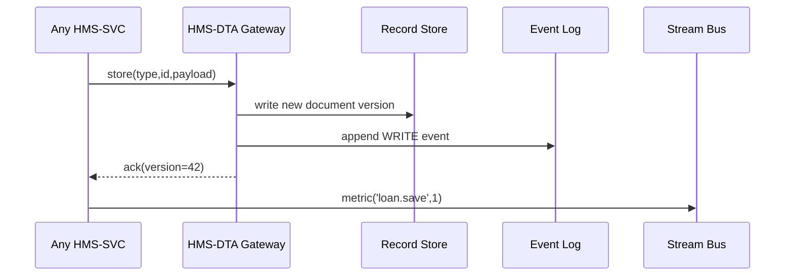

# Chapter 6: Data & Telemetry Hub (HMS-DTA)

[← Back to Chapter 5: Financial Transaction Core (HMS-ACH)](05_financial_transaction_core__hms_ach__.md)

---

## 0. Why Does HMS-DTA Exist?

Imagine a journalist files a **Freedom of Information Act (FOIA)** request:

> “Please send me every rule the Occupational Safety and Health Administration (OSHA) used to approve workplace-safety grants last Tuesday at 3 p.m.”

If our platform can’t **rewind history**, we risk non-compliance (and big headlines).

HMS-DTA is the platform’s **national archives + census bureau**:

* Archives every *record* (policies, payments, user profiles).  
* Logs every *event* (button click, ACH clearance).  
* Streams real-time *metrics* (30,000+ per second).  

Developers mine it for dashboards, auditors consult it for investigations, and agents feed AI models with fresh, trustworthy data.

---

## 1. A Citizen-First Story

Kendra applies for a disaster loan at 10:15 a.m.  
At 10:17 a.m. the system denies her—“incorrect income bracket.”  
Three days later, Kendra appeals. A reviewer opens the “timeline”:

```
10:15:07  POST /loans  status=DRAFT
10:15:44  PATCH /loans  value[income]=42000
10:17:02  SYSTEM_DECISION  result=DENIED
```

Because HMS-DTA versioned each change, the reviewer can:

1. **Replay** the exact data set.
2. **Explain** where the decision logic came from.
3. **Reverse** the mistake if policy has since changed.

---

## 2. Key Concepts (Plain English)

| Term              | Friendly Analogy                       | Simple Definition                                |
|-------------------|----------------------------------------|--------------------------------------------------|
| Record Store      | National Archives boxes                | Immutable, time-versioned JSON documents.        |
| Event Log         | Security camera with timestamps        | Append-only list of “who did what, when.”        |
| Metric Stream     | Census live counter                    | Pub/Sub topic spitting out numeric gauges.       |
| Snapshot Query    | Rewind button on a DVR                 | Fetch the world *as it looked* at any past time. |
| DTA SDK           | Flat-rate postage label                | One function to save, query, and subscribe.      |

---

## 3. Using HMS-DTA — 3 Tiny Recipes

### 3.1 Store a Versioned Record (8 lines)

```js
// loanService.js
import { dta } from '@hms/dta-sdk'

export async function saveLoan(id, payload) {
  await dta.store('LOAN', id, payload)
  // Auto-creates a new version; older ones untouched.
}
```

Explanation:  
The call writes `payload` to the **Record Store** and tags it with the user’s JWT for traceability.

---

### 3.2 Ask “What Did This Look Like Last Tuesday?” (9 lines)

```js
// auditTool.js
const lastTuesday = new Date('2024-05-07T15:00:00Z')
const loan = await dta.getSnapshot('LOAN', '123', lastTuesday)
console.log(loan.status)   // ➜ "DRAFT"
```

One parameter swap (`timestamp`) rewinds the state—no manual diffing needed.

---

### 3.3 Subscribe to Real-Time Metrics (11 lines)

```js
// dashboard.js
const sub = dta.metrics('ACH.payments.cleared')
sub.on('data', m => chart.update(m.value))
sub.on('open', () => console.log('Live!'))
```

Your UI now updates instantly whenever HMS-ACH posts a cleared payment.

---

## 4. What Happens Behind the Curtain?



1. A service sends a *store* request.  
2. HMS-DTA writes a new document, never overwriting prior data.  
3. It appends an **Event** (who, what, when).  
4. If a metric was included, it hits the **Stream Bus** for dashboards.

---

## 5. A Peek at the Internal Code

### 5.1 Ultra-Simplified Record Insert (15 lines)

```js
// gateway/store.js
export async function store(type, id, body, ctx) {
  const version = Date.now()
  await sql(`
    INSERT INTO records(type,id,version,body,actor)
    VALUES ($1,$2,$3,$4,$5)
  `, [type, id, version, body, ctx.user])
  await events.append({ type:'WRITE', id, version, by:ctx.user })
  return { version }
}
```

Notes:  
* `version` is millisecond-epoch → easy sorting.  
* `events.append` writes to a **Kafka** topic (`dta.events.v1`) for HMS-OPS monitoring.

---

### 5.2 Snapshot Query (12 lines)

```js
// gateway/snapshot.js
export async function getSnapshot(type, id, ts) {
  const row = await sql(`
    SELECT body FROM records
    WHERE type=$1 AND id=$2 AND version<= $3
    ORDER BY version DESC LIMIT 1
  `, [type, id, ts])
  return row?.body
}
```

Fast because `type,id,version` is a composite index.

---

### 5.3 Metric Fan-Out (10 lines)

```js
// metrics/push.js
import bus from './bus.js'   // wraps NATS

export function metric(path, value) {
  bus.publish('metrics', { path, value, ts: Date.now() })
}
```

Any chapter (e.g., [HMS-ACH](05_financial_transaction_core__hms_ach__.md)) calls `metric()`—dashboards light up in < 100 ms.

---

## 6. Common “Uh-oh” Moments & Fixes

| Problem                           | Quick Fix                                          |
|-----------------------------------|----------------------------------------------------|
| Snapshot returns `null`           | Wrong `timestamp` timezone—always use UTC.         |
| Record update overwrites fields   | Remember: *full* document replaces last version—send merged payload. |
| Metrics stream feels laggy        | Check WebSocket proxy; enable gzip & keep-alive.   |
| Event log too big / slow query    | Use `events_v2` table partitioned by month.        |

---

## 7. Where HMS-DTA Fits in the Stack

```
UI (HMS-MFE)
      ↓
HMS-SVC / HMS-ACH / HMS-GOV
      ↓
=========== HMS-DTA ===========
 Record Store | Event Log | Metrics
      ↓
Auditors • AI Agents • Dashboards • FOIA
```

Everything either **lands in** or **reads from** HMS-DTA—making it the single source of truth.

---

## 8. Recap & What’s Next

You just learned:

* Why time-versioned data is essential for FOIA, audits, and appeals.  
* How to **store**, **rewind**, and **stream** information with 3 simple SDK calls.  
* The internal flow that guarantees immutability and real-time insight.

Data is safe, searchable, and streaming live.  
Next we’ll keep those streams healthy with constant vigilance in [Chapter 7: Operational Monitoring & Reliability Layer (HMS-OPS)](07_operational_monitoring___reliability_layer__hms_ops__.md).

---

Generated by [AI Codebase Knowledge Builder](https://github.com/The-Pocket/Tutorial-Codebase-Knowledge)