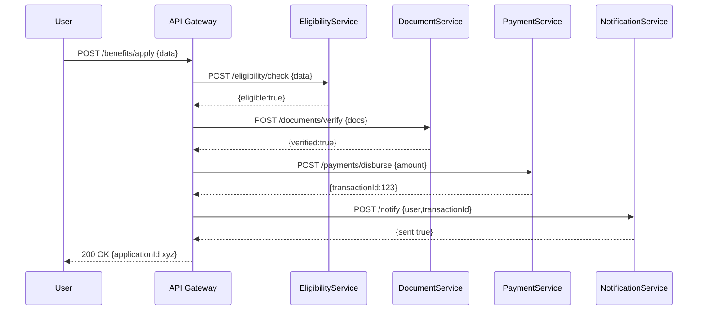

# Chapter 7: Microservices Architecture

In the previous chapter we saw how our front end talks to the [Backend API](06_backend_api_.md). Now we’ll take a step further: instead of one big API, we’ll split our system into **small, independent services**—each doing one job and talking over APIs. This is **Microservices Architecture**.

---

## Why Microservices Architecture?

Imagine a federal citizen-service portal as a busy marketplace. Instead of one giant department store handling everything, you have:

- A **Document Shop** (verifies uploads)  
- An **Eligibility Booth** (checks rules)  
- A **Payment Counter** (disburses funds)  
- A **Notification Stand** (sends emails/SMS)  

Each shop is specialized. If the Payment Counter needs more staff, you scale it up independently. If the Eligibility Booth has a bug, the others keep running. This boosts **scalability**, **resilience**, and **team autonomy**.

**Central Use Case**  
A citizen submits an unemployment benefit request. Internally, we:

1. Check eligibility via `EligibilityService`.  
2. Verify documents via `DocumentService`.  
3. Disburse funds via `PaymentService`.  
4. Notify the citizen via `NotificationService`.  

All services run separately but cooperate over HTTP.

---

## Key Concepts

1. **Microservice**  
   A small app with a focused responsibility and its own data.  
2. **API Contract**  
   A clear HTTP interface (endpoints and JSON schemas).  
3. **Service Registry / Discovery**  
   A simple list of where each service lives (hostname + port).  
4. **API Gateway**  
   A unified front door that routes external calls to the right service.  
5. **Independent Deployment**  
   Each service has its own pipeline—restart one without touching others.  
6. **Fault Isolation**  
   If one service fails, others remain up.  
7. **Scalability**  
   Scale services individually based on load.

---

## How It Works: A Step-by-Step Flow



---

## 1. Setting Up Each Service

We’ll create three tiny Express apps: `eligibility`, `document`, and `payment`.

services/eligibility/server.js  
```js
const express = require('express')
const app = express()
app.use(express.json())

app.post('/eligibility/check', (req, res) => {
  // Very simple rule: age ≥ 18
  const { age } = req.body
  res.json({ eligible: age >= 18 })
})

app.listen(3001, () => console.log('EligibilityService on 3001'))
```
This service listens on port 3001 and returns `{ eligible: true/false }`.  

services/document/server.js  
```js
const express = require('express')
const app = express()
app.use(express.json())

app.post('/documents/verify', (req, res) => {
  // Stub: accept all doc uploads
  res.json({ verified: true })
})

app.listen(3002, () => console.log('DocumentService on 3002'))
```

services/payment/server.js  
```js
const express = require('express')
const app = express()
app.use(express.json())

app.post('/payments/disburse', (req, res) => {
  // Stub: pretend we issued a transaction
  res.json({ transactionId: Date.now() })
})

app.listen(3003, () => console.log('PaymentService on 3003'))
```

---

## 2. Building the API Gateway

The Gateway hides all ports behind one URL. It calls each service in turn.

gateway/app.js  
```js
const express = require('express')
const fetch = require('node-fetch')
const app = express()
app.use(express.json())

app.post('/benefits/apply', async (req, res) => {
  const data = req.body
  // 1. Eligibility
  const el = await (await fetch('http://localhost:3001/eligibility/check', {
    method:'POST', body:JSON.stringify(data), headers:{'Content-Type':'application/json'}
  })).json()
  if (!el.eligible) return res.status(400).json({ error:'Not eligible' })

  // 2. Documents
  await fetch('http://localhost:3002/documents/verify', { /* similar */ })

  // 3. Payment
  const pay = await (await fetch('http://localhost:3003/payments/disburse', { /* similar */ })).json()

  // 4. (Optional) Notification omitted for brevity
  res.json({ applicationId: pay.transactionId })
})

app.listen(3000, () => console.log('API Gateway on 3000'))
```
When a client calls `POST /benefits/apply` on port 3000, the gateway coordinates calls to each microservice and returns a single JSON.

---

## 3. Service Registry (Simple)

We hard-code service URLs in this example. In production, you’d use:

- A DNS-based registry  
- A config file or environment variables  

For now, our gateway knows:
- EligibilityService at `localhost:3001`
- DocumentService at `localhost:3002`
- PaymentService at `localhost:3003`

---

## Benefits & Next Steps

With microservices, we can:

- Scale the PaymentService independently during peak payouts  
- Deploy a hotfix to EligibilityService without downtime elsewhere  
- Add a new NotificationService by pointing the gateway to it  

In the next chapter, we’ll see how to keep these services in sync with external legacy systems in [External System Sync](08_external_system_sync_.md).

---

## Conclusion

In this chapter you learned how to:

- Break a monolithic API into **microservices**  
- Define clear **API contracts** for each service  
- Use an **API Gateway** to orchestrate calls  
- Boost **scalability**, **resilience**, and **team autonomy**

Up next: tying our microservices to external systems and data sources in [External System Sync](08_external_system_sync_.md).

---

Generated by [AI Codebase Knowledge Builder](https://github.com/The-Pocket/Tutorial-Codebase-Knowledge)