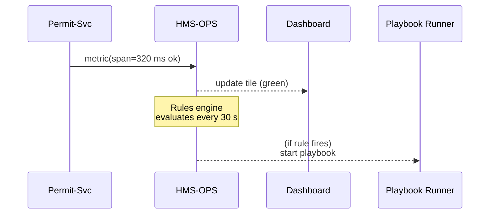

# Chapter 7: Operational Monitoring & Reliability Layer (HMS-OPS)

[← Back to Chapter&nbsp;6: Data & Telemetry Hub (HMS-DTA)](06_data___telemetry_hub__hms_dta__.md)

---

## 0. Why Do We Need HMS-OPS?

### A Tax-Day Horror Story (that never happened)

It is April 15th, 11:57 p.m.  
Millions of citizens—including Maria from Chapter 1—are submitting last-minute tax payments.

Suddenly the **Payment Service** inside HMS-ACH starts responding in 4 seconds instead of 200 ms.  
If nothing happens **now**, forms will time-out, citizens will panic, and headlines will scream *“Government portal collapses on tax day.”*

HMS-OPS is the **nerve center** that prevents that headline:

* Spots the latency spike within **15 seconds**.  
* Turns the dashboard tile from green → yellow → red.  
* Runs an **auto-playbook** that shifts traffic to a warm backup region.  
* Pages the on-call engineer only if automated steps fail.

Citizens hit “Submit”, never noticing the drama.

---

## 1. Key Concepts (Plain English)

| Term                    | Friendly Analogy                     | One-sentence meaning                         |
|-------------------------|--------------------------------------|---------------------------------------------|
| Probe                   | A park ranger’s hourly radio call    | Lightweight health ping (`/healthz`).       |
| SLO (Service Level Obj) | Speed limit sign                     | “99.95 % of requests < 500 ms.”             |
| Dashboard Tile          | Traffic light on a command screen    | Green/Yellow/Red rectangle for one metric.  |
| Alert Rule              | Smoke detector                       | “If error rate > 1 % for 5 min, alarm.”     |
| Playbook                | Fire drill card                      | Scripted steps: scale ↗, failover, notify.  |
| Synthetic User          | Crash-test dummy                     | Bot that logs in & runs a full form.        |

---

## 2. A 10-Minute “Hello, OPS” Walk-Through

We will:

1. Add a simple **latency probe** to a service.  
2. Create a **dashboard tile**.  
3. Define an **alert + playbook**.

### 2.1 Instrument Your Service (8 lines)

```js
// permit-service/index.js    ← from Chapter 3
import { ops } from '@hms/ops-sdk'
ops.init({ service: 'permit-svc' })   // 1️⃣

app.post('/permits', async (req, res) => {
  const span = ops.span('submit-permit')           // 2️⃣
  // ...existing logic
  span.ok()                                        // 3️⃣
  res.status(201).send({ status: 'queued' })
})
```

Explanation  
1 `ops.init()` opens a metrics channel to HMS-OPS.  
2 `span()` starts a timer for this request.  
3 `ok()` records duration & success, auto-sending it to HMS-DTA and OPS.

### 2.2 Add a Dashboard Tile (YAML, 9 lines)

```yaml
# dashboards/treasury.yaml
tiles:
  - name: Permit Latency (P95)
    source: metric
    query:  permit-svc.latency.p95
    slo:    "p95 < 0.5s"
    color:  auto          # green/yellow/red
```

• The tile will turn yellow if p95 ≥ 0.5 s for 2 mins, red if ≥ 1 s.

### 2.3 Define an Alert + Playbook (12 lines)

```yaml
# alerts/permit-latency.yaml
alert:  "permitLatencyHigh"
if:     "permit-svc.latency.p95 > 0.8s for 5m"
then:
  - run: "scale --service permit-svc --factor 2"
  - wait: "2m"
  - run: "traffic-shift --to us-west"
  - notify: "oncall@treasury.gov"
```

• First doubles the pod count.  
• If still red after 2 m, moves 50 % traffic to the backup region.  
• Only then sends a human page.

---

## 3. What Happens Under the Hood?



1. Each service continuously **streams metrics** to OPS (tiny gRPC packets).  
2. OPS stores raw numbers in [HMS-DTA](06_data___telemetry_hub__hms_dta__.md) and updates live dashboards.  
3. A **rules engine** checks every alert expression.  
4. When a rule fires, the **Playbook Runner** executes scripted steps over SSH/CLI/API.

---

## 4. Peeking at the OPS Code (Simplified)

### 4.1 Rules Engine (15 lines)

```js
// engine/rules.js
export function evalRule(rule, metrics) {
  // rule.if = "permit-svc.latency.p95 > 0.8s for 5m"
  const parsed = parse(rule.if)         // returns {path, op, thresh, window}
  const data = metrics.range(parsed.path, parsed.window)
  const recent = data.slice(-1)[0].value
  return compare(recent, parsed.op, parsed.thresh)
}
```

Runs every 30 s for each rule; returns `true` if action should fire.

### 4.2 Playbook Step Runner (18 lines)

```js
// runner/steps.js
export async function runStep(step) {
  switch (step.run?.split(' ')[0]) {
    case 'scale':
      await k8s.scale(step.run)        // scales pods
      break
    case 'traffic-shift':
      await voyager.shift(step.run)    // updates load balancer
      break
    case undefined:
      if (step.notify) await email(step.notify)
  }
}
```

Tiny helper calls hide the real Kubernetes or load-balancer APIs.

---

## 5. Synthetic Users

A **synthetic user** logs in like a real citizen every 60 seconds:

```js
// synthetics/tax-bot.js  (16 lines)
import { browser } from '@hms/ops-headless'

await browser.goto('https://my.gov/tax')
await browser.type('#ssn', '111-22-3333')
await browser.click('button#calc')
ops.metric('tax-bot.ok', 1)
```

If the bot fails any step → sends `tax-bot.ok = 0`, triggering its own alert rule.  
This catches full-stack problems (DNS, JavaScript, APIs) that component metrics might miss.

---

## 6. Common “Uh-oh” Moments & Fixes

| Symptom                                | Likely Cause                  | Quick Fix |
|----------------------------------------|-------------------------------|-----------|
| Dashboard tile stuck on *“No Data”*    | Metrics not reaching OPS      | Check `ops.init()` endpoint URL / firewall. |
| Alert flaps green ↔ red every minute   | Threshold too tight           | Add `for 5m` clause or widen SLO. |
| Playbook executed but latency persists | Problem in downstream DB      | Add extra step: `scale db-replica` or failover. |
| Synthetic user passes; real users fail | Bot uses cached tokens        | Add `browser.clearStorage()` before each run. |

---

## 7. Where HMS-OPS Fits in the Big Picture

```
┌──── Citizens ────┐
       ↓
HMS-MFE → HMS-SVC → HMS-ACH / HMS-GOV
       ↓            ↓
     HMS-DTA  ←── HMS-OPS  (this chapter)
                  ↑
          Playbooks & On-Call
```

Every other layer **emits** logs/metrics.  
HMS-OPS **collects**, **visualizes**, and **reacts** in real time.

---

## 8. Recap & What’s Next

You learned how HMS-OPS:

* Watches health via probes, SLOs, and synthetic users.  
* Turns metrics into dashboards, alerts, and automated playbooks.  
* Keeps critical deadlines (like tax day) drama-free for citizens.

Next we’ll introduce the AI helpers that can read those dashboards and even suggest fixes:  
[AI Representative Agent Framework (HMS-AGT / HMS-A2A)](08_ai_representative_agent_framework__hms_agt___hms_a2a__.md)

---

---

Generated by [AI Codebase Knowledge Builder](https://github.com/The-Pocket/Tutorial-Codebase-Knowledge)