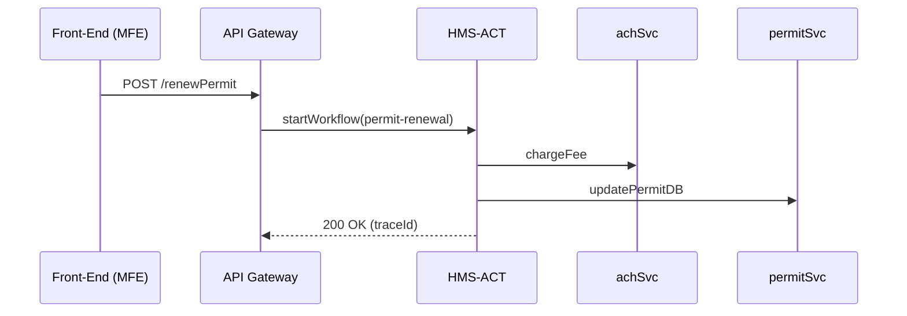

# Chapter 7: Workflow Orchestrator (HMS-ACT / HMS-OMS)

*(continuing from [Data Repository & Governance (HMS-DTA)](06_data_repository___governance__hms_dta__.md))*  

---

## 1. Why Do We Need an “Air-Traffic Controller” for Requests?

Imagine a citizen, **Maria**, renewing her *Short-Term Rental Permit* online:

1. Maria uploads proof of insurance.  
2. A payment of \$75 is charged via ACH.  
3. The city zoning office reviews zoning compliance.  
4. The permit database is updated.  
5. An email + PDF receipt are sent back to Maria.

If any **one** step is skipped or duplicated, you risk angry citizens, refund headaches, or worse—legal trouble.  
**HMS-ACT / HMS-OMS** is the **Workflow Orchestrator**: it watches every “plane” (request), assigns it to the correct “runway” (service), and logs the entire flight path.

---

## 2. Key Concepts (Plain-English Cheat-Sheet)

| Concept               | Airport Analogy           | One-Sentence Explanation |
|-----------------------|---------------------------|--------------------------|
| Workflow Definition   | Flight plan               | A list of ordered steps and their rules. |
| Task                  | Runway assignment         | A single call to a micro-service (e.g., chargeACH). |
| Service Lane          | Specific runway           | The micro-service endpoint that performs the task. |
| Event (“✈ landed”)    | Control-tower radio ping  | Message that a task has finished (success/fail). |
| Compensation          | Emergency go-around       | Auto-undo logic (e.g., refund) if later steps fail. |
| Trace ID              | Tail number               | Unique ID that links every log line for one workflow. |

Keep these six ideas in mind; the rest is just wiring them together.

---

## 3. A 5-Minute “Hello Workflow” Walk-Through

We will create and run a **3-step workflow** for Maria’s permit renewal *locally*.

### 3.1 Describe the Workflow (8 lines)

`workflows/permit-renewal.yaml`

```yaml
id: permit-renewal
steps:
  - id: uploadDocs     service: fileSvc.upload
  - id: chargeFee      service: achSvc.charge  compensate: achSvc.refund
  - id: updatePermitDB service: permitSvc.update
```

What’s inside?  
* Three **steps** in order.  
* Step 2 includes a **compensation** action (`refund`) in case something later fails.

### 3.2 Minimal Orchestrator Stub (19 lines)

`orchestrator/run.js`

```js
import fs from 'fs/promises';

export async function run(workflowId, payload) {
  const wf = YAML.parse(await fs.readFile(`workflows/${workflowId}.yaml`, 'utf8'));
  const trace = Date.now() + '-' + Math.random().toString(36).slice(2,7);

  for (const step of wf.steps) {
    try {
      log(trace, step.id, 'START');
      await callService(step.service, payload);
      log(trace, step.id, 'DONE');
    } catch (err) {
      log(trace, step.id, 'FAIL', err.message);
      if (step.compensate) await callService(step.compensate, payload);
      throw err;                      // bubble up
    }
  }
}
```

Explanation (line numbers refer to the code block):

1-4 Load the YAML definition.  
5 Create a **Trace ID** (`trace`).  
7-14 Loop through each step, calling the service and logging status.  
11 If a step fails, run its `compensate` service then exit.

`callService` is a tiny helper you could picture as `fetch('http://achSvc/charge')`—omitted for brevity.

### 3.3 Try It Out

```bash
node orchestrator/run.js permit-renewal ./samplePayload.json
```

Console output:

```
[1724491234-ab12c] uploadDocs START
[1724491234-ab12c] uploadDocs DONE
[1724491234-ab12c] chargeFee START
[1724491234-ab12c] chargeFee DONE
[1724491234-ab12c] updatePermitDB START
[1724491234-ab12c] updatePermitDB DONE
```

Change `permitSvc.update` to throw an error and run again—you’ll see `achSvc.refund` fire automatically.

---

## 4. How Does the Orchestrator Talk to the Rest of HMS?

The orchestrator sits **between** the API Gateway and the micro-services:



Every call is still authenticated by [IAM](04_identity___access_management__iam__.md) and scanned by [ESQ](05_security__privacy___legal_guardrails__hms_esq___platform_controls__.md); ACT simply **orders** them.

---

## 5. Peeking Under the Hood

### 5.1 State Store (tiny but mighty)

Each workflow instance keeps a one-row record in Redis / Postgres:

```json
{
  "trace": "1724491234-ab12c",
  "workflowId": "permit-renewal",
  "currentStep": "chargeFee",
  "status": "RUNNING",
  "started": "2024-04-18T14:00Z"
}
```

If the orchestrator crashes, another instance picks up unfinished traces and resumes at `currentStep`.

### 5.2 Event Bus Connection

`callService` can emit an **event** instead of HTTP when needed:

```js
publish('events', { step: step.id, trace, payload });
```

Micro-services that subscribe to `events` (for example, a “sendEmail” lambda) then react **asynchronously**—perfect for long-running tasks like background checks.

---

## 6. Adding Human-in-the-Loop Approval

Some steps require a real person (perhaps the **Office of Disability Employment Policy**) to click “Approve.”

Add a **pause** flag and a callback route:

```yaml
- id: zoningApproval
  service: zoningPortal.approve
  pause: true          # Orchestrator waits here
```

In code:

```js
if (step.pause) return await waitFor(`/callbacks/${trace}/${step.id}`);
```

The orchestrator now hangs until the zoning officer’s UI hits the callback URL, then continues—tying directly into [Human-in-the-Loop Oversight](10_human_in_the_loop__hitl__oversight_.md).

---

## 7. Common Beginner Questions

**Q: Is this the same as a message queue?**  
A: No. A queue delivers messages; the orchestrator **decides what to send where, and when**.

**Q: What if two steps can run in parallel?**  
A: Define them with `parallel: true` and spawn two `callService` promises—easy!

**Q: How do I see running workflows?**  
A: HMS-ACT exposes `/ui` that lists active traces, step status, and links to logs in [Monitoring & Metrics (HMS-OPS)](15_monitoring___metrics__hms_ops__.md).

**Q: Does every agency need its own orchestrator?**  
A: No. HMS-ACT is multi-tenant; each agency uploads its YAML files but the same engine runs them all, respecting IAM scopes.

---

## 8. Recap & What’s Next

In this chapter you learned how the Workflow Orchestrator:

• Reads a YAML **flight plan** and executes tasks in order.  
• Logs every step using a unique **Trace ID**.  
• Handles failures with automatic **compensation**.  
• Waits for **human approvals** when needed.  

Next we’ll explore how those YAML definitions can be **auto-generated** from actual statutes and agency policies by the rules powerhouse known as the **Policy & Legislative Engine (HMS-CDF)**.

👉 Continue to [Policy & Legislative Engine (HMS-CDF)](08_policy___legislative_engine__hms_cdf__.md)

---

Generated by [AI Codebase Knowledge Builder](https://github.com/The-Pocket/Tutorial-Codebase-Knowledge)