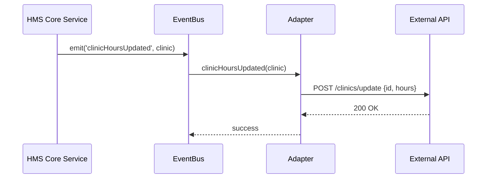

# Chapter 8: External System Sync

Welcome back! In [Chapter 7: Microservices Architecture](07_microservices_architecture_.md) we saw how HMS-MFE splits functionality into small, independent services. Now we’ll learn how to **keep third-party systems in lockstep** with our own—automatically and in real time. This is **External System Sync**.

## 1. Why External System Sync?

Imagine City Hall’s central clock: when it strikes noon, every municipal building’s schedule changes simultaneously. In HMS-MFE, policy or schedule updates often need to flow out to other organizations’ systems (scheduling tools, record-keeping databases) without someone hitting “sync” by hand.

**Central Use Case**  
A federal health-care portal changes its vaccination-campaign hours. External hospital systems and mobile-app notifications must pick up the new hours automatically, or else citizens end up at closed clinics.

External System Sync ensures that:
- A single update in our system  
- Triggers events in real time  
- Invokes small “adapter” modules  
- Which call each external API  
- With retries and error handling  

## 2. Key Concepts

1. **Sync Event**  
   A signal emitted when data changes (e.g. `clinicHoursUpdated`).  
2. **Event Bus**  
   A mini “clock” that broadcasts events to subscribers.  
3. **Adapter**  
   A connector that knows how to talk to one external system’s API.  
4. **Configuration**  
   A simple map of external systems, endpoints, and credentials.  
5. **Idempotency & Retries**  
   Guarantees we can re-run sync without duplicates and recover from failures.

## 3. How to Use External System Sync

We’ll walk through the steps to sync clinic-hour changes to a third-party scheduling API.

### 3.1 Define Your External Systems

Create a config file listing each system and its endpoint:

```js
// sync/config.js
export default {
  systems: [
    {
      name: 'ThirdPartyScheduler',
      endpoint: 'https://api.scheduler.gov/clinics/update',
      apiKey: process.env.SCHEDULER_API_KEY
    }
  ]
}
```
Explanation:
- `name`: internal label  
- `endpoint`: where to POST updates  
- `apiKey`: stored securely in environment variables

### 3.2 Write an Adapter

In `sync/adapters`, each file translates our events into external API calls:

```js
// sync/adapters/thirdPartyScheduler.js
import config from '../config'
export async function syncClinicHours(clinic) {
  const url = config.systems.find(s => s.name==='ThirdPartyScheduler').endpoint
  await fetch(url, {
    method: 'POST',
    headers: { 'x-api-key': config.systems[0].apiKey, 'Content-Type':'application/json' },
    body: JSON.stringify({ id: clinic.id, hours: clinic.hours })
  })
}
```
Explanation:
- Looks up the right `endpoint` and `apiKey`  
- Sends clinic `id` and new `hours` as JSON

### 3.3 Publish Sync Events

Whenever our core service updates clinic hours, we emit an event:

```js
// sync/publisher.js
import EventBus from './eventBus'
export function onClinicHoursChange(clinic) {
  EventBus.emit('clinicHoursUpdated', clinic)
}
```
Explanation:
- `onClinicHoursChange` is called by your service code  
- It pushes `clinic` data onto the Event Bus

## 4. What Happens Under the Hood?



1. **Core** publishes an event.  
2. **EventBus** finds subscribers (our adapter).  
3. **Adapter** calls the real **External API**.  
4. Success or failure is reported back for logging or retry.

## 5. Inside the Implementation

### sync/eventBus.js

A tiny pub/sub system:

```js
// sync/eventBus.js
const handlers = {}
export default {
  on(event, fn) {
    handlers[event] = handlers[event] || []
    handlers[event].push(fn)
  },
  emit(event, payload) {
    (handlers[event] || []).forEach(fn => fn(payload))
  }
}
```
Explanation:
- `on()`: subscribe an adapter to an event  
- `emit()`: call all subscribers with the data

### sync/syncService.js

Wires adapters to events:

```js
// sync/syncService.js
import EventBus from './eventBus'
import { syncClinicHours } from './adapters/thirdPartyScheduler'

// Register our adapter to the bus
EventBus.on('clinicHoursUpdated', async clinic => {
  try {
    await syncClinicHours(clinic)
    console.log('Synced hours for', clinic.id)
  } catch (err) {
    console.error('Sync failed for', clinic.id, err)
    // TODO: retry logic or dead-letter queue
  }
})
```
Explanation:
- On every `clinicHoursUpdated`, we call our adapter  
- Errors are caught for retries or alerting

## Conclusion

You’ve learned how to:

- Define external systems in a **config** file  
- Write **adapters** to translate events into API calls  
- Use a simple **Event Bus** to broadcast changes  
- Handle success and failures with basic logging  

With **External System Sync**, HMS-MFE propagates policy or schedule changes seamlessly to third-party systems—no manual steps needed. Up next, we’ll add an intelligent helper that negotiates with citizens on your behalf in [AI Representative Agent](09_ai_representative_agent_.md).

---

Generated by [AI Codebase Knowledge Builder](https://github.com/The-Pocket/Tutorial-Codebase-Knowledge)