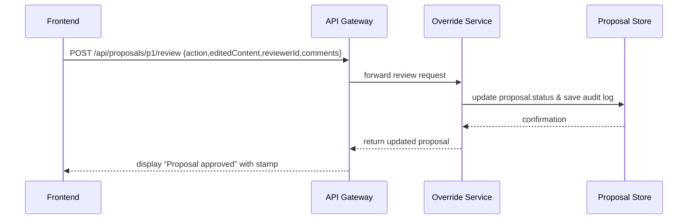

# Chapter 8: Human-in-the-Loop Override

In [Chapter 7: Process Proposal Module](07_process_proposal_module_.md) we saw how HMS-MFE drafts and ranks policy/process proposals automatically. Now, before any change becomes official, a real person needs to review and “stamp” the recommendation. That’s exactly what our **Human-in-the-Loop Override** layer provides.

## Why Human-in-the-Loop Override Matters

Imagine the Joint Fire Science Program (JFSP) uses an AI to propose new controlled‐burn guidelines. If a faulty suggestion went straight to policy, lives and forests could be at risk. Instead, a senior fire official must:

 1. See the AI’s draft proposal.  
 2. Edit or correct wording.  
 3. Approve or reject it.  
 4. Leave a digital “stamp” and rationale.

This checkpoint ensures accountability and mirrors how agencies have senior staff sign off on consultant reports before they become formal policy.

---

## Key Concepts

1. **Review Queue**  
   A list of AI-generated proposals awaiting human review.  
2. **Override Actions**  
   - **Approve**: accept as-is.  
   - **Edit**: tweak content before approval.  
   - **Reject**: send back with comments.  
3. **Audit Trail**  
   Every decision (who, when, what) is logged for transparency.  
4. **Decision Stamp**  
   A digital seal recorded on the final approved proposal.

---

## How to Use This Abstraction

Let’s walk through a minimal example: a staff user opens a pending proposal, makes edits, and approves it.

```ts
// File: src/override/usage.ts
import { OverrideService } from './overrideService'

async function reviewProposal() {
  const svc = new OverrideService()

  // 1. Load a pending proposal
  const draft = await svc.getPending('p1')
  console.log(draft.title, draft.content)

  // 2. Approve with an optional edit
  const final = await svc.applyOverride('p1', {
    action: 'approve',
    editedContent: draft.content.replace('old rule','new rule'),
    reviewerId: 'alice@agency.gov',
    comments: 'Looks good after small wording change'
  })

  console.log(final.status) // ➜ "approved"
}

reviewProposal()
```

Explanation:
- We fetch proposal `p1` from the **Review Queue**.
- We call `applyOverride` with an `action` (“approve”), any `editedContent`, the human `reviewerId`, and `comments`.
- The service returns the updated proposal with its new `status`.

---

## Step-by-Step Flow



1. Frontend sends a review request.  
2. Override Service records the decision and audit entry.  
3. It responds with the final, stamped proposal.

---

## Under the Hood: Implementation

### 1. API Route

File: `src/api/reviewRoutes.ts`

```ts
import { Router } from 'express'
import { OverrideService } from '../override/overrideService'

const router = Router()
const svc = new OverrideService()

// POST /api/proposals/:id/review
router.post('/:id/review', async (req, res) => {
  const { action, editedContent, reviewerId, comments } = req.body
  const updated = await svc.applyOverride(req.params.id, {
    action, editedContent, reviewerId, comments
  })
  res.json(updated)
})

export default router
```

Explanation:
- We accept a review payload with `action`, optional edits, who reviewed it, and comments.
- We call our service and return the updated proposal.

### 2. Override Service

File: `src/override/overrideService.ts`

```ts
import { ProposalStore } from '../store/proposalStore'

export class OverrideService {
  private store = new ProposalStore()

  async getPending(id: string) {
    return this.store.find(id)
  }

  async applyOverride(id: string, review: {
    action: 'approve'|'reject'|'edit'
    editedContent?: string
    reviewerId: string
    comments: string
  }) {
    // 1. Load the draft
    const draft = await this.store.find(id)

    // 2. Update content & status
    const updated = {
      ...draft,
      content: review.editedContent ?? draft.content,
      status: review.action,
      reviewer: review.reviewerId,
      reviewComments: review.comments,
      reviewTimestamp: new Date().toISOString()
    }

    // 3. Save both proposal and audit log
    await this.store.save(updated)
    await this.store.logAudit(id, review) // records who did what

    return updated
  }
}
```

Explanation:
- `getPending` fetches the draft proposal.
- `applyOverride` updates the proposal’s `status` and `content`, adds reviewer info and timestamp.
- We save the new state and write an audit record.

### 3. Proposal Store & Audit

File: `src/store/proposalStore.ts`

```ts
export class ProposalStore {
  private proposals: any[] = []
  private audits: any[] = []

  async find(id: string) {
    return this.proposals.find(p => p.id === id)
  }

  async save(proposal: any) {
    // replace old or push new
    this.proposals = this.proposals.filter(p => p.id !== proposal.id)
    this.proposals.push(proposal)
  }

  async logAudit(id: string, review: any) {
    this.audits.push({ proposalId: id, ...review })
  }
}
```

Explanation:
- We keep proposals and audit logs in memory (swap in a real DB later).
- `logAudit` captures every override action for compliance and traceability.

---

## Summary

You’ve learned how the **Human-in-the-Loop Override** abstraction:

- Presents an AI-generated proposal to a human reviewer.  
- Allows actions: approve, edit, or reject.  
- Records a full audit trail and digital “stamp.”  

Next up: keeping data in sync with outside systems in [Chapter 9: Real-Time External Sync](09_real_time_external_sync_.md).

---

Generated by [AI Codebase Knowledge Builder](https://github.com/The-Pocket/Tutorial-Codebase-Knowledge)