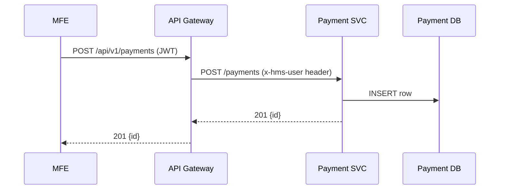

# Chapter 8: Microservices (HMS-SVC Family)

[← Back to Chapter 7: Identity & Access Management (IAM)](07_identity___access_management__iam__.md)

---

> “Imagine a government building with **many small service windows**—  
> one for payments, one for document storage, one for notifications.  
> Each window can open earlier, close for maintenance, or get more clerks  
> **without shutting down the whole building**.  
> That is the spirit of the HMS-SVC micro-service family.”

---

## 1. Why break the back-office into little windows?

Mini-story: **Renewing a Passport**

1. A citizen uploads a photo (Document Storage Service).  
2. Pays the renewal fee (Payment Service).  
3. Receives text alerts about status (Notification Service).

If all of this lived in **one giant app**, any bug in photo upload could block fee collection and SMS updates.  
By splitting the work into **small, single-purpose micro-services**, we get:

* Independent deploys – fix photo upload without touching payments.  
* Independent scaling – spin up 10 photo workers during spring rush.  
* Smaller blast radius – payment outage never deletes photos.

---

## 2. Key Concepts (service-window analogies)

| Micro-service term | Window analogy | Beginner-friendly meaning |
|--------------------|----------------|---------------------------|
| Bounded Context    | One window specializes in *one* type of task (“payments only”). |
| Service Contract   | Agency pamphlet | Public API showing what forms/endpoints the window accepts. |
| Stateless Service  | Clerk with no memory | Holds no session; every request carries all it needs. |
| Database-per-Service | File cabinet behind the window | Each service owns its own tables; no sharing files through the back door. |
| Horizontal Scale   | Add more clerks | Run many copies of the same service behind a load balancer. |

---

## 3. A 5-Minute Quick-Start — Build a Payment Service

We’ll create the tiniest **Payment Service** and wire it into the portal.

### 3.1 Service code (`svc-payments/index.js`) — 18 lines

```js
import express from 'express'
import { v4 as uuid } from 'uuid'
import bodyParser from 'body-parser'
const app = express().use(bodyParser.json())

// in-memory “DB” (swap for Postgres later)
const payments = new Map()

// ① Take a payment
app.post('/payments', (req, res) => {
  const id = uuid()
  payments.set(id, { id, ...req.body, owner: req.headers['x-hms-user'] })
  res.status(201).json({ id })
})

// ② Fetch a payment
app.get('/payments/:id', (req, res) =>
  res.json(payments.get(req.params.id) || {})
)

app.listen(8080, () => console.log('💸 Payment SVC on 8080'))
```

What happens?  
1. **POST /payments** stores an object keyed by a UUID.  
2. We trust `x-hms-user` (injected by the [Gateway](06_backend_api_gateway__hms_api___hms_mkt__.md)) to know *who* paid.  
3. **GET /payments/:id** retrieves it.

### 3.2 Route manifest for the Gateway — 10 lines

```yaml
# gateway/routes/payments.yaml
uri: /api/v1/payments/**
upstream: http://hms-svc-payments:8080
plugins:
  - auth:
      scopes: ["payments.write", "payments.read"]
  - rate-limit:
      limit: 30
      window: 60
```

Drop this YAML into the Gateway, wait 30 seconds → route goes live.

### 3.3 Call it from a Micro-Frontend (Banking Dashboard) — 11 lines

```js
// inside BankingDashboard.vue
import axios from 'axios'

const pay = async () => {
  const { data } = await axios.post('/api/v1/payments', {
    amount: 110, purpose: 'Passport renewal'
  })
  console.log('Payment ID', data.id)
}
```

No hard-coded hostnames—just the single `/api` entry point.

---

## 4. What happens end-to-end?  



Only the Payment Service talks to its own DB; no other service can sneak in.

---

## 5. Under the Hood — Scaling & Fault Isolation

1. **Stateless containers** → we can start N copies (`docker-compose scale payments=5`).  
2. **Health checks** → Kubernetes or Docker Swarm removes crashed copies without downtime.  
3. If the Payment DB dies, only payments fail; photo uploads keep working.  
4. Each service emits logs/metrics to the shared pipeline (see [Metrics & Observability Pipeline](12_metrics___observability_pipeline_.md)).

---

## 6. Adding a Second Window — Document Storage Service

### 6.1 Bare-bones service (`svc-docs/index.js`) — 14 lines

```js
import express from 'express'
import multer from 'multer'
const app = express()
const upload = multer({ dest: '/tmp' })

app.post('/docs', upload.single('file'), (req, res) => {
  // pretend we pushed the file to S3 ↙
  res.status(201).json({ url: `s3://gov-bucket/${req.file.filename}` })
})

app.listen(8090, () => console.log('📄 Doc SVC on 8090'))
```

### 6.2 Register route (6 lines)

```yaml
uri: /api/v1/docs/**
upstream: http://hms-svc-docs:8090
plugins: [auth, rate-limit]
```

Done—two windows, two deploy schedules, zero coupling.

---

## 7. Running Everything Together (mini `docker-compose.yml`)

```yaml
version: '3'
services:
  gateway:
    image: hms/gateway
    ports: ["9000:9000"]
    volumes: ["./gateway/routes:/routes"]
  payments-svc:
    build: ./svc-payments
  docs-svc:
    build: ./svc-docs
  iam:
    image: hms/iam-demo
```

`docker compose up` → open the portal, pay fees, upload docs—each service logs independently.

---

## 8. Best Practices Cheat-Sheet

| Do | Why |
|----|-----|
| Keep services under ~ 500 LOC | Easier to reason about, test, redeploy. |
| One DB per service | Prevents cross-team locking accidents. |
| Communicate via events | Use the [Event Bus / Service Mesh](10_event_bus___service_mesh_.md) for async flows. |
| Version your contracts | Never break clients; add new endpoints with `/v2`. |
| Monitor each service | Emit metrics & traces to the shared pipeline (Chapter 12). |

---

## 9. Hands-On Exercise (10 min)

1. Start the stack: `docker compose up`.  
2. Obtain a demo JWT (see Chapter 7).  
3. Create a payment:

```bash
curl -H "Authorization: Bearer $TOKEN" \
     -d '{"amount":42,"purpose":"FOIA copy fee"}' \
     http://localhost:9000/api/v1/payments
```

4. Upload a document:

```bash
curl -H "Authorization: Bearer $TOKEN" \
     -F "file=@./my_photo.jpg" \
     http://localhost:9000/api/v1/docs
```

5. Kill the Payments container (`docker stop hms-payments-svc-1`) and repeat step 4.  
   Notice file uploads still work—our “other windows” stayed open.

---

## 10. Common Questions

**Q: Can services call each other directly?**  
They *may*, but prefer events through the [Event Bus / Service Mesh](10_event_bus___service_mesh_.md) to reduce tight coupling.

**Q: How do services share common libraries?**  
Publish versioned NPM/Go packages; never share DATABASES.

**Q: What about transactions spanning multiple services?**  
Emit *saga* events or use outbox patterns; avoid distributed SQL transactions.

---

## 11. Recap & Next Stop

Today you:

✓ Built two tiny micro-services under 20 lines each.  
✓ Routed them through the secure Gateway using YAML only.  
✓ Saw how independent scaling isolates failures and boosts velocity.

Next, we’ll orchestrate **how policies and workflows actually run across these services** in  
[Chapter 9: Policy/Process Engine](09_policy_process_engine_.md).

---

Generated by [AI Codebase Knowledge Builder](https://github.com/The-Pocket/Tutorial-Codebase-Knowledge)