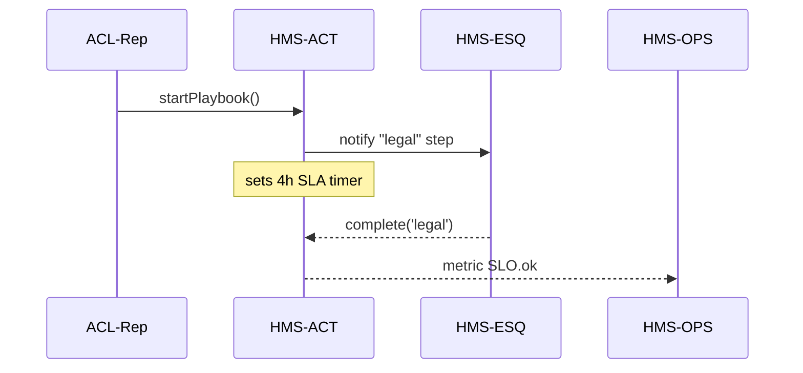

# Chapter 9: Agent Activity Orchestrator (HMS-ACT)

*(a.k.a. “The traffic controller who knows which agent speaks next, how long they have, and where the transcript is stored.”)*  

[← Back to Chapter 8: AI Representative Agent Framework (HMS-AGT / HMS-A2A)](08_ai_representative_agent_framework__hms_agt___hms_a2a__.md)

---

## 0. Why Do We Need HMS-ACT?

### A real-world story

It’s 2 p.m. at the **Administration for Community Living (ACL)**.  
An accessibility advocate submits a **policy-change proposal**:

> “Increase the wheelchair ramp rebate from \$800 to \$1,200.”

Inside our platform three things must happen—**in order and on time**:

1. **Draft**: The ACL-Rep agent writes a draft policy amendment.  
2. **Legal Review**: The HMS-ESQ compliance engine must sign off within 4 hours.  
3. **Deployment**: After approval, the change is pushed to production before midnight.

If any step slips, citizens might miss tomorrow’s rebate launch.  
This is the job of **HMS-ACT**—a tiny but strict air-traffic controller that:

* Schedules who (agent or human) does what, by when.  
* Tracks service-level agreements (SLAs) and auto-escalates.  
* Logs every utterance for a permanent, FOIA-ready transcript.

Without ACT we would have a chaos of chat messages, missed deadlines, and no clear “paper trail.”

---

## 1. Key Concepts (Plain English)

| Term             | Friendly Analogy                        | One-line meaning |
|------------------|-----------------------------------------|------------------|
| Activity         | A to-do card on a Kanban board          | Smallest unit of work (e.g., “Legal review draft”). |
| Playbook         | Recipe card in a kitchen                | Ordered list of Activities with timing rules. |
| SLA Timer        | Countdown clock                         | “Finish within 4 hours or escalate.” |
| Escalation Path  | Chain of command list                   | Who gets pinged when an SLA is missed. |
| Transcript       | Courtroom stenographer’s log            | Immutable record of every message & action, stored in [HMS-DTA](06_data___telemetry_hub__hms_dta__.md). |

---

## 2. Using HMS-ACT—Your First Playbook in 15 Lines

We will encode the three-step “Ramp Rebate Change” workflow.

```js
// rampRebate.playbook.js  (≤15 lines)
import { act } from '@hms/act-sdk'

export default act.playbook('ACL-Ramp-Rebate', {
  activities: [
    { id:'draft',  actor:'ACL-Rep',   sla:'2h' },
    { id:'legal',  actor:'HMS-ESQ',   sla:'4h' },
    { id:'deploy', actor:'DevOps',    sla:'6h' }
  ],
  onEscalate: (step, ctx) =>
    ctx.notify('acl.director@agency.gov',
      `⚠️ Step "${step.id}" missed SLA in playbook ${ctx.playbook}`)
})
```

What just happened?

1. We gave the playbook a **name** (`ACL-Ramp-Rebate`).  
2. Listed three **activities** with responsible **actors** and **SLA clocks**.  
3. Provided a one-line **escalation** callback—send the director an email.

### Kicking It Off (4 Lines)

```js
import playbook from './rampRebate.playbook.js'

const instance = await playbook.start({ citizen:'advocate123' })
console.log(instance.id)   // e.g., ACT-2024-00087
```

ACT stores the playbook instance, arms the timers, and returns an ID.

---

## 3. Agents or Humans Completing Activities

### 3.1 An Agent Marks a Step Done

```js
// inside ACL-Rep agent
await act.complete(instance.id, 'draft', { link:'https://gist/draft.md' })
```

### 3.2 A Human Reviewer Uses the Web UI

```text
✅  Click “Approve Legal Review” button …
```

Either way ACT:

* Stops the SLA clock.  
* Writes a transcript entry to [HMS-DTA](06_data___telemetry_hub__hms_dta__.md).  
* Starts the timer for the next activity.

---

## 4. What Happens Behind the Curtain?



1. ACT boots a **Playbook Instance** and stores it.  
2. Fires **notifications** to the next actor.  
3. **Timers** run inside ACT; if they expire → sends `SLO.miss` metric to [HMS-OPS](07_operational_monitoring___reliability_layer__hms_ops__.md) and calls `onEscalate`.

---

## 5. Peeking at the Code (Really Small Files)

### 5.1 Scheduler (17 Lines)

```js
// core/scheduler.js
const t = new Map()     // playbookId -> timeoutId

export function arm(id, step, durationMs, cb){
  clearTimeout(t.get(id))
  const tid = setTimeout(() => cb(step), durationMs)
  t.set(id, tid)
}

export function done(id){
  clearTimeout(t.get(id))
  t.delete(id)
}
```

Beginners’ notes:  
* Uses `setTimeout`; in production this is backed by Redis so timers survive restarts.  
* `cb(step)` will trigger the escalation logic.

### 5.2 Transcript Logger (11 Lines)

```js
// core/transcript.js
import { dta } from '@hms/dta-sdk'

export async function log(playbookId, entry){
  await dta.store('ACT_TRANSCRIPT', playbookId, {
    ts: Date.now(), ...entry             // e.g., {actor:'ACL-Rep', text:'draft done'}
  })
}
```

One line → the transcript is forever queryable & FOIA-ready.

---

## 6. Common “Uh-oh” Moments & Quick Fixes

| Problem                            | How to fix it |
|------------------------------------|---------------|
| SLA timer never started            | Forgot to call `playbook.start()`. |
| Step completed but next actor not pinged | Ensure `act.complete()` receives correct `stepId`. |
| Escalation e-mails not sent        | SMTP blocked—route via [HMS-OPS](07_operational_monitoring___reliability_layer__hms_ops__.md) notification plugin. |
| Transcript missing turns           | Custom code skipped `act.complete()`—always let ACT log for you. |

---

## 7. Where HMS-ACT Fits in the Whole Stack

```
Agents & Humans
      ↓
   HMS-ACT  ← (this chapter)
      ↓
SLA Metrics → [HMS-OPS]
Transcripts → [HMS-DTA]
```

HMS-ACT does **not** execute the business logic—that’s for agents, services, or humans.  
It simply **orders, times, and records** them.

---

## 8. Recap & Next Steps

You learned how HMS-ACT:

* Turns messy back-and-forth chats into clear **playbooks**.  
* Starts **SLA clocks**, escalates when they ring, and records every step.  
* Works hand-in-hand with [HMS-AGT / HMS-A2A](08_ai_representative_agent_framework__hms_agt___hms_a2a__.md), [HMS-OPS](07_operational_monitoring___reliability_layer__hms_ops__.md), and [HMS-DTA](06_data___telemetry_hub__hms_dta__.md).

Ready to see how agents keep their changing *context* small enough for language-model prompts yet rich enough for good answers?  
Jump to [Model Context Protocol (HMS-MCP)](10_model_context_protocol__hms_mcp__.md).

---

Generated by [AI Codebase Knowledge Builder](https://github.com/The-Pocket/Tutorial-Codebase-Knowledge)