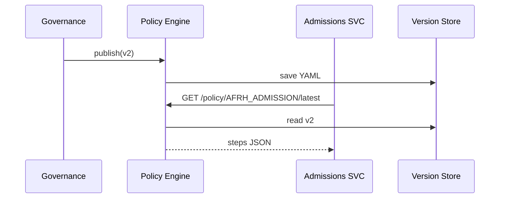

# Chapter 9: Policy/Process Engine  
*(a.k.a. “the rule factory”)*  

[← Back to Chapter 8: Microservices (HMS-SVC Family)](08_microservices__hms_svc_family__.md)

---

## 1. Why do we need a rule factory?

Mini-story: *The Armed Forces Retirement Home (AFRH) changes its admission rules*  

1. Congress updates a statute: applicants can now qualify with **20 years** of service (down from 30).  
2. AFRH must:
   • update the on-line form,  
   • reject fewer veterans,  
   • keep old logic handy in case Congress reverts the bill next month.  

Hard-coding the change inside a dozen micro-services would be a red-tape nightmare.  
**The Policy/Process Engine (PPE)** solves this by turning legal language into **versioned, executable workflows** that every service can consult at runtime.

Think of it as **an assembly line that converts new regulations into running code—while keeping older blueprints on the shelf**.

---

## 2. Key concepts (factory analogies)

| Term | Factory analogy | Beginner-friendly meaning |
|------|-----------------|---------------------------|
| Process Definition | Assembly blueprint | YAML/JSON file that lists every step (“collect DD-214”, “check service years”, …). |
| Version | Blueprint revision | A numbered snapshot (`v1`, `v2`, `v3`). |
| Conflict Resolver | QA inspector | Merges or flags clashes when two teams edit the same step. |
| Rollback Plan | Spare blueprint | Automatic switch back to the last good version. |
| Simulation | Test conveyor belt | Runs fake data through a draft to predict failures before go-live. |

---

## 3. Quick win: ship a new admission process in **3 files**

### 3.1 Draft the process (`afrh_admission_v2.yaml`) — 15 lines

```yaml
id: AFRH_ADMISSION
version: 2
steps:
  - id: collect-form
    action: form:afrh_application
  - id: check-service
    rule: applicant.service_years >= 20      # ← changed from 30
  - id: medical-review
    action: svc/medical#requestReview
  - id: final-signature
    action: human:hitl_officer
rollback: previous_version
```

Explanation  
• Plain YAML—no code required.  
• `rollback: previous_version` means “if v2 throws too many errors, flip back to v1”.

### 3.2 Register the file (Governance auto-imports)

```bash
curl -F "file=@afrh_admission_v2.yaml" \
     -H "Authorization: Bearer $TOKEN_HITL" \
     https://gov.hms.gov/policies/upload
```

The file lands in the [Governance Portal](05_governance_layer__hms_gov_portal_.md) queue.  
After a manager clicks **Accept**, PPE stores it as *v2*.

### 3.3 Query the engine from any service — 12 lines

```ts
// svc-admissions/src/check.ts
import axios from 'axios'

export async function admissionSteps(applicantId){
  const { data } = await axios.get(
    `/policy/AFRH_ADMISSION/latest`      // ① one URL, always up to date
  )
  return data.steps                      // → array with four step objects
}
```

① No hard-coding of version numbers; “latest” resolves to v2.

---

## 4. What happens under the hood?



Only five hops—no service re-deploy required.

---

## 5. A peek inside the engine (super-minimal code)

### 5.1 Route: fetch latest policy — 12 lines

```js
// ppe/routes/getLatest.js
import db from '../db.js'

export async function getLatest(req, res){
  const { id } = req.params           // “AFRH_ADMISSION”
  const doc  = await db.findOne({ id }, { sort:{version:-1} })
  if (!doc) return res.status(404).end()
  res.json(doc)                       // sends steps etc.
}
```

### 5.2 Auto-rollback guard — 18 lines

```js
// ppe/jobs/monitor.js
setInterval(async () => {
  const bad = await db.countErrors({ lastMin:5 })
  if (bad > 50){                                 // threshold
    const p = await db.current('AFRH_ADMISSION')
    if (p.rollback === 'previous_version'){
      const prev = await db.previous(p.id, p.version)
      await db.setCurrent(p.id, prev.version)
      bus.emit('policy.rolled_back', { id:p.id, to:prev.version })
    }
  }
}, 60_000)
```

Explanation  
• Every minute PPE checks error metrics (fed by Chapter 12).  
• If failures spike, it flips the “current” pointer back to v1 and broadcasts an event for dashboards.

---

## 6. Working with **simulations** before go-live

```bash
curl -X POST /policy/simulate \
  -d '{
        "policyId":"AFRH_ADMISSION",
        "draftVersion":2,
        "sampleDataUrl":"s3://afrh/testApplicants.csv"
      }'
# → { "result":"PASS", "errors":0 }
```

If `PASS`, Governance can enable “auto-accept” guardrails.

---

## 7. Tying into other HMS layers

* **Journey Engine** ([Chapter 2](02_intent_driven_navigation___ai_guided_journeys_.md)) reads the official step list to build user flows.  
* **AI Representative Agent** ([Chapter 3](03_ai_representative_agent__hms_a2a__.md)) proposes YAML patches like the one above.  
* **HITL Console** ([Chapter 4](04_human_in_the_loop__hitl__review_console_.md)) can pause or edit a live version.  
* **Microservices** ([Chapter 8](08_microservices__hms_svc_family__.md)) call `/policy/{id}/latest` rather than embedding logic.  
* Rollback and “policy.rolled_back” events travel on the upcoming [Event Bus / Service Mesh](10_event_bus___service_mesh_.md).

---

## 8. Hands-on exercise (10 min)

1. Clone the demo repo: `git clone https://github.com/hms-demo/ppe && cd ppe`.  
2. Start PPE + Version Store: `docker compose up`.  
3. Upload `afrh_admission_v2.yaml` using the curl command above.  
4. Call the endpoint:

```bash
curl http://localhost:7000/policy/AFRH_ADMISSION/latest | jq .version
# → 2
```

5. Simulate high error count:

```bash
curl -X POST http://localhost:7000/dev/fakeErrors?count=100
sleep 70
curl http://localhost:7000/policy/AFRH_ADMISSION/latest | jq .version
# → 1  (rollback happened!)
```

Watch the terminal—PPE logs `policy.rolled_back`.

---

## 9. Common questions

**Q: Where are versions stored?**  
Any key-value DB works. The demo uses Mongo; production often chooses PostgreSQL with row-level history.

**Q: Can two policies call each other?**  
Yes, via *sub-process* steps (`action: subprocess:OTHER_POLICY`). PPE resolves dependencies recursively.

**Q: How do I resolve merge conflicts?**  
The Governance Portal shows a side-by-side diff and forces a human decision; PPE never auto-merges conflicting edits.

**Q: Does every micro-service need PPE SDKs?**  
No—plain HTTPS is enough. SDKs just add caching.

---

## 10. Summary & what’s next

You now know how to:

✓ Describe a government workflow in plain YAML.  
✓ Publish, version, and (auto-)rollback rules without touching code.  
✓ Let every micro-service fetch the **latest process** at runtime.  
✓ Keep citizens safe: simulations + guardrails prevent bad releases.

In the next chapter we will move those *policy events* around the system in real time using a lightweight message backbone:  
[Chapter 10: Event Bus / Service Mesh](10_event_bus___service_mesh_.md)

---

Generated by [AI Codebase Knowledge Builder](https://github.com/The-Pocket/Tutorial-Codebase-Knowledge)