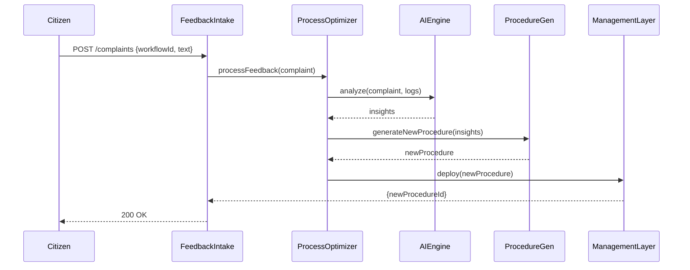

# Chapter 10: AI-Facilitated Process Optimization

In [Chapter 9: AI Representative Agent](09_ai_representative_agent_.md) we saw how our AI agent proposes improvements based on metrics. Now let’s close the loop: **user complaints** or feedback trigger **automatic AI analysis** that **generates improved procedures**—no human-in-the-middle required. Think of it as a feedback-driven traffic system that senses jams and retunes light timings on the fly.

---

## Why Do We Need AI-Facilitated Process Optimization?

Imagine a passport-renewal center where citizens often complain about long waits. Today, each complaint sits in an email inbox until an analyst reviews it. What if:

1. Every new complaint fired off an AI workflow  
2. The AI studied past complaint patterns and current process steps  
3. It automatically rewrote the renewal procedure—say, by running identity checks in parallel instead of serially  

Now the loop from **citizen input → AI optimization → updated workflow** is fully closed.

### Central Use Case: Passport Renewal Complaints

1. A citizen submits a “I waited 3 hours for my renewal” complaint.  
2. Our system ingests that complaint.  
3. AI analyzes last month’s renewal data + complaint text.  
4. AI suggests and applies a new procedure that splits document checks across two teams.  
5. Citizens see shorter waits immediately—no manual policy editing.

---

## Key Concepts

- **Feedback Intake**  
  A module that listens for new user complaints or feedback.  
- **AI Analysis Engine**  
  Reads complaints and process logs, detects bottlenecks or pain points.  
- **Procedure Generator**  
  Builds updated workflow definitions automatically.  
- **Auto-Deploy**  
  Swaps out the old procedure for the new one in real time.  
- **Monitoring Loop**  
  Tracks results of the updated procedure and repeats if needed.

---

## 1. How to Use This in Your Code

Here’s a simple script that runs the optimization whenever a new complaint arrives:

```js
// scripts/optimizeOnComplaint.js
import ProcessOptimizer from '../optimizer/ProcessOptimizer'

// Suppose complaint is an object { id, workflowId, text }
async function handleComplaint(complaint) {
  const result = await ProcessOptimizer.processFeedback(complaint)
  console.log('Updated workflow:', result.newProcedureId)
}

handleComplaint({
  id: 'c123',
  workflowId: 'passportRenewal',
  text: 'I waited too long for my ID check.'
})
```
*Explanation:*  
- `processFeedback()` takes a complaint, runs AI analysis, and returns the ID of the updated procedure.  
- You could wire `handleComplaint` to a message queue or HTTP webhook for real-time operation.

---

## 2. What Happens Step-by-Step?



1. **FeedbackIntake** receives the complaint.  
2. **ProcessOptimizer** orchestrates: Analysis → Generation → Deploy.  
3. **AIEngine** mines logs & text for root causes.  
4. **ProcedureGen** constructs a tweaked workflow.  
5. **ManagementLayer** (see [Chapter 2](02_management_layer_.md)) applies the new procedure.  
6. Citizen gets confirmation; next applicants follow the optimized flow.

---

## 3. Inside the Implementation

Below is a minimal, modular view of the key files under `optimizer/`.

### 3.1 optimizer/ProcessOptimizer.js

```js
import Analyzer from './aiEngine'
import Generator from './procedureGenerator'
import Deployer from './procedureDeployer'

export default {
  async processFeedback(complaint) {
    const insights = await Analyzer.analyze(complaint)
    const newProc = await Generator.create(insights)
    const procId = await Deployer.deploy(newProc)
    return { newProcedureId: procId }
  }
}
```
*Explanation:*  
- Coordinates three stages: analyze, generate, deploy.

### 3.2 optimizer/aiEngine.js

```js
// optimizer/aiEngine.js
export default {
  async analyze({ workflowId, text }) {
    // Stub: call an AI service or simple keyword logic
    return { workflowId, issues: ['parallelizeChecks'] }
  }
}
```
*Explanation:*  
- Returns a list of detected issues to fix, e.g. `"parallelizeChecks"`.

### 3.3 optimizer/procedureGenerator.js

```js
// optimizer/procedureGenerator.js
export default {
  async create({ workflowId, issues }) {
    // Load existing workflow definition
    const old = require(`../management/workflows/${workflowId}`)
    // Example tweak: if issue is parallelizeChecks, split that step
    if (issues.includes('parallelizeChecks')) {
      old.steps.splice(2, 1, [
        { name: 'idCheckA', handler: 'checkIDTeamA' },
        { name: 'idCheckB', handler: 'checkIDTeamB' }
      ])
    }
    return old
  }
}
```
*Explanation:*  
- Reads the JSON/JS workflow, adjusts steps, and returns the new definition.

### 3.4 optimizer/procedureDeployer.js

```js
// optimizer/procedureDeployer.js
import Management from '../management/ManagementLayer'

export default {
  async deploy(workflowDef) {
    // Replace the stored workflow
    await Management.updateWorkflow(workflowDef.id, workflowDef)
    return workflowDef.id
  }
}
```
*Explanation:*  
- Calls into [Management Layer](02_management_layer_.md) to overwrite the stored workflow.

---

## Conclusion

You’ve learned how **AI-Facilitated Process Optimization**:

- Listens to **real user feedback**  
- Runs **automated AI analysis** to spot process pain points  
- Generates and **deploys improved procedures** on the fly  

This closes the loop from citizen input to operational change—just like adjusting traffic lights to clear congestion in real time. Next up, we’ll add a final safety net so humans can review and approve these AI-driven changes in [Human-in-the-Loop (HITL) Oversight](11_human_in_the_loop__hitl__oversight_.md).

---

Generated by [AI Codebase Knowledge Builder](https://github.com/The-Pocket/Tutorial-Codebase-Knowledge)