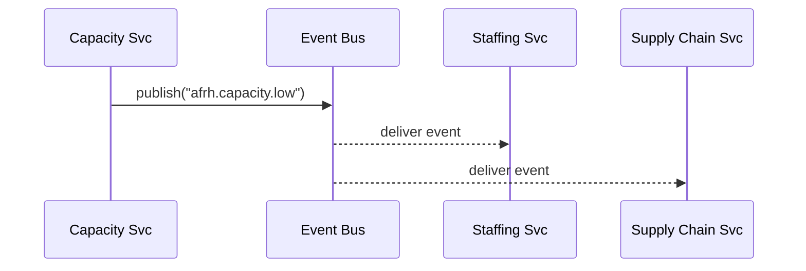

# Chapter 10: Event Bus / Service Mesh
[← Back to Chapter 9: Policy/Process Engine](09_policy_process_engine_.md)

---

> “Think of a city-wide subway that shuttles envelopes between every government office.  
> You drop a message in at one station—within seconds it pops out at the right desks, even if a few tunnels are closed for repair.”  

The **Event Bus / Service Mesh** is that subway.  
It gives our micro-services a **low-latency, fault-tolerant** way to talk without hard-coding URLs, retries, or time-outs in every file.

---

## 1. Why do we need this? – One concrete use-case

*Armed-Forces Retirement Home (AFRH) Capacity Spike*  

1. A heat-wave forces one dormitory to close beds.  
2. The **Capacity Service** emits  
   `event: "afrh.capacity.low"  data: {bedsFree: 4}`.  
3. Within 100 ms:  
   • **Staffing Service** schedules extra nurses.  
   • **Supply Chain Service** diverts meal shipments.  
   • **Journey Engine** (citizen portal) hides “apply today” buttons.  

No REST fan-out, no cron jobs—**one** event, automatic ripple.

---

## 2. Key Concepts (subway analogies)

| Term | Subway analogy | Beginner meaning |
|------|----------------|------------------|
| Event | Passenger | A tiny JSON envelope that describes *what happened*. |
| Topic / Channel | Train line (“Green line”) | Label that decides which envelopes ride together. |
| Publisher | Passenger entering station | Service that *fires* an event. |
| Subscriber | Passenger exiting station | Service that *reacts* to a topic. |
| Service Mesh | Subway map + traffic lights | Sidecar proxies that add retries, time-outs, and traces **without** code changes. |
| Circuit Breaker | Train bypass | Auto-detour when a subscriber is down. |

---

## 3. 90-second Quick-Start

We’ll wire three tiny services together using **NATS** (a lightweight, open-source event bus).  
All code blocks stay under 20 lines.

### 3.1 Publish an event  (capacity-svc/index.js)

```js
import { connect } from 'nats'

const nc = await connect({ servers: 'nats://bus:4222' })

export async function bedsFreed(count){
  await nc.publish('afrh.capacity.low',
    JSON.stringify({ bedsFree: count, ts: Date.now() })
  )
  console.log('🚨 Published low-capacity event')
}
```

Explanation  
• Connect once, then `publish(topic, data)`.  
• No knowledge of *who* will read it.

---

### 3.2 Subscribe: Staffing Service  (staff-svc/index.js)

```js
import { connect } from 'nats'
const nc = await connect({ servers:'nats://bus:4222' })

nc.subscribe('afrh.capacity.low', (msg) => {
  const { bedsFree } = JSON.parse(msg.data)
  console.log('🧑‍⚕️ Staffing up – extra nurses for', bedsFree, 'beds')
  // …call HR API here
})
```

### 3.3 Subscribe: Supply-Chain Service  (food-svc/index.js)

```js
import { connect } from 'nats'
const nc = await connect({ servers:'nats://bus:4222' })

nc.subscribe('afrh.capacity.low', (msg) => {
  const { bedsFree } = JSON.parse(msg.data)
  console.log('🍎 Diverting meals for', bedsFree, 'unused beds')
  // …update vendor order
})
```

Fire the publisher once → both subscribers react immediately.

---

## 4. What actually happens?  



*Services never know each other’s IPs—only the **topic name**.*

---

## 5. Under the Hood – Service Mesh magic

With a **mesh sidecar** (e.g., Istio or Linkerd) each container gets an invisible proxy:

```
┌────────────┐          ┌──────────┐
│ your code  │  ↔ HTTP ↔│  sidecar │ ↔ encrypted mTLS ↔ network
└────────────┘          └──────────┘
```

Benefits you get **without changing code**:

1. **Retries** – sidecar resends messages if the first try fails.  
2. **Circuit breakers** – after N failures, traffic is paused for that subscriber.  
3. **Tracing** – every hop is tagged so [Metrics & Observability](12_metrics___observability_pipeline_.md) can draw flame-graphs.  

### Minimal sidecar config (k8s YAML – 10 lines)

```yaml
apiVersion: v1
kind: Pod
metadata:
  annotations:
    proxy.istio.io/config: |
      outboundTrafficPolicy:
        mode: REGISTRY_ONLY
spec:
  containers:
  - name: capacity-svc     # ← your container
  - name: istio-proxy      # ← injected automatically
```

Deploy once; every outgoing event now enjoys mTLS + retries.

---

## 6. Internal Implementation – build-your-own (tiny demo)

Too small for Istio? Two files give you a **mini-bus** inside one Node process.

### 6.1 `bus.js` – 15 lines

```js
import EventEmitter from 'events'
export const bus = new EventEmitter()

export function publish(topic, data){
  bus.emit(topic, data)
}

export function subscribe(topic, fn){
  bus.on(topic, fn)
}
```

### 6.2 Usage

```js
import { publish, subscribe } from './bus.js'

subscribe('alert', (d)=>console.log('heard',d))
publish('alert', {msg:'hello'})
```

Great for unit tests or local demos before adding NATS/Kafka.

---

## 7. Government-flavored pattern library

| Pattern | Example |
|---------|---------|
| Audit Tap | Subscriber `compliance.trail` logs every event for [Compliance & Audit Trail](13_compliance___audit_trail_.md). |
| Fan-out | One `census.release.2024` topic wakes 10+ agencies (Commerce, Transportation…). |
| Saga | `payment.completed` → `permit.issue` → `notification.send` chain, each step an event. |

---

## 8. Best-practice cheat-sheet

* Use **verbs** in topic names (`benefit.approved`), not nouns.  
* Keep payloads small; large blobs go to Document Service + include a URL.  
* Mark events **idempotent** – re-processing should never double-charge.  
* Prefer **at-least-once** delivery; consumers de-dupe by `eventId`.  
* Log to the shared pipeline for replay & audits.

---

## 9. Hands-On Exercise (5 min)

1. Start demo stack:

```bash
docker compose up nats capacity-svc staff-svc food-svc
```

2. Emit an event:

```bash
docker exec capacity-svc node -e "import('./index.js').then(m=>m.bedsFreed(4))"
```

3. Watch logs—both other containers print their reactions within < 100 ms.  
4. Stop `food-svc` → emit again. Note: Staffing still works; bus stores + re-delivers when food-svc comes back.

---

## 10. Common Questions

**Q: Isn’t this the same as the Gateway?**  
No. The [Backend API Gateway](06_backend_api_gateway__hms_api___hms_mkt__.md) handles *request-reply* HTTP traffic.  
The **Event Bus** is *fire-and-forget* publish/subscribe.

**Q: Do I need Kafka for production?**  
Start with NATS (tiny, zero-ops). Upgrade to Kafka or Pulsar only if you need > 100 MB/s or durable replay for years.

**Q: How is security handled?**  
Sidecar proxies enforce mTLS; topics can be ACL-restricted by the same roles/scopes you saw in [IAM](07_identity___access_management__iam__.md).

---

## 11. Recap & Next Stop

Today you:

✓ Saw how one event fans out to many services in milliseconds.  
✓ Wrote < 20-line publish / subscribe samples.  
✓ Learned how a Service Mesh adds retries, mTLS, and tracing without code.  
✓ Practiced fault tolerance by killing a subscriber.

Next, we’ll zoom further out to the **core infrastructure** that keeps this mesh healthy across clusters:  
[Chapter 11: Core Infrastructure & Service Mesh (HMS-SYS)](11_core_infrastructure___service_mesh__hms_sys__.md)

---

Generated by [AI Codebase Knowledge Builder](https://github.com/The-Pocket/Tutorial-Codebase-Knowledge)