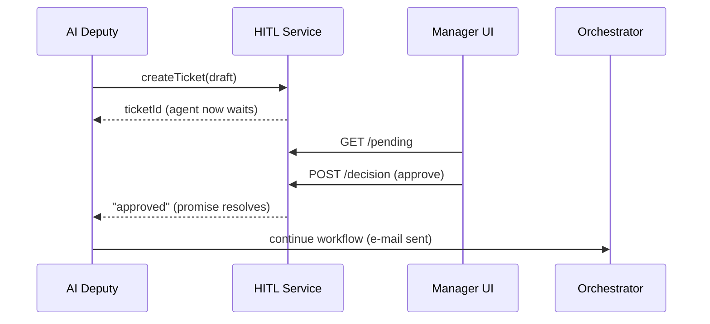

# Chapter 10: Human-in-the-Loop (HITL) Oversight  

*(continuing from [Chapter 9: AI Representative Agent Framework](09_ai_representative_agent_framework__hms_agt___hms_agx__.md))*  


## 1. Why Add a Human Check-Point?

Imagine an AI deputy at the **Securities and Exchange Commission (SEC)** that auto-drafts rule updates.  
One morning it proposes:

> “Decrease the quarterly filing deadline from 45 days to 20 days.”

Before that change hits the Federal Register, an SEC **Division Director** must glance at it, maybe tweak the wording, or hit *Reject* outright.  

**Human-in-the-Loop (HITL) Oversight** formalises this moment:

* The AI (or any workflow) **pauses** and creates an *approval ticket*.  
* A designated official reviews the ticket in a simple queue UI.  
* Their **Approve / Edit / Reject** decision is stored forever in an audit log.  
* Only after “Approve” does the system continue.

Result: we keep AI speed **and** human accountability.


## 2. Key Concepts (Plain-English Cheat-Sheet)

| Term                | Government Analogy (plain)                  | One-Sentence Meaning                                    |
|---------------------|---------------------------------------------|---------------------------------------------------------|
| Approval Ticket     | Routing slip on a memo                      | Record that needs a human sign-off.                     |
| Approver Role       | Division Director badge                     | IAM role allowed to decide on this ticket.              |
| Queue               | In-tray on a supervisor’s desk              | List of pending tickets ordered by time or priority.    |
| Decision            | Signed “APPROVED” stamp                     | Approver’s choice: `approve`, `edit`, or `reject`.      |
| Audit Trail         | Clerk writes in ledger                      | Immutable log of who decided what & when.               |
| Resume Hook         | Clerk yells “Next!” to staff                | Callback that un-blocks the workflow/agent.             |


## 3. 5-Minute “Hello Approval” Walk-Through

We will glue HITL onto the deputy built in Chapter 9.  
Goal: the deputy cannot e-mail a policy change until **Jessica Manager** clicks *Approve*.

### 3.1 Deputy Pauses and Creates a Ticket

`agentSkills/sendPolicyEmail.js`  (15 lines)

```js
import { createTicket } from '../hitl/sdk.js';

export async function sendPolicyEmail(draft) {
  // 1️⃣ ask for human approval
  const ticket = await createTicket({
    title: 'Send SEC Rule-Change Email',
    body: draft,
    approverRole: 'division_director'
  });

  // 2️⃣ wait for decision (promise resolves when approved)
  await ticket.wait();           // rejects if manager hits "Reject"

  // 3️⃣ actually send e-mail
  await smtpSend(draft);         // (implementation not shown)
}
```

Explanation  
1. `createTicket` stores the request in the HITL queue.  
2. The promise suspends the agent until a human acts.  
3. On approval, the e-mail goes out; on rejection an exception is thrown and the agent stops.


### 3.2 Very Tiny Manager UI (Vue, 19 lines)

*Real projects use HMS-MFE components; here’s a toy version.*

```vue
<script setup>
import { ref, onMounted } from 'vue'
const tickets = ref([])

async function load()  { tickets.value = await fetch('/api/hitl/pending').then(r=>r.json()) }
async function decide(id, ok) {
  await fetch(`/api/hitl/${id}/decision`, {method:'POST',body:JSON.stringify({ok})})
  load()           // refresh list
}
onMounted(load)
</script>

<template>
  <h2>Pending Approvals</h2>
  <div v-for="t in tickets" :key="t.id" class="ticket">
    <h3>{{t.title}}</h3>
    <pre>{{t.body}}</pre>
    <button @click="decide(t.id,true)">Approve</button>
    <button @click="decide(t.id,false)">Reject</button>
  </div>
</template>
```

What happens?  
* The page fetches `/api/hitl/pending` (only tickets Jessica’s IAM role can see).  
* Clicking a button calls the decision endpoint.  
* The agent waiting on that ticket instantly resumes or aborts.


## 4. What Happens Under the Hood?




## 5. Inside the HITL Service

### 5.1 Data Model (single JSON row)

```json
{
  "id": "TCK-sec-2024-17",
  "title": "Send SEC Rule-Change Email",
  "body": "<draft text>",
  "approverRole": "division_director",
  "status": "PENDING",
  "created": "2024-04-18T14:10Z"
}
```

Stored in Redis, Postgres, or any queue DB.


### 5.2 REST Endpoints (all < 15 lines)

`routes/hitl.js`

```js
import express from 'express';
const r = express.Router(), db = new Map(); // ⭐ demo in-mem store

r.get('/pending', (req,res)=>{
  const role = req.user.role;                 // IAM injects this
  res.json([...db.values()].filter(t=>t.status==='PENDING' && t.approverRole===role))
});

r.post('/:id/decision', (req,res)=>{
  const t = db.get(req.params.id);
  t.status = req.body.ok ? 'APPROVED' : 'REJECTED';
  resolveWaiter(t.id, t.status);              // wakes sleeping agent
  audit(t, req.user.sub, t.status);           // HMS-OPS
  res.sendStatus(204);
});

export default r;
```

Explanation  
* `db` is an in-memory map for brevity.  
* `resolveWaiter` is a tiny helper that resolves the promise from `createTicket`.  
* `audit` writes to [Monitoring & Metrics (HMS-OPS)](15_monitoring___metrics__hms_ops__.md).


### 5.3 Helper in the Agent SDK

`sdk.js`  (13 lines)

```js
const waiters = new Map()
export async function createTicket(meta) {
  const res = await fetch('/api/hitl', {method:'POST',body:JSON.stringify(meta)})
  const { id } = await res.json()

  return {
    wait: ()=> new Promise((ok, err)=>{
      waiters.set(id, status=>{
        status==='APPROVED' ? ok() : err(new Error('Rejected'))
      })
    })
  }
}
export function resolveWaiter(id, status){ waiters.get(id)?.(status) }
```

The agent gets an easy `.wait()` abstraction; the service resolves it when a human decides.


## 6. HITL’s Friends in the HMS Family

| HITL Touch-Point | Interaction |
|------------------|-------------|
| IAM | Ensures only authorized roles can view / approve tickets. |
| ESQ | Scans ticket **body** so no PII leaks to approvers by mistake. |
| ACT | Workflows insert `pause: true` steps that map to HITL tickets. |
| AGT | Agents call `createTicket` when hitting the `hitl.when` rule set in YAML. |
| OPS | Every decision is logged for FOIA or Inspector-General audits. |


## 7. Frequently Asked Beginner Questions

**Q: What if no one acts on a ticket?**  
A: Set `expiryMinutes` when creating the ticket. After that time, the ticket auto-rejects or escalates to a higher role.

**Q: Can approvers *edit* the draft?**  
A: Yes. Add a `PATCH /hitl/:id/body` route. The agent reads the edited body when it resumes.

**Q: Does HITL slow agents down?**  
A: Only on steps marked `pause:true`. Routine, low-risk actions still run instantly.

**Q: Can multiple approvers be required?**  
A: Absolutely. Store `required=2` in the ticket; resolve the promise only after two distinct IAM IDs click *Approve*.


## 8. Recap & What’s Next

You learned how **HITL Oversight**:

• Lets AI **pause** at sensitive moments.  
• Presents a simple **queue UI** to human officials.  
• Records immutable decisions for audits.  
• Fits neatly with IAM, ESQ, AGT, and ACT layers.

Next we will standardise *what context* agents see so humans and machines stay on the same page—enter the **Model Context Protocol (HMS-MCP)**.

👉 Continue to [Model Context Protocol (HMS-MCP)](11_model_context_protocol__hms_mcp__.md)

---

Generated by [AI Codebase Knowledge Builder](https://github.com/The-Pocket/Tutorial-Codebase-Knowledge)