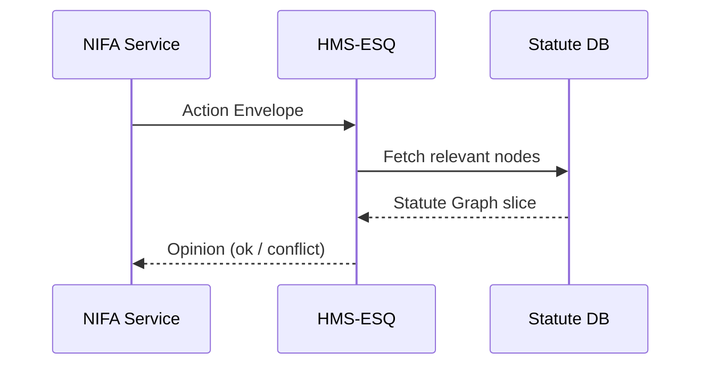

# Chapter 11: Compliance & Legal Reasoner (HMS-ESQ)

[← Back to Chapter&nbsp;10: Model Context Protocol (HMS-MCP)](10_model_context_protocol__hms_mcp__.md)

---

## 0. Why Do We Need a Tireless Digital Lawyer?

### A real-world story  

The **National Institute of Food and Agriculture (NIFA)** wants to auto-approve mini-grants for 4-H robotics clubs.  
An agent submits this MCP envelope:

```
directive: INVOKE
tool: disburse-funds
args:
  amount: 1500
  account: "4H-Robotics"
```

Question:  
• Is there actually **statutory authority** for NIFA to spend $1,500 on robotics?  
• Does an **executive order** cap the amount at $1,000?  
• Did Congress restrict these grants to rural counties only?

Humans would dig through the **Code of Federal Regulations (CFR)**, recent **OMB guidance**, and the latest **appropriations law**—hours of work!

**HMS-ESQ** does it in milliseconds, right inside the request path, and returns an answer the agent can act on (or not).

---

## 1. Beginner-Friendly Breakdown

| Concept                | Friendly Analogy                          | One-sentence meaning |
|------------------------|-------------------------------------------|----------------------|
| Statute Graph          | Giant legal family tree                   | Nodes = laws, regs, memos; edges = “overrides”, “depends-on”. |
| Action Envelope        | A form you slide under a lawyer’s door    | JSON that says “I intend to do X with authority Y.” |
| Authority Token        | Lawyer’s highlighted citation             | e.g., “7 U.S.C. §3318(b)(2)”. |
| Conflict Flag          | Red sticky note                           | Signals a mismatch (over budget, wrong program, etc.). |
| ESQ SDK                | Lawyer on speed dial                      | Tiny library agents/services call: `esq.check(envelope)` |

---

## 2. Your First Compliance Check in 14 Lines

```js
// nifaGrant.js
import { esq } from '@hms/esq-sdk'

export async function payGrant(req) {
  const envelope = {
    actor:  'NIFA-Rep',
    intent: 'DISBURSE_FUNDS',
    amount: 1500,
    program:'4H-Robotics'
  }

  const opinion = await esq.check(envelope)   // 1️⃣

  if (!opinion.ok)               // 2️⃣
    throw new Error(opinion.note)             // "Exceeds $1k cap in EO 14008"

  // 3️⃣ safe to proceed
  await achRequest(envelope)                 // see Chapter 5
}
```

Explanation  
1. `esq.check` sends the envelope to HMS-ESQ.  
2. If a **Conflict Flag** appears, we stop and surface the note.  
3. Otherwise we carry on with the payment.

---

### Sample `opinion` Object

```json
{
  "ok": false,
  "note": "Exceeds $1,000 limit set by Executive Order 14008 §5(a)(1).",
  "citations": [
    "7 U.S.C. §3318(b)(2)",
    "EO 14008 §5(a)(1)"
  ]
}
```

---

## 3. What Happens Behind the Curtain?



1. ESQ receives the envelope.  
2. Looks up linked statutes, EOs, OMB memos.  
3. Runs lightweight rule reasoning (budget limit, program scope).  
4. Returns a concise legal opinion.

---

## 4. Peek at the Code (Friendly & Short)

### 4.1 The `check` Endpoint (18 lines)

```js
// api/check.js
import { graph, rules } from '../lib/engine.js'

export async function check(req, res) {
  const env = req.body                 // the action envelope
  const slice = await graph.fetch(env) // statutes touching this program

  const result = rules.evaluate(env, slice) // returns {ok, note, citations}

  await graph.audit(env, result)       // write to HMS-DTA
  res.json(result)
}
```

Key takeaways  
* **graph.fetch** returns only ~100 nodes, so it’s fast.  
* **rules.evaluate** is a pluggable set of JavaScript functions (“budgetCap”, “geoScope”).  
* Every call is **audited** to [HMS-DTA](06_data___telemetry_hub__hms_dta__.md).

### 4.2 A Mini Rule (10 lines)

```js
// rules/budgetCap.js
export default function budgetCap(env, slice) {
  const capNode = slice.find(n => n.tag === 'CAP_AMOUNT')
  if (!capNode) return { ok: true }

  const cap = capNode.value              // e.g., 1000
  return env.amount <= cap
    ? { ok: true }
    : { ok: false,
        note: `Exceeds $${cap} cap in ${capNode.cite}`,
        citations: [capNode.cite] }
}
```

Beginners’ notes  
* Each rule returns the same simple shape.  
* Adding a rule is just a new file and a line in `rules/index.js`.

---

## 5. How to Authorize a New Program in 3 Steps

1. **Add nodes** to the statute graph:

```yaml
# cfg/statutes/4h_robotics.yaml
- id: usc_3318_b_2
  cite: "7 U.S.C. §3318(b)(2)"
  tag: AUTHORITY
  text: "…cooperative agreements for youth programs…"

- id: eo_14008_5_a_1
  cite: "EO 14008 §5(a)(1)"
  tag: CAP_AMOUNT
  value: 1000
```

2. **Link** them:

```yaml
links:
  - from: usc_3318_b_2
    to: eo_14008_5_a_1
    type: MODIFIES
```

3. **Reload**:

```bash
$ hms-esq reload
Graph: 2 nodes, 1 edge loaded. ✔
```

No service restarts, no code changes.

---

## 6. Common “Uh-oh” Moments & Fast Fixes

| Symptom                               | Likely Cause | Quick Fix |
|---------------------------------------|--------------|-----------|
| `Error: Unknown program`              | Statute node missing | Add `AUTHORITY` node & reload. |
| Opinion always `ok` even when wrong   | Rule not registered | Verify it’s exported in `rules/index.js`. |
| Performance spike (>500 ms)           | Massive graph fetch | Add `scope` field to envelope to narrow search. |
| Duplicate citations in output         | Two rules returning same `cite` | Dedup in `rules.evaluate` or merge rules. |

---

## 7. Where HMS-ESQ Fits in the Big Picture

```
 Agents / Services
         ↓
    HMS-ESQ  ← (legal opinion)
         ↓
  HMS-DTA (audit)
         ↓
  HMS-OPS (latency metrics)
```

Every potentially **binding** action routes through HMS-ESQ before money moves (HMS-ACH), data publishes (HMS-DTA), or policies deploy (HMS-ACT).

---

## 8. Recap & Next Steps

You learned:

* Why a **digital Office of General Counsel** saves hours and prevents compliance nightmares.  
* The core pieces—Statute Graph, Action Envelope, Authority Token, Conflict Flag.  
* How to call `esq.check()` in <15 lines and interpret the opinion.  
* How HMS-ESQ ties into the wider stack, auditing every decision.

Our legal guardrails are now automatic.  
Next we’ll see how the entire platform can *codify* democratic input and publish transparent rulebooks in real time:  
[Chapter 12: Codified Democracy Engine (HMS-CDF)](12_codified_democracy_engine__hms_cdf__.md)

---

Generated by [AI Codebase Knowledge Builder](https://github.com/The-Pocket/Tutorial-Codebase-Knowledge)