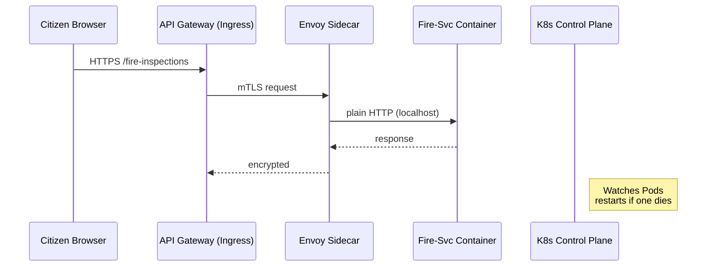

# Chapter 11: Core Infrastructure & Service Mesh (HMS-SYS)

[← Back to Chapter 10: Event Bus / Service Mesh](10_event_bus___service_mesh_.md)

---

> “Plumbing, wiring, and sprinkler pipes.”  
> HMS-SYS is the invisible utility room that keeps every kiosk, policy engine, and micro-service powered, cooled, and talking—no matter how many citizens click “Submit” at the same time.

---

## 1. Why do we need an invisible janitor?

### Real-world tale: The USPTO “Mega Monday”

1. Congress halves trademark fees for one week.  
2. Filings jump from **20 000 to 240 000 per hour**.  
3. Without elastic servers, the Fire-Inspection module (totally unrelated!) would crash because it competes for the same CPUs and network ports.

HMS-SYS steps in to:

* Spin up **dozens of extra Pods** in seconds.  
* Route every request through **zero-trust sidecars** so a spike in one agency never leaks data from another.  
* Auto-heal dead containers before any human notices.

---

## 2. Key Concepts (building-maintenance analogies)

| HMS-SYS Term | Building Analogy | One-liner |
|--------------|-----------------|-----------|
| Kubernetes Cluster | Utility basement | Group of machines that run all services. |
| Pod | Utility closet | The smallest deployable unit (one app + helpers). |
| Service | Address directory | Stable name (`fire-svc.default.svc`) that always points to healthy Pods. |
| Sidecar Proxy | Surge protector | Sits next to the app; adds mTLS, retries, and metrics. |
| Horizontal Pod Autoscaler (HPA) | Extra water pumps | Adds more Pods when load rises. |
| Network Policy | Locked door | Denies traffic unless explicitly allowed. |

---

## 3. 60-Second Win: Deploy a Fire-Inspection Service with Auto-mTLS

### 3.1 One tiny Deployment (18 lines)

```yaml
# fire-svc-deploy.yaml
apiVersion: apps/v1
kind: Deployment
metadata: { name: fire-svc }
spec:
  replicas: 2
  selector: { matchLabels: { app: fire-svc } }
  template:
    metadata: { labels: { app: fire-svc } }
    spec:
      containers:
        - name: api
          image: hms/fire-svc:1.0
          ports: [{ containerPort: 8080 }]
      # ① label triggers sidecar injection
      annotations:
        sidecar.istio.io/inject: "true"
```

Explanation  
① With one annotation Kubernetes automatically injects an **Envoy** sidecar that encrypts every packet.

### 3.2 Service object (8 lines)

```yaml
apiVersion: v1
kind: Service
metadata: { name: fire-svc }
spec:
  selector: { app: fire-svc }
  ports: [{ port: 80, targetPort: 8080 }]
```

Apply both files:

```bash
kubectl apply -f fire-svc-deploy.yaml -f fire-svc-svc.yaml
```

### 3.3 Test from *any* Pod

```bash
curl http://fire-svc.default.svc/ping
# → { "ok": true }
```

No IPs, no secrets—the **cluster DNS** finds the right Pod.

---

## 4. What happens under the hood?



---

## 5. Auto-Scaling & Healing

### 5.1 Horizontal Pod Autoscaler (8 lines)

```yaml
apiVersion: autoscaling/v2
kind: HorizontalPodAutoscaler
metadata: { name: fire-svc-hpa }
spec:
  scaleTargetRef: { apiVersion: apps/v1, kind: Deployment, name: fire-svc }
  minReplicas: 2
  maxReplicas: 20
  metrics: [{ type: Resource, resource: { name: cpu, target: { type: Utilization, averageUtilization: 70 }}}]
```

Kubernetes now adds Pods when CPU > 70 %.

### 5.2 Self-heal demo

```bash
kubectl delete pod -l app=fire-svc     # kill them all
watch kubectl get pods                 # new ones appear in seconds
```

---

## 6. Zero-Trust Networking

### 6.1 Deny‐all, then allow Gateway-only (12 lines)

```yaml
apiVersion: networking.k8s.io/v1
kind: NetworkPolicy
metadata: { name: fire-svc-only-from-gw }
spec:
  podSelector: { matchLabels: { app: fire-svc } }
  policyTypes: ["Ingress"]
  ingress:
    - from:
        - podSelector: { matchLabels: { app: hms-gateway } }
```

Result: even if a rogue container shows up, it **cannot** reach Fire-Svc.

---

## 7. Where HMS-SYS fits with other layers

* **Gateway** (Chapter 6) runs as an **Ingress Controller Pod** inside HMS-SYS.  
* **Event Bus** sidecars (Chapter 10) piggy-back on the same mTLS mesh.  
* **Metrics & Observability Pipeline** (next chapter) scrapes every sidecar for free request counts.  
* **Deployment & Rollback Orchestrator** (Chapter 15) simply pushes new container tags; the cluster handles the rollout.

---

## 8. Hands-On Drill (5 min)

```bash
# 1. Spin up a local kind (Kubernetes-in-Docker) cluster
kind create cluster

# 2. Apply demo manifests
kubectl apply -f k8s/demo/

# 3. Hammer the endpoint
hey -n 1000 -c 50 http://localhost/fire-inspections

# 4. Watch auto-scaling
watch kubectl get hpa,po
```

You’ll see replicas jump from 2 → 8, then back when the load ends.

---

## 9. Common Questions

| Q | A |
|---|---|
| Do I have to learn all of Kubernetes to contribute? | No. Most teams touch only the YAML above; the **Deployment & Rollback Orchestrator** wraps it in friendly commands. |
| What if the whole node dies? | The cluster scheduler reschedules Pods on a healthy node automatically. |
| How do stateful databases fit? | Each DB runs in its own **StatefulSet** with persistent volumes; still behind sidecars for encryption. |
| Can I run this on-prem? | Yes—any CNCF-compatible Kubernetes (EKS, AKS, OpenShift, bare-metal) works; manifests stay identical. |

---

## 10. Recap & Next Steps

You learned how HMS-SYS:

✓ Launches containers, injects sidecars, and encrypts every hop.  
✓ Scales to meet sudden spikes (like “Mega Monday”).  
✓ Self-heals and blocks unwanted traffic with one YAML line.

Next we’ll make those sidecars **speak**: collecting logs, metrics, and traces so teams can spot issues before citizens do.

[Continue to Chapter 12: Metrics & Observability Pipeline](12_metrics___observability_pipeline_.md)

---

Generated by [AI Codebase Knowledge Builder](https://github.com/The-Pocket/Tutorial-Codebase-Knowledge)