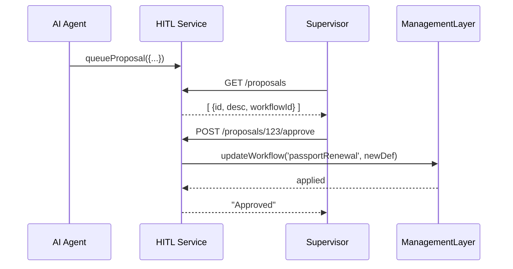

# Chapter 11: Human-in-the-Loop (HITL) Oversight

In the previous chapter we saw how AI can _automatically_ optimize workflows in [AI-Facilitated Process Optimization](10_ai_facilitated_process_optimization_.md). Now, before any changes go live, we’ll add a **Human-in-the-Loop (HITL) Oversight** layer so real people can review and approve AI proposals. It’s like a mayor signing off on a planning commission’s recommendations—ensuring accountability and policy alignment.

## Why Do We Need HITL Oversight?

AI can suggest great improvements, but sometimes we need a human check to:

- Catch unintended side effects  
- Ensure proposals align with legal or ethical guidelines  
- Provide a final stamp of accountability  

**Central Use Case**  
Our AI agent just generated a new version of the `passportRenewal` workflow that splits ID checks across two teams. Before replacing the old procedure, a supervisor should review the proposal:

1. AI enqueues a “split ID check” proposal.  
2. Supervisor logs into a small dashboard.  
3. They read the description and view diff of steps.  
4. They click **Approve** or **Reject**.  
5. If approved, the new workflow deploys via the [Management Layer](02_management_layer_.md).

---

## Key Concepts

1. **Proposal**  
   A suggested workflow change (ID, description, payload).  
2. **Proposal Store**  
   A queue or database holding pending proposals.  
3. **Reviewer Dashboard**  
   UI or API where humans list and review proposals.  
4. **Approve/Reject Endpoints**  
   Simple HTTP calls that record decisions.  
5. **Integration**  
   On **approve**, we call `ManagementLayer.updateWorkflow(...)` to apply.

---

## 1. Queuing a Proposal

When the AI agent finishes a suggestion, it calls into our HITL service:

```js
// hitl/HITLOversight.js
import ProposalStore from './ProposalStore'

export async function queueProposal(proposal) {
  // proposal: { id, workflowId, description, newDefinition }
  await ProposalStore.add(proposal)
}
```
Explanation:  
- `queueProposal()` takes a proposal object and saves it for review.

---

## 2. Reviewing & Approving via API

We expose two simple endpoints: list proposals and approve one.

```js
// hitl/routes/hitlRoutes.js
const router = require('express').Router()
const Store  = require('../hitl/ProposalStore')
const ML     = require('../management/ManagementLayer')

// List pending proposals
router.get('/proposals', (req, res) =>
  res.json(Store.getAll())
)

// Approve a proposal
router.post('/proposals/:id/approve', async (req, res) => {
  const p = Store.find(req.params.id)
  if (!p) return res.status(404).send('Not found')
  await ML.updateWorkflow(p.workflowId, p.newDefinition)
  Store.remove(p.id)
  res.send('Approved')
})

module.exports = router
```
Explanation:  
- `GET /proposals` returns all queued proposals.  
- `POST /proposals/:id/approve` applies the change via the [Management Layer](02_management_layer_.md) and removes it from the queue.

---

## 3. What Happens Step-by-Step?



1. **AI Agent** sends a proposal to **HITL Service**.  
2. **Supervisor** fetches pending proposals.  
3. They approve one via HTTP call.  
4. **HITL Service** calls **Management Layer** to swap in the new workflow.  

---

## 4. Internal Implementation Details

### 4.1 ProposalStore (Minimal In-Memory)

```js
// hitl/ProposalStore.js
const proposals = []

module.exports = {
  add(p)      { proposals.push(p) },
  getAll()    { return proposals },
  find(id)   { return proposals.find(p => p.id === id) },
  remove(id)  {
    const i = proposals.findIndex(p => p.id===id)
    if (i>=0) proposals.splice(i,1)
  }
}
```
Explanation:  
- A simple array holds proposals in memory. In prod, use a database.

### 4.2 Wiring the Routes

```js
// hitl/app.js
const express = require('express')
const app     = express()
app.use(express.json())
app.use('/hitl', require('./routes/hitlRoutes'))
app.listen(4000, () =>
  console.log('HITL Service on port 4000')
)
```
Explanation:  
- The HITL service listens on port 4000 under `/hitl`.

---

## Conclusion

In this chapter you learned how to:

- Queue AI-generated proposals for human review  
- Expose simple **list** and **approve** APIs  
- Integrate approvals with the [Management Layer](02_management_layer_.md)  
- Ensure accountability by having a human sign off on AI changes  

With **HITL Oversight**, AI-driven optimizations gain a reliable safety net. This wraps up our core tutorial—thanks for following along!

---

Generated by [AI Codebase Knowledge Builder](https://github.com/The-Pocket/Tutorial-Codebase-Knowledge)