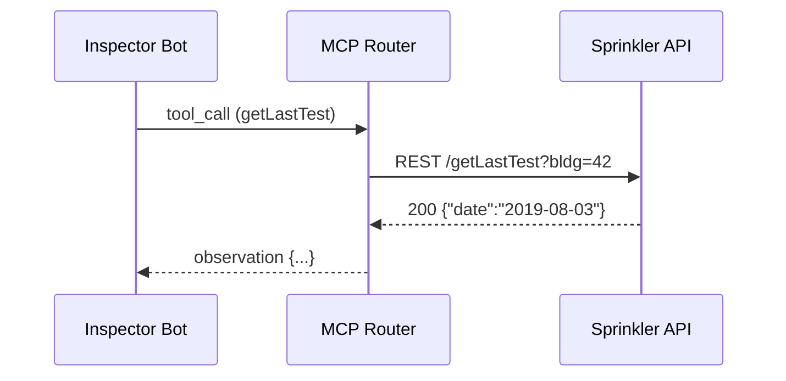

# Chapter 11: Model Context Protocol (HMS-MCP)

*(continuing from [Human-in-the-Loop (HITL) Oversight](10_human_in_the_loop__hitl__oversight_.md))*  

---

## 1. Why Do We Need a “Cockpit Language”?

Imagine the **U.S. Fire Administration (USFA)** runs two AI deputies:

* **Inspector Bot** → asks a building-inspection database for the last sprinkler test date.  
* **Reporter Bot**  → drafts a citizen-facing safety notice.

Both deputies are built by different vendors, yet they must:

1. Share results (`"sprinklerTest":"2019-08-03"`).  
2. Keep an audit trail of *who* said *what* and *why*.  
3. Pass HITL or ESQ checks without re-implementing bespoke parsers.

Without a **common language** you get garbled messages and broken guardrails.  
**Model Context Protocol (HMS-MCP)** is that language—think of it as **ICAO English for AI agents**:

```
🛫 Agent → “REQUEST /sprinklerTest”
🛬 Tool  → “OBSERVATION {"sprinklerTest":"2019-08-03"}”
🔄 Agent → “THOUGHT Let's send a notice.”
```

Because every vendor speaks MCP, HMS can mix-and-match agents, reuse tools, and centrally audit every turn.

---

## 2. Key Concepts (Plain-English Cheat-Sheet)

| MCP Term | Air-traffic Analogy | 1-Sentence Meaning |
|-----------|--------------------|--------------------|
| Turn      | One radio exchange | A pair *(agent message ↔ tool/LLM response)*. |
| Role      | Pilot / Tower      | `agent`, `tool`, `observer`, or `system`. |
| Content   | Radio words        | Natural language or JSON payload. |
| Envelope  | Radio channel      | JSON wrapper: `{role, type, content, timestamp}`. |
| Type      | “Request / Reply”  | `prompt`, `tool_call`, `observation`, `final`… |

Keep these five in mind—the rest is just filling the envelope.

---

## 3. 5-Minute “Hello MCP” Walk-Through

Goal: Inspector Bot asks a **Sprinkler API** for test dates and hands the answer to Reporter Bot—all in plain MCP messages.

### 3.1 The Message Objects (≤ 20 lines each)

```js
// 1️⃣ Agent asks for data
const m1 = {
  role: 'agent',
  type: 'prompt',
  content: 'Fetch last sprinkler test for building 42.',
  timestamp: Date.now()
};

// 2️⃣ Tool call constructed by runtime
const m2 = {
  role: 'agent',
  type: 'tool_call',
  content: {tool:'SprinklerAPI', op:'getLastTest', args:{bldgId:42}},
  timestamp: Date.now()
};

// 3️⃣ Tool responds
const m3 = {
  role: 'tool',
  type: 'observation',
  content: {sprinklerTest:'2019-08-03'},
  timestamp: Date.now()
};
```

### 3.2 Stitching the Turns

```js
import { sendToLLM } from './llm.js';
const context = [m1, m2, m3];        // 📨 full “black-box” history
const reportDraft = await sendToLLM(context);   // LLM sees structured turns
```

What happened?  
1. **Inspector Bot** built `m1` & `m2`.  
2. **SprinklerAPI** returned `m3`.  
3. The whole context went to GPT-4 (or any LLM) with **zero vendor-specific glue**.

---

## 4. What Occurs Behind the Curtain?



1. The **Router** sees `type:"tool_call"` and knows to hit the listed tool.  
2. The observation is re-wrapped into an MCP envelope and returned.  
3. Everything is logged once for audits.

---

## 5. Anatomy of the Envelope (1 Slide)

```json
{
  "role"      : "tool",
  "type"      : "observation",
  "content"   : { "sprinklerTest": "2019-08-03" },
  "turnId"    : "turn-7e61",
  "conversationId": "conv-0c9a",
  "timestamp" : "2024-04-18T15:02:11Z",
  "signature" : "ed25519:..."          // optional, enables tamper check
}
```

*Every* attribute has a purpose:

* `conversationId` – lets [Monitoring & Metrics](15_monitoring___metrics__hms_ops__.md) stitch logs together.  
* `turnId` – unique row for quick database writes.  
* `signature` – vendor can cryptographically sign content; auditors verify later.

---

## 6. Quick Start: `@hms/mcp-js` Helper

Install once:

```bash
npm i @hms/mcp-js
```

### 6.1 Build Messages in 3 Lines

```js
import { prompt, toolCall, observation } from '@hms/mcp-js';

const ask   = prompt('agent', 'Fetch last sprinkler test.');
const call  = toolCall('SprinklerAPI', 'getLastTest', {bldgId:42});
const reply = observation({sprinklerTest:'2019-08-03'});
```

### 6.2 Ship to Any LLM

```js
import { chat } from '@hms/mcp-js/openai';

const answer = await chat([ask, call, reply], {model:'gpt-4o'});
```

The helper converts MCP envelopes into the OpenAI JSON schema **and back**—no more bespoke adapters.

---

## 7. Under-the-Hood Implementation (Gentle Peek)

### 7.1 Router Skeleton (14 lines)

`router/index.js`

```js
export async function route(msg) {
  switch (msg.type) {
    case 'tool_call':
      const tool = tools[msg.content.tool];
      const result = await tool(msg.content.args);
      return envelope('tool','observation',result);
    case 'prompt':
      return envelope('system','ack','Received');     // e.g., logging only
    default:
      throw Error('Unknown type');
  }
}

function envelope(role, type, content){
  return {role, type, content, timestamp:Date.now()}
}
```

1. **Detects** message type.  
2. **Executes** the right helper (`tool`).  
3. **Wraps** the reply back into MCP.

### 7.2 Tool Registry (9 lines)

`router/tools/index.js`

```js
import { getLastTest } from './sprinkler.js';

export const tools = {
  SprinklerAPI: async ({ bldgId }) => getLastTest(bldgId)
};
```

Adding a new tool is just one more function.

---

## 8. Where MCP Touches Other HMS Layers

| Layer | Interaction |
|-------|-------------|
| [AGT](09_ai_representative_agent_framework__hms_agt___hms_agx__.md) | Agents **produce/consume** MCP envelopes instead of raw strings. |
| [HITL](10_human_in_the_loop__hitl__oversight_.md) | Tickets embed the *exact* MCP turn that needs approval. |
| [ESQ](05_security__privacy___legal_guardrails__hms_esq___platform_controls__.md) | Scans `content` fields—uniform JSON = simpler rules. |
| [CDF](08_policy___legislative_engine__hms_cdf__.md) | Reads `prompt` turns to spot proposals that touch legislation. |
| [OPS](15_monitoring___metrics__hms_ops__.md) | Stores envelope metadata without deep-parsing vendor formats. |

---

## 9. Frequently Asked Beginner Questions

**Q: Is MCP only for LLM chat?**  
A: No. Any stateful model (vision, speech) can wrap its inputs/outputs in the same envelope—making multimodal audits trivial.

**Q: My tool already returns XML—do I need to change it?**  
A: The tool can stay untouched; the router just places XML in the `content` field. Guardrails will still see a uniform wrapper.

**Q: How big can `content` be?**  
A: Up to 2 MB by policy (larger blobs should be stored in [HMS-DTA](06_data_repository___governance__hms_dta__.md) and referenced by ID).

**Q: Does MCP add latency?**  
A: Enveloping is pure JSON serialization—<< 1 ms per turn.

---

## 10. Recap

You now know that **Model Context Protocol**:

* Defines a single, vendor-neutral **envelope** for every agent or tool message.  
* Lets the platform route, guard, and audit AI traffic **without guessing formats**.  
* Powers smooth cooperation between Inspector Bot, Reporter Bot, and any future deputy.

Next we’ll zoom out from single-agency chat to **cross-agency** information exchange—welcome to the **Inter-Agency Protocol Layer (HMS-A2A)**.

👉 Continue to [Inter-Agency Protocol Layer (HMS-A2A)](12_inter_agency_protocol_layer__hms_a2a__.md)

---

Generated by [AI Codebase Knowledge Builder](https://github.com/The-Pocket/Tutorial-Codebase-Knowledge)