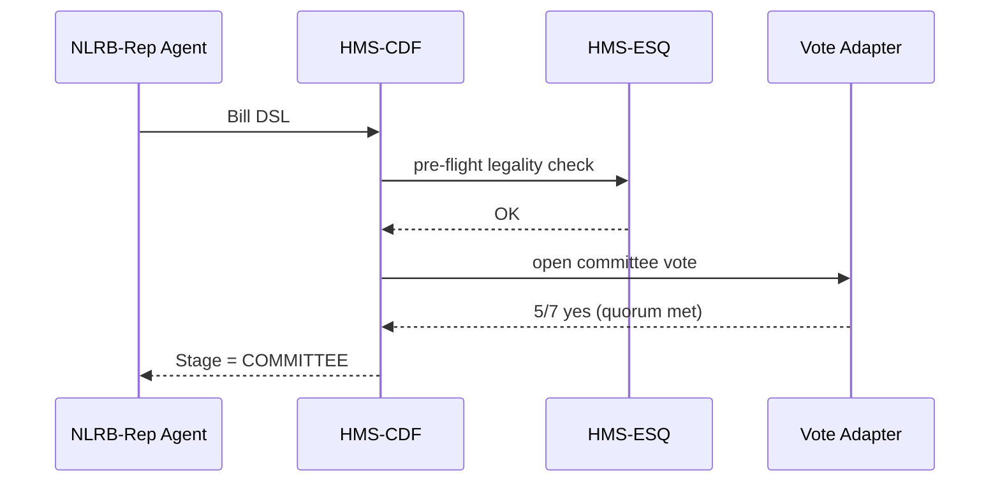

# Chapter 12: Codified Democracy Engine (HMS-CDF)

*[← Back to Chapter 11: Compliance & Legal Reasoner (HMS-ESQ)](11_compliance___legal_reasoner__hms_esq__.md)*  

---

## 0. Why Do We Need a “Democracy Engine” for Software?

Picture this true-to-life scene:

> An AI agent inside the **National Labor Relations Board (NLRB)** drafts a rule that raises the minimum back-pay for unfair-labor-practice cases from **\$50,000** to **\$75,000**.  
>   
> Citizens, unions, and employers all deserve to know **exactly** how this proposal travels from idea → law, and that it is *identical* to the path a human-written bill would take.

Without a codified workflow we risk:

* “Shadow regulations” written by code that bypass public scrutiny.  
* Auditors unable to reconstruct who changed what, when.  
* Lawsuits claiming unequal treatment of AI-drafted policy.

**HMS-CDF** solves this by turning the U.S. legislative pipeline into executable Rust code.  
Every proposal—whether typed by a senator or generated by GPT—must:

1. **INTRODUCE** → 2. **COMMITTEE MARK-UP** → 3. **FLOOR VOTE** → 4. **ENACT**

…and leaves a cryptographic audit trail the public can replay line-by-line.

---

## 1. Key Concepts (Plain English)

| CDF Term | Friendly Analogy | One-Sentence Meaning |
|----------|------------------|----------------------|
| Bill Draft | Word doc a staffer emails | Plain-language text (“Raise back-pay to \$75k”). |
| Bill DSL  | Official bill formatting | Structured YAML the engine can execute. |
| Stage     | Checkpoint stamp | INTRODUCED, COMMITTEE, FLOOR, ENACTED, VETOED. |
| Rule Engine | Capitol parliamentarian | Rust code that enforces stage order & quorum rules. |
| Trace ID   | USPS tracking number | 128-bit ID every bill keeps forever. |
| Vote Adapter | Electronic voting board | Pluggable module (mock votes, human votes, HITL). |

---

## 2. From Plain-Language Bill to Executable Logic

### 2.1 The Citizen-Friendly Text

```
Bill Title: “Fair Back-Pay Act”
Section 1: Increase maximum back-pay from $50,000 to $75,000.
Effective Date: 1 Oct 2024
```

### 2.2 Auto-Converted Bill DSL (≤15 lines)

```yaml
# bill_fair_backpay.yaml
meta:
  title: Fair Back-Pay Act
  sponsor: NLRB-Rep
body:
  amend: 29 CFR §101.10
  change:
    max_backpay: 75000
timeline:
  effective: 2024-10-01
```

*Conversion helpers live in the `@hms/cdf-dsl` NPM package.*

---

## 3. Submitting a Bill (8 Lines of JavaScript)

```js
import { submitBill } from '@hms/cdf-sdk'
import bill from './bill_fair_backpay.yaml'

const id = await submitBill(bill)  // ➜ "CDF-682A...F9"
console.log(id)                    // Track this everywhere!
```

What happens?

1. The SDK wraps the YAML in a **Trace ID**.  
2. Sends it to the CDF API (`POST /bills`).  
3. Returns immediately with status `INTRODUCED`.

---

## 4. Watching the Bill Move (12 Lines)

```js
import { onStatus } from '@hms/cdf-sdk'

onStatus('CDF-682A...F9', s => {
  console.log('💡 stage', s.stage)
  if (s.stage === 'ENACTED')
    alert('Rule will activate on ' + s.effective)
})
```

Console output might look like:

```
💡 stage INTRODUCED
💡 stage COMMITTEE
💡 stage FLOOR
💡 stage ENACTED
```

---

## 5. What Happens Behind the Curtain?



*If any vote or ESQ opinion fails, CDF automatically moves the bill to `FAILED` and publishes the reason.*

---

## 6. A Tiny Peek at the Rust Core (≤19 Lines)

```rust
// engine/stage.rs
pub fn advance(bill: &mut Bill, event: Event) -> Result<()> {
    match (&bill.stage, event) {
        (Stage::Introduced, Event::CommitteePassed(q)) if q.quorum() => {
            bill.stage = Stage::Committee;
        }
        (Stage::Committee, Event::FloorPassed{ayes, nays})
            if ayes > nays => {
            bill.stage = Stage::Floor;
        }
        (Stage::Floor, Event::SignedByPresident) => {
            bill.stage = Stage::Enacted;
        }
        _ => return Err(Error::InvalidTransition)
    }
    Ok(())
}
```

Explanation (for absolute beginners):

* `Stage` and `Event` are simple enums.  
* Pattern matches guarantee **only** valid progressions.  
* One error path stops anything illegal from sneaking through.

---

## 7. Where Does the Audit Trail Live?

Every transition writes a **single line** to [HMS-DTA](06_data___telemetry_hub__hms_dta__.md):

```json
{
  "bill": "CDF-682A...F9",
  "stage": "COMMITTEE",
  "actor": "vote-adapter.house-labor",
  "ts": 1715144812345
}
```

FOIA officers can replay an entire session with one query:

```sql
SELECT * FROM records
WHERE type='CDF_BILL' AND id='CDF-682A...F9'
ORDER BY version;
```

---

## 8. Common “Uh-oh” Moments & Quick Fixes

| Issue | Why it Happens | Quick Fix |
|-------|----------------|-----------|
| `InvalidTransition` error | You tried to jump COMMITTEE → ENACTED directly. | Let the Vote Adapter emit a `FloorPassed` event first. |
| Bill stuck in `COMMITTEE` | Not enough yes votes (quorum unmet). | Use [Human-in-the-Loop Override](13_human_in_the_loop__hitl__override_.md) or extend vote deadline. |
| ESQ rejects bill | Conflicts with statutory budget cap. | Amend `bill.body.change` and resubmit as **new Trace ID**. |
| Audit record missing | Your service wrote directly to CDF DB. | Always use `submitBill()` or REST API, never bypass. |

---

## 9. How CDF Ties Into Earlier Layers

```
             Agents (HMS-AGT) or Humans
                         ↓
    Bill DSL  →  HMS-CDF  →  HMS-ESQ (legal)  
                         ↓
             Vote Adapter / HITL Overrides  
                         ↓
    Audit Trail → HMS-DTA   |   Metrics → HMS-OPS
```

CDF **does not** care who wrote the proposal; it only guarantees the *process* is identical and transparent.

---

## 10. Recap

You now know:

1. **Why** HMS-CDF exists: to guarantee algorithm-written policy plays by the same democratic rules as humans.  
2. **What** its parts are—Bill DSL, stages, Rust rule engine, vote adapters, trace IDs.  
3. **How** to submit a bill, track its status, and understand the stage transitions.  
4. **Where** every decision is logged for eternal public review.

In the real world votes sometimes stall, or a human needs to step in and override an AI suggestion.  
That safety net lives in the next chapter:  
[Chapter 13: Human-in-the-Loop (HITL) Override](13_human_in_the_loop__hitl__override_.md)

---

---

Generated by [AI Codebase Knowledge Builder](https://github.com/The-Pocket/Tutorial-Codebase-Knowledge)