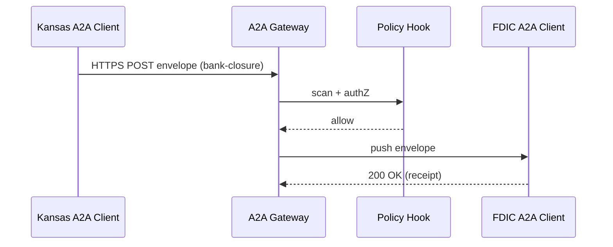

# Chapter 12: Inter-Agency Protocol Layer (HMS-A2A)

*(continuing from [Chapter 11: Model Context Protocol (HMS-MCP)](11_model_context_protocol__hms_mcp__.md))*  

---

## 1. Why Do We Need an “International-Relations Desk” for Agencies?

Picture this Monday-morning headache:

* The **FDIC** wants up-to-the-minute bank-closure alerts from the **Kansas State Banking Commission**.  
* At the same time, the **Bureau of Safety and Environmental Enforcement (BSEE)** must push an offshore-rig incident report to the **U.S. Coast Guard**—but only after redacting personnel names.  
* Both exchanges must be encrypted, schema-validated, and fully auditable.

If every pair of agencies wrote its **own** data format, encryption routine, and handshake, we would drown in fragile adapters.  
**HMS-A2A** is the UN interpreter in the middle: one common envelope, one handshake ritual, and one place to plug in security and audit rules.

---

## 2. Key Ideas (Plain-English Cheat-Sheet)

| A2A Term | Everyday Analogy | What It Means |
|----------|------------------|---------------|
| Envelope | FedEx box | Holds the payload + address info. |
| Channel  | FedEx truck lane | HTTPS or MQ tunnel the envelope rides on. |
| Schema Registry | Barcode database | Canonical JSON schemas everyone trusts. |
| Handshake | Delivery-person signature | Mutual TLS + token exchange proving identities. |
| Policy Hook | Customs check | Calls [HMS-ESQ](05_security__privacy___legal_guardrails__hms_esq___platform_controls__.md) before delivery. |
| Receipt | Tracking number | Immutable log entry in [HMS-OPS](15_monitoring___metrics__hms_ops__.md). |

Keep these six ideas in mind—the rest is wiring.

---

## 3. Concrete Use-Case: “Bank Closure Alert”

1. The **Kansas Banking Commission** detects *Heartland Community Bank* is insolvent.  
2. It must notify the **FDIC** within 5 minutes.  
3. FDIC’s internal audit tool must ingest the alert *unchanged* for examiners.  
4. Both sides want zero custom code.

Let’s solve it with HMS-A2A step-by-step.

---

## 4. Step-By-Step Walk-Through (≤ 15 mins)

### 4.1 Register a Shared Schema (1-time)

```json
// schemas/bank-closure-v1.json  (10 lines)
{
  "$id": "bank-closure-v1",
  "type": "object",
  "required": ["bankId","state","timestamp","reason"],
  "properties": {
    "bankId":   { "type":"string" },
    "state":    { "type":"string","maxLength":2 },
    "timestamp":{ "type":"string","format":"date-time" },
    "reason":   { "type":"string" }
  }
}
```

Upload once:

```bash
a2a-cli schema publish ./schemas/bank-closure-v1.json
```

*A2A responds with* `schemaId=bank-closure-v1`—keep it.

---

### 4.2 Sender: Wrap & Send the Envelope (17 lines)

```js
// kansas/sendAlert.js
import { envelope, send } from '@hms/a2a';

const alert = {
  bankId: 'FDIC12345',
  state: 'KS',
  timestamp: new Date().toISOString(),
  reason: 'capital insolvency'
};

const msg = envelope({
  to:   'fdic.alerts',
  from: 'ks.bank-commission',
  schema: 'bank-closure-v1',
  body: alert
});

await send(msg);   // HTTPS POST to A2A Gateway
console.log('✅ Alert sent');
```

What happened?  
1. `envelope()` signs + encrypts the payload.  
2. `send()` uses mutual-TLS; IAM token is attached (see [Identity & Access Management (IAM)](04_identity___access_management__iam__.md)).  
3. The A2A Gateway stores a **Receipt** and forwards the message to FDIC’s queue.

---

### 4.3 Receiver: Subscribe & Validate (13 lines)

```js
// fdic/receiveAlerts.js
import { subscribe } from '@hms/a2a';

subscribe('fdic.alerts', async msg => {
  const data = msg.body;          // already schema-validated
  console.log('🚨 BANK ALERT', data.bankId, data.reason);

  // pipe into FDIC audit tool...
});
```

*The callback only fires if*  
• schema = `bank-closure-v1` and  
• ESQ rules say the FDIC is allowed to see it.

---

## 5. What Happens Under the Hood?



1. **Handshake**: Mutual-TLS station-to-station + JWT from IAM.  
2. **Scan**: ESQ ensures no PII leaks.  
3. **Forward**: Gateway selects the right channel (HTTP push, SQS, etc.).  
4. **Receipt**: Both sides get a tracking number in HMS-OPS.

---

## 6. Inside HMS-A2A (Gentle Peek)

### 6.1 Envelope Structure (8 lines)

```json
{
  "hdr": { "from":"ks.bank-commission", "to":"fdic.alerts",
           "schema":"bank-closure-v1", "id":"msg-7b3e" },
  "sig": "ed25519:…",      // sender signature
  "enc": "AES-GCM",
  "body": "<cipher-text>"
}
```

Everything except `hdr` is encrypted; ESQ can still read headers for routing.

### 6.2 Gateway Skeleton (17 lines)

```js
// gateway/router.js
import { verify, decrypt, validate } from './lib.js';

export async function handle(req, res) {
  const env = req.body;

  if (!verify(env))  return res.status(401).send('Bad signature');
  const clear = decrypt(env);

  if (!validate(clear.body, env.hdr.schema))
       return res.status(400).send('Schema error');

  await policyScan(req.user, clear);       // ESQ hook
  await fanOut(env.hdr.to, env);           // push to queues

  logReceipt(env.hdr.id, req.user);        // HMS-OPS
  res.json({ok:true});
}
```

*All under 20 lines:* verify → decrypt → validate → policy → fan-out → log.

---

## 7. Where A2A Plugs Into Other HMS Layers

| Layer | Interaction |
|-------|-------------|
| [API Gateway](03_backend_api_gateway__hms_api___hms_svc__.md) | Handles *citizen* HTTP APIs; A2A handles **agency-to-agency** pipes. |
| [ESQ](05_security__privacy___legal_guardrails__hms_esq___platform_controls__.md) | Scans envelope headers + decrypted body before delivery. |
| [IAM](04_identity___access_management__iam__.md) | Issues the mutual-TLS client certs and JWTs. |
| [MCP](11_model_context_protocol__hms_mcp__.md) | If the body is AI chat, it is itself a nested MCP envelope. |
| [OPS](15_monitoring___metrics__hms_ops__.md) | Stores Receipts for 10 years (FOIA friendly). |

---

## 8. Frequently Asked Beginner Questions

**Q: Do I need to open a firewall port?**  
A: No. Each agency *outbounds* to the shared A2A Gateway over 443. No inbound ports required.

**Q: Can I send big files (e.g., 200 MB CSV)?**  
A: Yes—store the file in [HMS-DTA](06_data_repository___governance__hms_dta__.md) and put the file ID in the envelope body.

**Q: What if schemas change?**  
A: Publish `bank-closure-v2`. The header’s `schema` field tells receivers which version they’re getting. Old and new can coexist.

**Q: Is this like EDI or NIEM?**  
A: Similar spirit but lighter: JSON schemas, HTTPS, and built-in hooks to IAM & ESQ—so a junior dev can adopt it in an afternoon.

---

## 9. Recap

You learned that **HMS-A2A**:

* Gives agencies a single, secure **envelope + handshake** for data exchange.  
* Embeds schema validation, encryption, and policy scans **by default**.  
* Produces immutable receipts for audits, all with **<20 lines** on each side.

Up next, we’ll see how HMS keeps **external** (non-government) systems in sync with these agency exchanges. 👉 [External System Synchronization](13_external_system_synchronization_.md)

---

---

Generated by [AI Codebase Knowledge Builder](https://github.com/The-Pocket/Tutorial-Codebase-Knowledge)