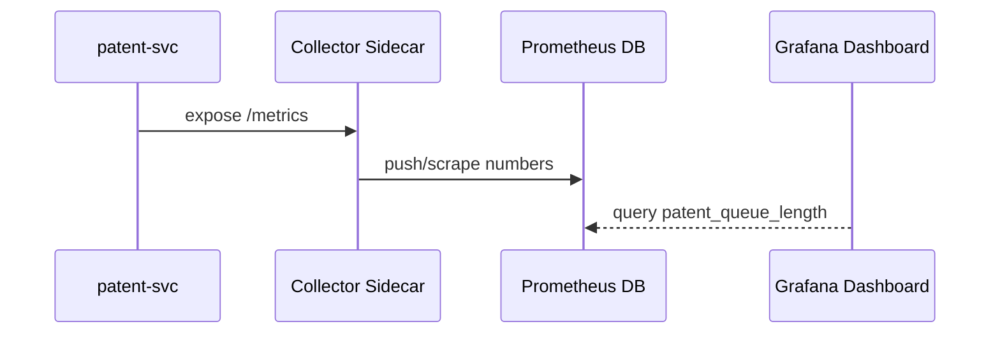

# Chapter 12: Metrics & Observability Pipeline
[← Back to Chapter 11: Core Infrastructure & Service Mesh (HMS-SYS)](11_core_infrastructure___service_mesh__hms_sys__.md)

---

> “The rules are live, the servers are humming—  
> but **did our new AI policy actually shorten the Patent Office queue?**  
> Metrics & Observability is the **scoreboard in the control room** that answers,  
> ‘Is the government getting better or just busier?’”

---

## 1 . Why a Scoreboard? — A 2-minute Story

1. The **AI Representative Agent** ([Chapter 3](03_ai_representative_agent__hms_a2a__.md)) rolls out a rule to auto-triage patent filings.  
2. The **Policy/Process Engine** ([Chapter 9](09_policy_process_engine_.md)) sets it live at 09:00.  
3. By 09:30 Congress phones the CIO:  
   “Are wait-times down yet?”  

Without real-time numbers we can only shrug.  
With a **Metrics & Observability Pipeline** we open a dashboard and say:  

```
USPTO Average Wait Time
Before (8 h)  ⟶  After (2 h)  ✅
Error Rate: 0.3 % (no regressions)
```

Decision-makers breathe easy, citizens see progress, auditors see evidence.

---

## 2 . Key Concepts (scoreboard analogies)

| Term | Stadium Analogy | Beginner Meaning |
|------|-----------------|------------------|
| Telemetry | Fans’ cheers | Raw signals: logs, traces, counters, user thumbs-up 👍 |
| Collector | Microphone array | Sidecar that grabs signals from every service |
| Time-Series DB | Score history board | Stores numbers over time (e.g., Prometheus) |
| Dashboard | Jumbotron | Visual chart for humans (e.g., Grafana) |
| Alert | Referee whistle | Message when a metric crosses a limit |
| SLO / KPI | Winning goal line | Agreed target (e.g., “< 1 s response in 95 % of calls”) |

---

## 3 . Quick Start – Emit & Visualise One Metric

We’ll add a **“patent queue length”** gauge to an existing `patent-svc`.

### 3.1 Add a metric in 15 lines

```js
// patent-svc/metrics.js  (15 lines)
import client from 'prom-client'
const gauge = new client.Gauge({ name:'patent_queue_length', help:'Items in queue' })

export function setQueueLength(n){
  gauge.set(n)
}

// expose /metrics endpoint
export function initMetrics(app){
  client.collectDefaultMetrics()
  app.get('/metrics', (_req,res)=>res.end(client.register.metrics()))
}
```

Explanation  
1. `prom-client` creates a **gauge**.  
2. `setQueueLength(…)` updates it each time we poll the DB.  
3. `GET /metrics` spills all numbers in Prometheus format.

### 3.2 Wire it into the service (under 10 lines)

```js
import express from 'express'
import { setQueueLength, initMetrics } from './metrics.js'
const app = express()
initMetrics(app)

setInterval(async ()=>{
  const n = await db.countOpenFilings() // fake helper
  setQueueLength(n)
}, 60_000)

app.listen(8080)
```

### 3.3 Tell the Collector to scrape (8 lines)

```yaml
# prometheus/scrape-config.yaml
scrape_configs:
  - job_name: patent-svc
    metrics_path: /metrics
    static_configs:
      - targets: ['patent-svc.default.svc:8080']
```

Prometheus now pulls the gauge every 15 s—**no code change in other services**.

### 3.4 Draw the chart (Grafana, JSON snippet ≤ 10 lines)

```json
{
  "title": "Patent Queue Length",
  "type":  "graph",
  "targets": [{ "expr": "patent_queue_length" }]
}
```

Open the dashboard → watch the line drop when the AI rule kicks in.

---

## 4 . End-to-End Flow



Four actors, zero hard-coded IPs—**sidecars** (auto-injected by HMS-SYS) handle encryption and retries.

---

## 5 . Beyond Numbers — Logs & User Feedback

### 5.1 Structured logs in 10 lines

```js
// patent-svc/logger.js
import pino from 'pino'
export const log = pino({
  base: { svc:'patent' },
  transport:{ target:'pino-pretty' }   // dev-friendly
})

// usage
log.info({ filingId:123 }, 'queued')
```

Logs stream to **Loki** (or Elasticsearch) via sidecar and can be filtered:
```
svc="patent" level="error" last 1h
```

### 5.2 Citizens’ thumbs-up API (12 lines)

```js
// frontend/Thumbs.vue
<template>
  <button @click="vote(1)">👍</button>
  <button @click="vote(-1)">👎</button>
</template>
<script setup>
import axios from 'axios'
function vote(score){
  axios.post('/api/v1/feedback', { page:'/patent', score })
}
</script>
```

On the backend, `feedback-svc` counts scores and exposes `feedback_average{page="/patent"}`.

---

## 6 . Alerts & SLOs – 2 examples

### 6.1 Alert rule (Prometheus, 6 lines)

```
- alert: PatentQueueTooLong
  expr: patent_queue_length > 50
  for: 5m
  labels: { severity: "page" }
  annotations: { summary: "Patent backlog growing" }
```

Triggers PagerDuty or a Slack channel.

### 6.2 SLO dashboard snippet

```
Avg response < 1 s (95 th percentile) —  ✗ 89 %
Error rate < 0.1 %                  —  ✓ 0.03 %
```

Violations auto-notify the **HITL Console** ([Chapter 4](04_human_in_the_loop__hitl__review_console_.md)) so staff can pause a bad policy.

---

## 7 . Under the Hood (mini implementation)

### 7.1 Sidecar config (Istio, 8 lines)

```yaml
apiVersion: telemetry.istio.io/v1alpha1
kind: Telemetry
metadata: { name: default }
spec:
  metrics:
    - providers: [ prometheus ]
```

Istio auto-injects the scraping endpoint and TLS certificates.

### 7.2 Aggregator snippet (Node, 18 lines)

```js
// metrics-aggregator/index.js
import express from 'express'
const app = express()
let kpi = {}

app.post('/push', express.json(), (req,res)=>{
  const { name, value } = req.body
  kpi[name] = value                       // simple in-mem store
  res.status(202).end()
})

app.get('/kpi/:name', (req,res)=>res.json({ value: kpi[req.params.name] }))

app.listen(9100, ()=>console.log('KPI Aggregator ready'))
```

Services without Prometheus libraries can `POST` raw numbers here.

---

## 8 . Linking with Other HMS Layers

| Layer | How it uses metrics |
|-------|--------------------|
| **AI Representative Agent** ([Chapter 3](03_ai_representative_agent__hms_a2a__.md)) | Reads KPIs to decide if a new policy is successful or should self-rollback. |
| **Policy/Process Engine** ([Chapter 9](09_policy_process_engine_.md)) | Monitors error spikes to auto-rollback a bad version. |
| **Governance Portal** ([Chapter 5](05_governance_layer__hms_gov_portal_.md)) | Shows live scorecards next to proposals (“Projected vs. Actual impact”). |
| **Compliance & Audit Trail** (next chapter) | Stores metric anomalies alongside user actions for investigations. |

---

## 9 . Hands-On Exercise (5 min)

```bash
# 1. Launch the stack
docker compose up prometheus grafana patent-svc

# 2. Generate test load
watch curl -s http://localhost:9000/api/v1/patents/queue

# 3. Open Grafana → import 'Patent Queue Length' panel
# 4. Manually drop queue length to 0 (simulate AI success)
docker exec patent-svc node -e "console.log('simulate');"
# 5. Watch the line fall; alert should clear automatically
```

---

## 10 . Common Questions

| Q | A |
|---|---|
| **Do I need to choose Prometheus & Grafana?** | No. Any metrics stack (Datadog, CloudWatch, New Relic) works; examples use open-source defaults. |
| **Is scraping safe across agencies?** | Yes—sidecars add mTLS and each agency gets its own namespace & label filter. |
| **How long are metrics kept?** | Raw data: 14 days. Aggregated 1-hour roll-ups: 400 days (tunable in Prometheus). |
| **Can I export charts for a congressional report?** | Grafana → Share → Export PNG/CSV. Governance Portal embeds the image via iframe. |

---

## 11 . Recap & Next Chapter

You can now:

✓ Instrument any service with **< 20 lines** of code.  
✓ Collect logs, metrics, and citizen feedback **without touching networking code**.  
✓ Alert humans or auto-rollback policies when KPIs go red.  
✓ Give decision-makers live, trustworthy dashboards.

Next we’ll see how every metric, log, and human action is preserved in a **tamper-proof ledger** for auditors and inspectors general:  
[Chapter 13: Compliance & Audit Trail](13_compliance___audit_trail_.md)

---

Generated by [AI Codebase Knowledge Builder](https://github.com/The-Pocket/Tutorial-Codebase-Knowledge)