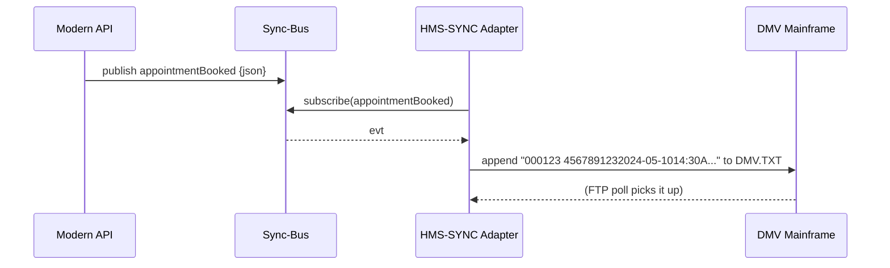

# Chapter 13: External System Synchronization  
*(continuing from [Inter-Agency Protocol Layer (HMS-A2A)](12_inter_agency_protocol_layer__hms_a2a__.md))*  

---

## 1. Why Do We Need a “Universal Power Adapter” for Software?

Picture your state **Department of Motor Vehicles (DMV)**:  
* Front-office clerks use a modern web app built on HMS-MFE.  
* Back-office scheduling still runs on a 1980s **COBOL** mainframe that understands only fixed-width text files dropped on an FTP folder every 10 minutes.

Without help, each new HMS feature would also need 40-year-old COBOL plumbing—painful and slow.

**External System Synchronization (HMS-SYNC)** is that power adapter:

1. Listens to **real-time events** from modern services (JSON over HTTPS).  
2. Translates them into the **exact format** legacy systems expect (CSV, fixed-width, XML, even printer escape codes!).  
3. Delivers them reliably—so the mainframe sees changes **instantly**, nobody re-keys data, and clerks stay in one shiny interface.

---

## 2. Key Concepts (Plain-English Cheat-Sheet)

| Term            | Everyday Analogy                       | One-Sentence Meaning                                    |
|-----------------|----------------------------------------|---------------------------------------------------------|
| Source Stream   | Airport’s arrival board                | Continuous list of new events (e.g., `appointmentBooked`). |
| Adapter         | Electrical plug converter              | Converts event → legacy format (JSON → fixed-width).    |
| Mapping File    | Phrasebook                             | Declares “field A goes to column 3, pad with zeros.”    |
| Checkpoint      | Bookmark                               | Last processed event ID—guarantees **exactly-once**.    |
| Replay          | DVR rewind                             | Re-run events from a checkpoint to rebuild state.       |

Keep these five ideas handy; everything else is wiring.

---

## 3. 5-Minute “Hello Sync” Walk-Through

Goal: whenever a *new DMV appointment* is created in our modern API, the legacy mainframe receives a **fixed-width record** within seconds.

### 3.1 Modern Service Emits an Event (already exists)

```js
// api/appointments.js  (excerpt, 7 lines)
import { publish } from '@hms/sync-bus'

export async function createAppointment(req, res) {
  const appt = await db.insert(req.body)    // new appointment
  publish('appointmentBooked', appt)        // 🔔 fire event
  res.json(appt)
}
```

*What happened?*  
`publish` pushes a JSON event onto a Kafka / Redis stream called **Sync-Bus**.

### 3.2 Declare a Mapping (YAML, 10 lines)

`mappings/dmv_fixedwidth.yaml`

```yaml
event:  appointmentBooked
output: fixedwidth
width:  40
fields:
  - { name: apptId,     start: 1,  length: 6,  pad: "0" }
  - { name: citizenId,  start: 7,  length: 9,  pad: " " }
  - { name: date,       start: 16, length: 10, pad: " " }
  - { name: time,       start: 26, length: 5,  pad: " " }
  - { name: desk,       start: 31, length: 10, pad: " " }
```

*Explanation*  
Line 2 says this mapping listens to `appointmentBooked` events.  
Each field gets a *start position* and *length*; short values are padded.

### 3.3 Minimal Adapter (Node, 18 lines)

```js
// adapters/fixedWidth.js
import fs from 'fs', path from 'path'
import { subscribe } from '@hms/sync-bus'
import map  from '../mappings/dmv_fixedwidth.yaml' assert {type:'yaml'}

subscribe(map.event, async evt => {
  const line = map.fields.map(f => {
    const val = String(evt[f.name] ?? '')
    const padded = f.pad.repeat(f.length) + val      // ensure enough chars
    return padded.slice(-f.length)                   // keep rightmost chars
  }).join('')

  await writeLine(line)                              // ⬇️ save to FTP dir
})

function writeLine(line){
  const file = path.join('/mnt/ftp_out', 'DMV.TXT')
  fs.appendFileSync(file, line + '\n')
}
```

*Step-by-step*  
1. `subscribe` listens from the last **checkpoint** automatically.  
2. Each field is padded/truncated per mapping.  
3. The combined line is appended to `DMV.TXT`—the mainframe polls this file every minute.

Run it:

```bash
node adapters/fixedWidth.js   # stays running
```

Book a test appointment via API; the file updates immediately—no human data entry!

---

## 4. What Happens Under the Hood?



• The adapter keeps **checkpoint #123** so if it restarts it never loses or duplicates events.

---

## 5. Peeking Inside HMS-SYNC Core (Gentle)

### 5.1 Checkpoint Store (8 lines)

```js
// sync/checkpoint.js
import fs from 'fs'
export function read(id){ 
  try { return Number(fs.readFileSync('.ckpt.'+id)) }
  catch{ return 0 }
}
export function write(id, val){
  fs.writeFileSync('.ckpt.'+id, String(val))
}
```

Every adapter calls `read/​write(id)` with its own ID (`dmv_fixedwidth`)—dead simple, works even on air-gapped servers.

### 5.2 Stream Helper (14 lines)

```js
// sync-bus/index.js  (tiny wrapper around Redis Streams)
import Redis from 'ioredis'
const r = new Redis()

export function publish(topic, payload){
  r.xadd(topic, '*', 'json', JSON.stringify(payload))
}

export function subscribe(topic, onMsg){
  const group = topic + '_grp'
  r.xgroup('CREATE', topic, group, '$', 'MKSTREAM').catch(()=>{})
  setInterval(async ()=>{
    const res = await r.xreadgroup('GROUP', group,'consumer1','COUNT',10,'BLOCK',0,'STREAMS',topic,'>')
    res?.[0]?.[1]?.forEach(async ([id, [,json]])=>{
      await onMsg(JSON.parse(json))
      // store checkpoint elsewhere if desired
    })
  },500)
}
```

Adapters need no Redis knowledge—just call `publish` / `subscribe`.

---

## 6. How HMS-SYNC Fits with Other Layers

| Layer | Why It Matters |
|-------|----------------|
| [Workflow Orchestrator](07_workflow_orchestrator__hms_act___hms_oms__.md) | Emits events the sync layer listens to—no extra code in workflows. |
| [Security, Privacy & Legal Guardrails](05_security__privacy___legal_guardrails__hms_esq___platform_controls__.md) | Scans events **before** adapters see them, masking PII if needed. |
| [Monitoring & Metrics](15_monitoring___metrics__hms_ops__.md) | Receives adapter health pings & lag metrics (e.g., “2 events behind”). |
| [Inter-Agency Protocol](12_inter_agency_protocol_layer__hms_a2a__.md) | For cross-agency legacy targets, SYNC pipes its output back through A2A envelopes. |

---

## 7. Frequently Asked Beginner Questions

**Q: What if the legacy system only accepts nightly batch files?**  
A: Change `writeLine` to buffer lines in `batch.txt` and move the file at 2 AM—same mapping still works.

**Q: Can one event feed several legacy systems?**  
A: Absolutely. Run multiple adapters, each with its own mapping and checkpoint.

**Q: How do I debug a bad mapping?**  
A: Set `DEBUG=sync` env var; adapters print both the JSON event and generated line. You can also replay events by deleting the `.ckpt.*` file.

**Q: Is polling FTP folders secure?**  
A: For sensitive data, put a SFTP/FTPS server behind [API Gateway](03_backend_api_gateway__hms_api___hms_svc__.md) so IAM & ESQ still apply.

---

## 8. Recap & Next Steps

In this chapter you:

* Saw how **HMS-SYNC** turns modern JSON events into mainframe-friendly text—no manual re-keying.  
* Learned the five core concepts: **Source Stream, Adapter, Mapping, Checkpoint, Replay**.  
* Built a **working 18-line adapter** and followed the journey with a sequence diagram.  

Now that data is whizzing everywhere, it’s time to **move money** just as smoothly.  
In the next chapter we’ll explore the **Financial Transaction Engine (HMS-ACH)**, the layer that posts payments with the same reliability you just saw for data.

👉 Continue to [Financial Transaction Engine (HMS-ACH)](14_financial_transaction_engine__hms_ach__.md)

---

Generated by [AI Codebase Knowledge Builder](https://github.com/The-Pocket/Tutorial-Codebase-Knowledge)