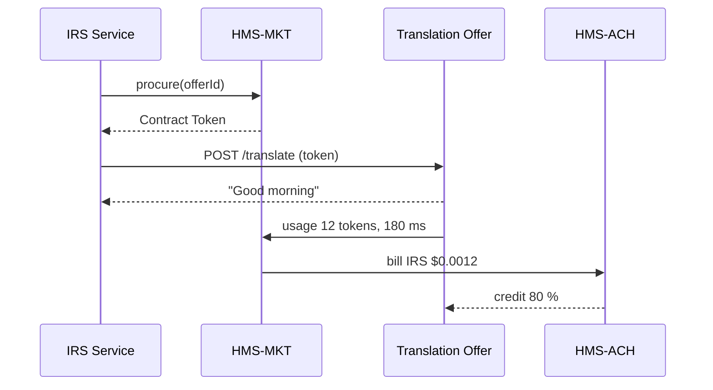

# Chapter 14: AI Marketplace (HMS-MKT)

[← Back to Chapter&nbsp;13: Human-in-the-Loop (HITL) Override](13_human_in_the_loop__hitl__override_.md)

---

## 0. Why Should Government Agencies Share AI Instead of Re-Inventing It?

### A quick citizen story  

Sofia is a small-business owner.  
In one week she:

1. Applies for an SBA loan (needs **fraud detection**)  
2. Uploads Spanish tax documents to the IRS (needs **language translation**)  
3. Requests a FEMA disaster voucher (needs **risk scoring**)  

Today each agency buys, builds, or contracts a *separate* model for the *same* task.  
Taxpayers foot the bill three times, and quality varies wildly.

**AI Marketplace (HMS-MKT)** turns these siloed efforts into a **GSA-style catalog** of algorithms:

* Agencies can **browse** trusted models (“Fraud v2”, “US-Spanish Translator 97 % BLEU”).  
* Click **Procure** to pay only for what they use—per call or per million tokens.  
* Push their *own* models back into the catalog and earn budget credits.  
* Telemetry loops back into pricing and SLAs, rewarding accuracy and uptime.

Result: Sofia experiences faster, more consistent services—and taxpayers pay once, not thrice.

---

## 1. Key Concepts (Plain English)

| Marketplace Term | Real-World Analogy | One-Sentence Meaning |
|------------------|-------------------|----------------------|
| Catalog | GSA Schedule book | List of every approved model with price & metrics. |
| Offer | Line item in the book | A single algorithm (“DHS Fraud v2”). |
| Meter | Taxi meter | Counts usage (tokens, images, calls). |
| SLA Score | Yelp stars | Rolling grade for latency & accuracy. |
| Contract Token | Signed purchase order | Grants an agency permission to call an Offer. |
| Revenue Share | Re-imbursable agreement | % of usage fees returned to the model’s owner. |

---

## 2. Browsing & Buying in Two Tiny API Calls

### 2.1 Search the Catalog (9 lines)

```js
import { mkt } from '@hms/mkt-sdk'

// 1) List Spanish translators above 90 % BLEU
const offers = await mkt.search({
  task:   'translation',
  source: 'es',
  target: 'en',
  minScore: 0.90
})
console.log(offers[0].name)   // "US-Spanish Translator v3"
```

*Explanation – plain English*  
`mkt.search` returns an array of Offers filtered by task and quality score.

### 2.2 Procure & Call (<= 20 lines)

```js
// pick the first offer
const offerId = offers[0].id

// 2) Sign a one-click contract
const token = await mkt.procure({
  offerId,
  purchaser: 'IRS'
})

// 3) Use the translator just like any REST API
const res = await fetch(
  `https://mkt.gov/api/${offerId}/translate`,
  {
    method: 'POST',
    headers: { 'Authorization': `Bearer ${token}` },
    body: JSON.stringify({ text: 'Buenos días' })
  }
)
console.log(await res.json()) // ➜ "Good morning"
```

*What just happened?*  
1. `mkt.procure` issued a **Contract Token** scoped to the IRS.  
2. Each call decrements the Meter and updates the Offer’s SLA Score.  
3. Billing will appear in IRS’s monthly statement—**no extra paperwork**.

---

## 3. A 5-Step Walkthrough Under the Hood



1. **Procure** call writes a contract row in HMS-DTA.  
2. Runtime token tells SVC which agency is calling.  
3. Usage → Meter → HMS-ACH for billing & revenue share.

---

## 4. Inside HMS-MKT: Tiny Source Files

### 4.1 `catalog.js` – 15 lines

```js
// lib/catalog.js
const offers = new Map()   // offerId -> details

export function search(q) {
  return [...offers.values()].filter(o =>
    o.task === q.task &&
    o.meta.src === q.source &&
    o.meta.tgt === q.target &&
    o.sla.score >= q.minScore)
}

export function add(offer) {
  offers.set(offer.id, offer)
}
```

*Beginners’ notes*  
* Just an in-memory map for demo—production uses Postgres.  
* `sla.score` auto-updates from the Meter service.

### 4.2 `meter.js` – 17 lines

```js
// lib/meter.js
import { ach } from '@hms/ach-sdk'

export async function record({ offerId, agency, units, ms }) {
  const pricePerUnit = 0.0001    // simplistic
  const cost = units * pricePerUnit

  await ach.bill({
    from: agency,
    to:   'MKT',
    amount: cost
  })

  // share 80 % back to provider
  await ach.credit({
    to: offers.get(offerId).owner,
    amount: cost * 0.8
  })

  updateSla(offerId, ms)
}
```

*Takeaways*  
* Uses [Financial Transaction Core (HMS-ACH)](05_financial_transaction_core__hms_ach__.md) for money.  
* Calls a helper `updateSla()` (not shown) that keeps the Offer’s rolling stars.

---

## 5. Publishing Your Own Offer in < 15 Lines

```js
// publish.js  (agency DevOps)
import { mkt } from '@hms/mkt-sdk'

await mkt.publish({
  id:      'dhs-fraud-v2',
  name:    'DHS Fraud Detector v2',
  task:    'fraud-detection',
  price:   0.002,          // per API call
  owner:   'DHS',
  contact: 'ai@dhs.gov'
})
console.log('Offer live in catalog!')
```

*Once this runs:*

* Other agencies can find “DHS Fraud Detector v2”.  
* Revenue Share starts flowing automatically.  
* SLA stars reset and begin calculating from first use.

---

## 6. Common “Uh-oh” Moments & Quick Fixes

| Problem | Why It Happens | Quick Fix |
|---------|----------------|-----------|
| `403 No Contract` when calling an Offer | Forgot to `procure()` before first call | Run the simple procure step; token lasts 24 h by default. |
| SLA Score plummets | Your model latencies ↑ | Scale your service or lower price to attract fewer calls. |
| Billing shows 0 $ even after heavy use | Offer owner missing `owner` field | Re-publish offer with correct owner agency code. |
| Duplicate offers clutter search | Different teams publish same model | Use `mkt.deprecate(id)` to hide old entries. |

---

## 7. Where HMS-MKT Sits in the Big Picture

```
 Agents / Services
        ↕ (search / procure / call)
      HMS-MKT  ─── Meter → HMS-ACH (billing)
        ↓                     ↓
SLA & Usage to HMS-OPS   Records to HMS-DTA
```

HMS-MKT touches money (ACH), metrics (OPS), and history (DTA) but **never** stores model weights itself—that is left to each provider.

---

## 8. Quick Reference Cheat-Sheet

```
mkt.search(filters)        → Array<Offer>
mkt.procure({offerId,...}) → Contract Token
mkt.publish(offer)         → Add to catalog
mkt.deprecate(id)          → Hide an offer
Offer.sla.score            → 0–100 (higher = better)
Meter.units                → tokens | calls | images
```

Tape this next to your monitor—95 % of daily tasks need only these calls.

---

## 9. Recap & What’s Next

You learned:

1. **Why** a shared AI marketplace avoids triple spending across agencies.  
2. **How** to find, buy, and call a model in **two** simple SDK calls.  
3. **How** billing, SLA stars, and revenue share work under the hood.  
4. **How** to publish your own Offer and start earning budget credits.

The last puzzle piece is syncing with *legacy* partner systems that can’t speak modern APIs.  
That bridge is built in the next—and final—chapter:  
[Chapter 15: External System Synchronizer](15_external_system_synchronizer_.md)

---

*End of Chapter 14*

---

Generated by [AI Codebase Knowledge Builder](https://github.com/The-Pocket/Tutorial-Codebase-Knowledge)