# Chapter 14: Data Governance & Privacy Guardrails
[← Back to Chapter&nbsp;13: Compliance & Audit Trail](13_compliance___audit_trail_.md)

---

> “Think of a vault clerk who **automatically slaps a red ‘CONFIDENTIAL’ stamp,  
> locks the drawer, and hands visitors only the parts they’re allowed to see.**  
> These are the **Data Governance & Privacy Guardrails**.”

---

## 1. Why do we need guardrails? — A concrete story

### The *“Veterans & Student-Loans Mix-up”*

1. The Department of Education receives a combined dataset of  
   • veteran medical bills (HIPAA) and  
   • student-loan payment history (FERPA).  
2. A data-science intern launches a Jupyter notebook to predict default risk.  
3. **Risk:** one careless chart could leak protected health info.

With **Guardrails** switched on:

* The dataset is **auto-tagged** `PHI` (health) and `FERPA` (student).  
* Columns like `diagnosis` are instantly **masked** (`****`).  
* The intern sees only aggregate counts, while licensed clinicians keep full access.  
* Every access attempt is logged into the [Compliance & Audit Trail](13_compliance___audit_trail_.md).

Result: insights without scandals.

---

## 2. Key Concepts (library-vault analogies)

| Guardrail Term | Library Vault Analogy | Friendly meaning |
|----------------|----------------------|------------------|
| Data Catalog | Card catalogue | Lists every table/file with privacy tags. |
| Classifier | Librarian stamping books | Auto-detects PHI, PII, FERPA, GDPR, agency tags. |
| Masking Rule | Black marker on pages | Replaces sensitive values with `****` or hashes. |
| Policy Enforcement Point (PEP) | Security turnstile | Checks “Who asks for which chapter?” and applies rules in real time. |
| De-Identification | Summarised excerpts | Shares aggregates so no individual can be re-identified. |
| Lineage | Borrower log | Full history of *who read what*. |

---

## 3. 3-Minute Hands-On — “Tag & Query” demo

### 3.1 Upload a CSV and auto-classify it *(10 lines)*

```python
# demo/tag_dataset.py
from hms_guardrails import Catalog

id = Catalog.register(
      path='s3://uploads/vet_loans.csv',
      owner='edu_LOANS_TEAM')
print("📚 Data ID:", id)
```
Output (console):

```
PHI columns detected: ["diagnosis", "treatment_cost"]
FERPA columns detected: ["loan_amount"]
Data registered as asset 42
```

### 3.2 Query the data as an **intern** *(15 lines)*

```python
# notebook cell
from hms_guardrails import open_secure

with open_secure(asset_id=42, role='data_intern') as df:
    print(df.head(3))
```

Console shows:

```
diagnosis treatment_cost loan_amount
*********       ****         12000
*********       ****         22000
*********       ****         18000
```

The intern sees masked PHI but full loan data.

### 3.3 Same query as a **licensed clinician**

```python
with open_secure(asset_id=42, role='clinician') as df:
    print(df.head(1))
```

Now full values appear—access granted by role.

---

## 4. What happens behind the curtain?

```mermaid
sequenceDiagram
    participant NB as Notebook
    participant PEP as Guardrail PEP
    participant IAM as IAM
    participant S3 as Secure Storage
    NB->>PEP: request asset 42 (JWT)
    PEP->>IAM: verify role & scopes
    IAM-->>PEP: ✅ clinician / data_intern
    PEP->>S3: fetch, apply masking/encryption
    PEP-->>NB: filtered dataframe
```



*One extra hop (PEP) protects every dataset.*

---

## 5. Under-the-hood snippets (all ≤ 18 lines)

### 5.1 Policy YAML *(agency-readable)*

```yaml
# policies/veterans_data.yaml
asset_id: 42
rules:
  - if:  role in ["data_intern"]
    then: mask: ["diagnosis", "treatment_cost"]
  - if:  role == "clinician"
    then: allow
  - else: deny
logs:  always         # forward to Audit Trail
```

### 5.2 Minimal PEP middleware *(Node.js)*

```js
// guardrails/pep.js
import { mask } from './mask.js'
import { getPolicy } from './catalog.js'

export async function enforce(req, res, next){
  const asset = req.params.id
  const policy = await getPolicy(asset)
  const role = req.user.roles            // injected by Gateway
  const rule = policy.rules.find(r=>eval(r.if)) || policy.rules.at(-1)
  if (rule.deny)  return res.status(403).end()
  req.data = rule.mask ? mask(req.data, rule.mask) : req.data
  next()
}
```

### 5.3 Auto-classifier stub *(Python, 14 lines)*

```python
import pandas as pd, re

def classify(df: pd.DataFrame):
    tags = {}
    for col in df.columns:
        if re.search(r'diag|icd', col, re.I):
            tags.setdefault(col, []).append('PHI')
        if re.search(r'loan', col, re.I):
            tags.setdefault(col, []).append('FERPA')
    return tags            # {column: ['PHI', 'FERPA']}
```

---

## 6. How Guardrails talk to other HMS layers

| Layer | Interaction |
|-------|-------------|
| [Identity & Access Management (IAM)](07_identity___access_management__iam__.md) | Provides roles/scopes for the PEP. |
| [Policy/Process Engine](09_policy_process_engine_.md) | Stores versioned masking policies (`*.yaml`). |
| [Event Bus / Service Mesh](10_event_bus___service_mesh_.md) | Emits `data.accessed`, `data.masked` events. |
| [Compliance & Audit Trail](13_compliance___audit_trail_.md) | Records every access + applied rule. |

---

## 7. Hands-On Exercise (5 min)

1. Run demo stack:  
   `docker compose up guardrails catalog pep iam`
2. Register a sample CSV (`examples/vet_loans.csv`).  
3. Obtain an **intern** JWT (see Chapter 7).  
4. `python notebook_demo.py` → verify masked columns.  
5. Swap token for a **clinician** role → PHI visible.  
6. Tail Audit log → entries show `"action":"data.accessed","mask":"yes/no"`.

---

## 8. Common Questions

| Q | A |
|---|---|
| **Is data encrypted at rest?** | Yes—S3/KMS or on-prem hardware keys; guardrails manage keys per asset. |
| **How are tags kept up-to-date?** | Nightly classifier re-scans; humans can override in the Catalog UI. |
| **Can I export raw data for research?** | Only after a [HITL](04_human_in_the_loop__hitl__review_console_.md) officer approves a “release workflow”; the PEP wraps it in a secure enclave. |
| **What about differential privacy?** | Guardrails can enforce noise injection for aggregate queries—topic for the advanced appendix. |

---

## 9. Summary & What’s Next

You learned:

✓ Why **automatic tagging, masking, and enforcement** prevent accidental leaks.  
✓ Key pieces: Catalog, Classifier, Masking Rules, Policy Enforcement Point.  
✓ How to protect a CSV with **two tiny scripts** and a YAML policy.  
✓ How guardrails integrate with IAM, Policy Engine, Event Bus, and Audit Trail.

Data is safe—now we need to ship new versions of these guardrails (and *everything else*) without downtime.  
Hop to [Chapter 15: Deployment & Rollback Orchestrator](15_deployment___rollback_orchestrator_.md).

---

Generated by [AI Codebase Knowledge Builder](https://github.com/The-Pocket/Tutorial-Codebase-Knowledge)