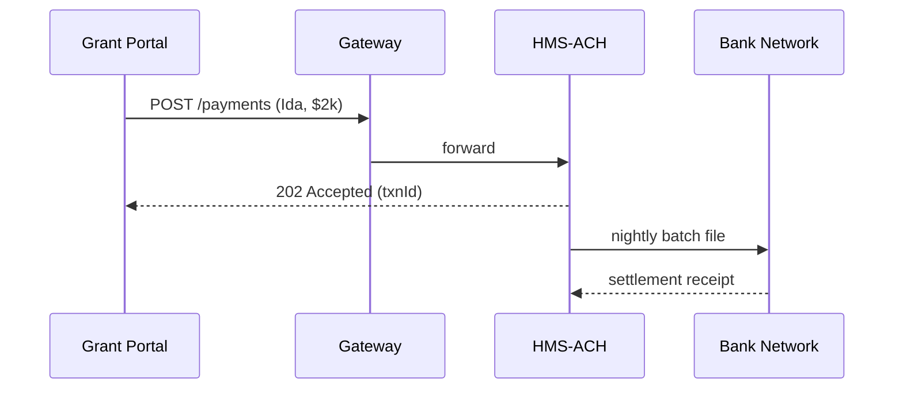

# Chapter 14: Financial Transaction Engine (HMS-ACH)

*(continuing from [Chapter 13: External System Synchronization](13_external_system_synchronization_.md))*  

---

## 1. Why Another Engine? — A Payday Example

The **U.S. Department of Agriculture (USDA)** must send a \$2 000 conservation-grant payment to farmer *Ida Fields* this Friday.

Things that **must** go right:

1. Ida’s routing & account numbers are real (no typos).  
2. Funds leave Treasury only *after* internal controls approve the grant.  
3. Ida’s local credit-union receives a **single, secure ACH batch file**, not 2000 little API calls.  
4. Auditors can prove—years later—that the payment followed every federal cash-management rule.

Doing all of that by hand in every service would be maddening.  
**Financial Transaction Engine (HMS-ACH)** is the platform’s **“software Federal Reserve”**—it clears, settles, and audits money the way the real ACH network does for banks.

---

## 2. Key Concepts (plain-English cheat-sheet)

| Concept | Everyday Analogy | One-sentence meaning |
|---------|------------------|----------------------|
| Routing Check | Dialling a phone number to hear “this line is active” | Confirms the bank + account exist before money moves. |
| Batch Settlement | Nightly bank truck | Groups many payments into one encrypted file sent at 6 pm ET. |
| Escrow Ledger | Locked cash drawer | Holds funds until both payer & payee meet conditions (e.g., disaster-relief inspections). |
| Reversal Window | “Stop payment” button | Limited time to pull back a wrong transfer. |
| NACHA Report | Bank statement | Machine-readable file that auditors or Treasury can review. |

Keep these five ideas in mind; the rest is wiring.

---

## 3. 5-Minute “Hello Payment” Walk-Through

We will (locally!)  
1. Create Ida’s \$2 000 payment.  
2. Validate routing + account.  
3. Let the nightly **settlement job** write an `ach_batch.ach` file.

### 3.1 Install the mini SDK

```bash
npm i @hms/ach-cli   # ≈40 kB helper
```

### 3.2 Book the Payment (8 lines)

```js
// pay.js
import { createTxn } from '@hms/ach-cli'

const txn = await createTxn({
  id       : 'TXN-2024-0007',
  amount   : 2000_00,              // pennies
  routing  : '103100195',          // Ida's CU
  account  : '987654321',
  purpose  : 'USDA Conservation Grant'
})

console.log(txn.status)   // → "QUEUED_FOR_BATCH"
```

**What just happened?**  
• The SDK hit HMS-ACH’s `/payments` API.  
• Routing & account strings passed the **routing check** (see Section 5).  
• The payment is now queued; no money has moved yet.

### 3.3 Run the Nightly Settlement Job (10 lines)

```bash
# pretend it's 6 pm
npx ach-cli run-settlement
```

Console output:

```
⏳ Collating 1 transactions...
✅ Batch file written: ./out/ach_batch_20240418.ach
```

Open the file (truncated):

```
101 03100195 000000000 240418USDAACH  ...
622103100195987654321    0000200000
8200000001003100195       0000200000
```

Ida’s payment is now inside a **proper ACH batch record** compatible with Treasury/NACHA upload tools.

---

## 4. What Happens Under the Hood?



1. **APP** sees immediate “Accepted”; user can navigate away.  
2. Actual cash moves hours later when **ACH** hands the batch to the **Bank Network**.  
3. A settlement receipt flows back, updating the ledger and triggering an e-mail to Ida.

---

## 5. Peeking Inside HMS-ACH (gentle version)

### 5.1 Routing-Number Validation (12 lines)

```js
//svc/validate.js
export function isValidRouting(rt){
  if(!/^\d{9}$/.test(rt)) return false      // 9 digits
  const digits = rt.split('').map(Number)
  const sum = (7*(digits[0]+digits[3]+digits[6]) +
               3*(digits[1]+digits[4]+digits[7]) +
               9*(digits[2]+digits[5]+digits[8]))
  return sum % 10 === 0                    // official checksum rule
}
```

• Called on **every** `POST /payments`.  
• Rejects typos before they ever reach the batch file.

### 5.2 Minimal Ledger Row (JSON, 7 lines)

```json
{
  "txnId"   : "TXN-2024-0007",
  "amount"  : 200000,
  "status"  : "BATCHED",
  "settlesAt": "2024-04-18T22:00Z",
  "reversalBy": "2024-04-22T22:00Z"
}
```

This ledger lives in Postgres; status flips to `SETTLED` once the bank receipt arrives.

### 5.3 Batch Builder Skeleton (17 lines)

```js
// jobs/settle.js
import { openBatch, addEntry, closeBatch } from './achWriter.js'
import { dueTxns, markBatched } from './store.js'

export async function runSettlement(){
  const txns = await dueTxns()             // pick today's payments
  if(!txns.length) return

  const batch = openBatch()
  for(const t of txns){
    addEntry(batch, t)                     // writes 6-22 record
    await markBatched(t.txnId)
  }
  closeBatch(batch)                        // writes 8-20 record
}
```

Under 20 lines, yet it writes a compliant NACHA file.

---

## 6. Where HMS-ACH Meets the Rest of HMS

| Layer | Interaction |
|-------|-------------|
| [API Gateway](03_backend_api_gateway__hms_api___hms_svc__.md) | Handles `/payments` REST calls; adds IAM token. |
| [Security, Privacy & Legal Guardrails](05_security__privacy___legal_guardrails__hms_esq___platform_controls__.md) | Masks PII (e.g., last-4 of account) in logs & reports. |
| [Workflow Orchestrator](07_workflow_orchestrator__hms_act___hms_oms__.md) | Grants, refunds, or escrow releases call **ACH** as tasks inside YAML workflows. |
| [Monitoring & Metrics](15_monitoring___metrics__hms_ops__.md) | Receives `payment_created`, `batch_sent`, `settled` events for dashboards & alerts. |
| [External System Sync](13_external_system_synchronization_.md) | If a legacy mainframe needs the same batch file, SYNC simply copies the `.ach` output. |

---

## 7. Frequently Asked Beginner Questions

**Q: Can I send real-time (same-day) ACH?**  
A: Yes. Add `priority:"SAME_DAY"` when creating the txn; HMS-ACH will include it in the 2 pm ET expedited window.

**Q: How do refunds work?**  
A: Call `POST /payments/{id}/reverse` within the *reversal window* (default 4 business days). HMS-ACH generates an *R06* record in the next batch.

**Q: What about credit-card or FedWire?**  
A: HMS-ACH focuses on ACH only. Other rails will appear as sister engines (`HMS-CARD`, `HMS-WIRE`) that share the same ledger interface.

**Q: Do I need a separate Treasury bank account?**  
A: No. HMS-ACH supports **sub-accounts**; your agency only sees its ledger slice while Treasury sees the global picture.

---

## 8. Recap & Onward

In this chapter you:

* Saw why HMS-ACH acts like the platform’s **software clearinghouse**.  
* Booked a \$2 000 grant payment in **8 lines** of code.  
* Generated a fully compliant **ACH batch file**.  
* Peeked at routing-number validation and the nightly batch builder.  
* Learned how ACH meshes with API Gateway, ESQ guardrails, workflows, and metrics.

Next we’ll watch those payment events light up dashboards and alerts in **HMS-OPS**.

👉 Continue to [Monitoring & Metrics (HMS-OPS)](15_monitoring___metrics__hms_ops__.md)

---

Generated by [AI Codebase Knowledge Builder](https://github.com/The-Pocket/Tutorial-Codebase-Knowledge)