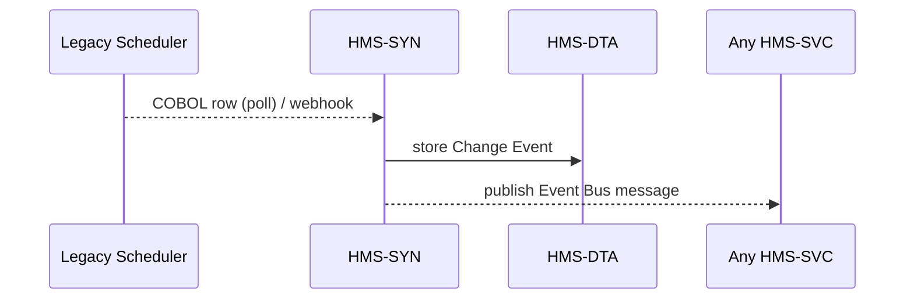

# Chapter 15: External System Synchronizer
*[← Back to Chapter 14: AI Marketplace (HMS-MKT)](14_ai_marketplace__hms_mkt__.md)*  

---

## 0. Why Do We Need a Synchronizer at All?

A true story from the U.S. Department of Health & Human Services (HHS):

* HHS already owns a **1998 COBOL scheduler** that books vaccination-van routes.  
* The shiny new `my.gov` portal (built with [HMS-MFE](01_micro_frontend__hms_mfe_component__.md) + [HMS-SVC](03_backend_service___api_layer__hms_svc__.md)) lets citizens pick time slots online.  
* If the two clocks tick out of sync, a van could arrive at an address **with zero registered patients**.

**External System Synchronizer (HMS-SYN)** is the alarm clock that shakes both systems awake at the same second—so nurses, vans, and patients see the *same* schedule.

It works in two flavors:  

1. **Push** – the legacy system **webhooks** every change.  
2. **Pull** – HMS-SYN **polls** the legacy DB on a fixed cadence.

Either mode creates a **single, time-ordered change feed** that every micro-service can trust.

---

## 1. Key Concepts (Plain English)

| Term                | Friendly Analogy               | Simple Definition |
|---------------------|---------------------------------|-------------------|
| Change Event        | Sticky note on a file          | JSON describing *one* create/update/delete. |
| Adapter             | Translator headset             | Tiny function that turns the legacy record into HMS format. |
| Push Mode           | Doorbell                       | Legacy system calls *us* when something changes. |
| Pull Mode           | Nightly janitor                | We peek into the legacy DB every *N* minutes. |
| Replay Window       | TiVo rewind                    | Time range to re-emit events (e.g., “last 24 h”). |
| Conflict Resolver   | Tie-breaker judge              | Decides which side wins when values differ. |

---

## 2. Quick-Start: Sync an Old Scheduler in 3 Tiny Steps

### 2.1 Describe the External System (10 lines)

```js
// hhsScheduler.json
{
  "id": "hhs-scheduler",
  "mode": "pull",
  "intervalSec": 300,                 // every 5 min
  "adapter": "./hhsAdapter.js"
}
```

> Put this file in `/configs/sync/` and HMS-SYN will auto-load it on startup.

### 2.2 Write a 12-Line Adapter

```js
// hhsAdapter.js
export function toEvent(row) {
  return {
    type:   'APPT_UPDATED',
    id:     row.APT_ID,
    at:     new Date(row.UPDATED_TS).toISOString(),
    data: {
      time: row.TIME,
      site: row.SITE_CODE,
      nurse: row.NURSE_ID
    }
  }
}
```

*Turns one COBOL row into a portable **Change Event**.*

### 2.3 Listen from Any Service (8 lines)

```js
import { syn } from '@hms/syn-sdk'

syn.subscribe('APPT_UPDATED', evt =>
  console.log('📆 slot changed:', evt.data)
)
```

Now *every* micro-service, agent, or dashboard sees updates within five minutes—no direct COBOL touch needed.

---

## 3. Push vs Pull at a Glance

|                     | Push (Webhook) | Pull (Polling) |
|---------------------|----------------|----------------|
| Latency             | ~1 s           | Interval-bound |
| Legacy code change? | Yes (add HTTP) | None           |
| Firewall hassle     | Expose port    | Outbound only  |
| Good for            | Modern CRMs    | Mainframes, flat files |

Switch the `"mode"` field—everything else stays identical.

---

## 4. What Happens Behind the Curtain?



1. **Collect** – via webhook *or* poll job.  
2. **Normalize** – run through the Adapter (`toEvent`).  
3. **Persist** – append to the **Change Event** table in [HMS-DTA](06_data___telemetry_hub__hms_dta__.md).  
4. **Broadcast** – emit on an internal NATS topic for listeners.

---

## 5. A Tiny Peek at the Internal Code

### 5.1 Poll Worker (≤ 18 lines)

```js
// workers/poll.js
import { schedule } from 'node-cron'
import { db } from './cobolClient.js'
import { store, publish } from './emit.js'

export function start(cfg) {
  schedule(`*/${cfg.intervalSec} * * * * *`, async () => {
    const rows = await db.changedSince(cfg.lastTs)
    for (const row of rows) {
      const evt = (await import(cfg.adapter)).toEvent(row)
      await store(evt)             // -> HMS-DTA
      publish(evt)                 // -> Event Bus
      cfg.lastTs = evt.at
    }
  })
}
```

Beginners’ notes  
* `node-cron` schedules a pull every `intervalSec`.  
* `store()` is a thin wrapper over `dta.store('CHANGE', …)`.

### 5.2 Webhook Router (≤ 15 lines)

```js
// api/webhook.js
app.post('/sync/:systemId', async (req, res) => {
  const cfg = loadCfg(req.params.systemId)
  const evt = (await import(cfg.adapter)).toEvent(req.body)
  await store(evt)
  publish(evt)
  res.sendStatus(202)
})
```

*Same adapter, same emit helpers—just triggered by an inbound call.*

---

## 6. Common “Uh-oh” Moments & Quick Fixes

| Symptom                                 | Likely Cause & Fix |
|-----------------------------------------|--------------------|
| Duplicate events                        | Legacy update feeds incremental *and* full dumps → add `DISTINCT ON (id,at)` before emit. |
| 5-minute gap after deploy               | `lastTs` reset → set `"replayWindow": "24h"` in config to backfill. |
| COBOL char-encoding garbles JSON        | Call `.toString('latin1')` before parsing row. |
| Firewall drops webhook calls            | Switch to Pull mode until IT grants ingress. |

---

## 7. Where HMS-SYN Lives in the Mega-Stack

```
Legacy Apps  ⇆  HMS-SYN  ⇆  Event Bus
                       ↙          ↘
                HMS-DTA        HMS-OPS
```

* Pushes data **upwards** to modern layers without forcing the old system to learn new tricks.  
* Streams metrics to [HMS-OPS](07_operational_monitoring___reliability_layer__hms_ops__.md) so operators spot lag.

---

## 8. Recap

You now know how the **External System Synchronizer**:

* Keeps legacy schedulers, document stores, or payment gateways **in lock-step** with the HMS platform.  
* Offers two modes—**Push** (webhook) and **Pull** (polling)—both powered by the same tiny **Adapter** pattern.  
* Stores every change in [HMS-DTA](06_data___telemetry_hub__hms_dta__.md) and broadcasts real-time events to any interested service or agent.  
* Fits neatly into the monitoring and billing layers you already learned.

Congratulations—you’ve completed the full HMS journey from pixel to policy, from citizen click to bank ledger, and from AI draft to legal enactment. 🚀  

*End of Tutorial Series.*

---

Generated by [AI Codebase Knowledge Builder](https://github.com/The-Pocket/Tutorial-Codebase-Knowledge)