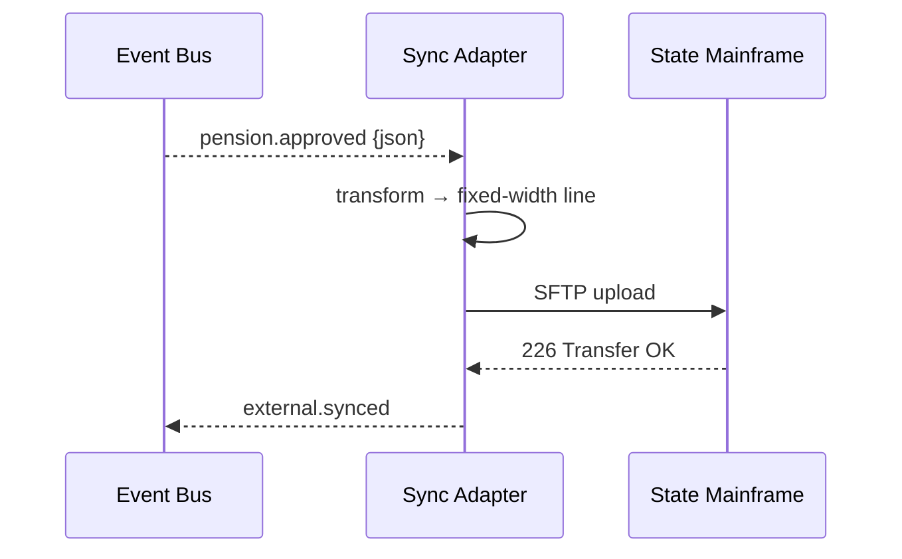

# Chapter 16: External System Sync Adapter  
*(“The embassy translator for legacy partners”)*  

[← Back to Chapter&nbsp;15: Deployment & Rollback Orchestrator](15_deployment___rollback_orchestrator_.md)

---

## 1. Why do we need a translator at all?

### Mini-story: The State Pension “Instant-Approve”

1. A veteran clicks **Submit** on the HMS portal.  
2. HMS rules (see [Policy/Process Engine](09_policy_process_engine_.md)) approve the pension in 2 seconds.  
3. The *actual* pension money lives on a **1980s COBOL mainframe** that only speaks  
   • fixed-width text files  
   • uploaded every night via SFTP.

If we wait for the nightly batch, the veteran sees “Approved” but the bank account is still empty—bad experience, angry calls.

**External System Sync Adapter (ESSA)** steps in:

* Listens to the instant HMS event `pension.approved`.  
* Translates it into the mainframe’s 240-character fixed-width line.  
* Pushes the file immediately (or queues it for the next allowed window).  
* Reports success/failure back to HMS metrics.

Citizens enjoy real-time service while ancient systems keep their comfort blanket.

---

## 2. Key Concepts (embassy‐translator analogies)

| Term | Embassy analogy | Plain meaning |
|------|-----------------|---------------|
| Source Event | Diplomat’s speech | HMS event (`pension.approved`) in modern JSON. |
| Mapping Rule | Interpreter notes | Instructions: which JSON field maps to which column/field in legacy format. |
| Adapter | Human translator | Small service that applies rules + delivers payload. |
| Connector | Phone line | The actual wire: SFTP, SOAP, CSV-over-email, etc. |
| Ack Event | “Message received” stamp | Confirmation (`external.synced`) sent back to HMS. |

---

## 3. 3-Minute Quick-Start — Send a pension to a COBOL mainframe

### 3.1 Declare a mapping rule (YAML, 14 lines)

```yaml
# mappings/pension_to_cobol.yaml
source_event: pension.approved
target_format: fixed_width
length: 240               # total line length
fields:
  - json: applicant.ssn       pos: 1   len: 9
  - json: applicant.lastName  pos: 10  len: 20  pad: " "
  - json: amount              pos: 30  len: 10  pad: "0" align: right
  - json: approvedAt          pos: 40  len: 14  format: YYYYMMDDHHmmss
connector:
  type: sftp
  host: sftp.pension.state.gov
  path: /inbox/hms_${YYYYMMDD}.txt
```

What it says  
1. Listen for `pension.approved`.  
2. Build a 240-char line with field positions.  
3. Drop it on the state’s SFTP server.

### 3.2 Connect the Adapter in **one** import (Node, 12 lines)

```js
// essa/index.js
import { on } from 'hms-bus'                    // Event Bus listener
import { loadMapping, toFixedWidth, send } from './lib.js'

const cfg = await loadMapping('pension_to_cobol.yaml')

on(cfg.source_event, async evt => {
  const line = toFixedWidth(evt.data, cfg)      // JSON → 240-char string
  await send(cfg.connector, line)               // SFTP upload
  bus.publish('external.synced', { id: evt.id })// Ack for metrics
})
```

Explanation  
• **6 lines** of real work: listen, transform, send, ack.  
• No service knows the mainframe password—only the adapter does.

---

## 4. What happens step-by-step?



Five hops, no changes to the core services.

---

## 5. Under the Hood – Tiny helper functions

### 5.1 `toFixedWidth()` (18 lines)

```js
export function toFixedWidth(data, cfg){
  const buf = Array(cfg.length).fill(' ')
  for (const f of cfg.fields){
    let v = get(data, f.json)            // grab JSON field
    if (f.format) v = formatDate(v, f.format)
    v = String(v).slice(0, f.len)        // truncate
    if (f.pad) {
      const padFn = f.align === 'right' ? padStart : padEnd
      v = padFn(v, f.len, f.pad)
    }
    insert(buf, f.pos - 1, v)            // put into buffer
  }
  return buf.join('')
}
```

### 5.2 `send()` connector wrapper (12 lines)

```js
import sftp from 'ssh2-sftp-client'
export async function send(cfg, line){
  const client = new sftp()
  await client.connect({ host: cfg.host })
  const path = cfg.path.replace('${YYYYMMDD}', today())
  await client.append(Buffer.from(line + '\n'), path)
  await client.end()
}
```

Both helpers stay < 20 lines and live in `essa/lib.js`.

---

## 6. Hot-Deploy & Rollback with DRO

Because ESSA is just another micro-service:

* Package it as `hms-sync-pension:1.0`.  
* Add to a [Deployment Blueprint](15_deployment___rollback_orchestrator_.md) phase.  
* If the mainframe responds with errors, the KPI sentinel triggers auto-rollback—blue Pods gone, green (old batch job) returns.

---

## 7. Best-practice cheat-sheet

| Do | Why |
|----|-----|
| Keep mappings in **versioned YAML** | Change pension length from 240 → 300 chars without code. |
| Always publish `external.synced` / `external.failed` | Observability & retries handled by other HMS layers. |
| Retry with back-off | SFTP or SOAP endpoints love to nap at 2 a.m. |
| Separate secrets from mappings | Store passwords in Vault; mapping YAML stays in Git. |
| Test with a **stub connector** in CI | No need to ping the real mainframe from GitHub Actions. |

---

## 8. Hands-On Exercise (5 min)

```bash
# 1. Run demo stack
docker compose up nats essa sftp-mock

# 2. Emit a fake approval event
docker exec nats nats pub pension.approved \
  '{"id":1,"applicant":{"ssn":"123456789","lastName":"DOE"},"amount":1500,"approvedAt":"2024-06-30T12:00:00Z"}'

# 3. Check mock SFTP inbox
cat volumes/sftp/inbox/hms_20240630.txt
# → 123456789DOE                 000000150020240630120000
```

The file line appears instantly—victory!

---

## 9. Common Questions

| Q | A |
|---|---|
| **Can one adapter handle many systems?** | Yes—load multiple mapping YAMLs, each with its own connector config. |
| **What about real-time APIs (SOAP / REST)?** | Write a `send()` connector that `fetch()`es XML or JSON instead of SFTP. |
| **How are failures retried?** | ESSA publishes `external.failed` events; a small worker listens and retries with exponential back-off. |
| **Is data encrypted?** | Connectors must use TLS/SFTP; payload lives only in memory, never logs. |
| **Does this replace ETL tools?** | It covers the last-mile *sync* path; big offline analytics still use your favourite ETL pipeline. |

---

## 10. What you learned

✓ Why legacy partners need an **embassy translator**.  
✓ Key pieces: source events, mapping rules, connectors, ack events.  
✓ Built a working pension adapter in ~30 lines of code + one YAML file.  
✓ Saw how ESSA plugs into Event Bus, Metrics, and Deployment Orchestrator.  

Congratulations—you’ve reached the end of the HMS tutorial series!  
Your platform can now **speak to citizens, modern micro-services, AI agents, and even 40-year-old mainframes—all in real time.**

Happy syncing, and thank you for modernising government IT 🎉

---

Generated by [AI Codebase Knowledge Builder](https://github.com/The-Pocket/Tutorial-Codebase-Knowledge)