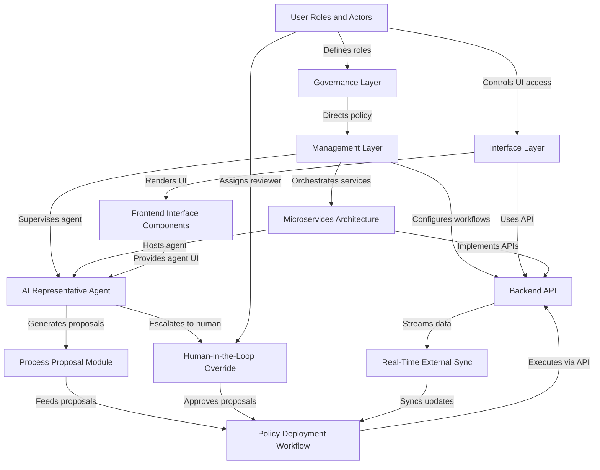

# Tutorial: HMS-MFE

**HMS-MFE** is a collection of *micro-frontend Vue.js components* that plug into an **AI-powered, microservices platform** for government and industry.  
These specialized interfaces—like banking dashboards or food delivery apps—connect to a **backend API** and **AI representative agents** to deliver citizen services, manage workflows, and enforce policies.  
In a public sector context, it acts as a digital “service desk,” offering *transparent policy management*, *real-time synchronization*, and *human-in-the-loop* review to ensure compliance and accountability.

**Source Repository:** [None](None)

## Chapters

1. [User Roles and Actors
](01_user_roles_and_actors_.md)
2. [Interface Layer
](02_interface_layer_.md)
3. [Frontend Interface Components
](03_frontend_interface_components_.md)
4. [Backend API
](04_backend_api_.md)
5. [Microservices Architecture
](05_microservices_architecture_.md)
6. [AI Representative Agent
](06_ai_representative_agent_.md)
7. [Process Proposal Module
](07_process_proposal_module_.md)
8. [Human-in-the-Loop Override
](08_human_in_the_loop_override_.md)
9. [Real-Time External Sync
](09_real_time_external_sync_.md)
10. [Policy Deployment Workflow
](10_policy_deployment_workflow_.md)
11. [Management Layer
](11_management_layer_.md)
12. [Governance Layer
](12_governance_layer_.md)

---

Generated by [AI Codebase Knowledge Builder](https://github.com/The-Pocket/Tutorial-Codebase-Knowledge)