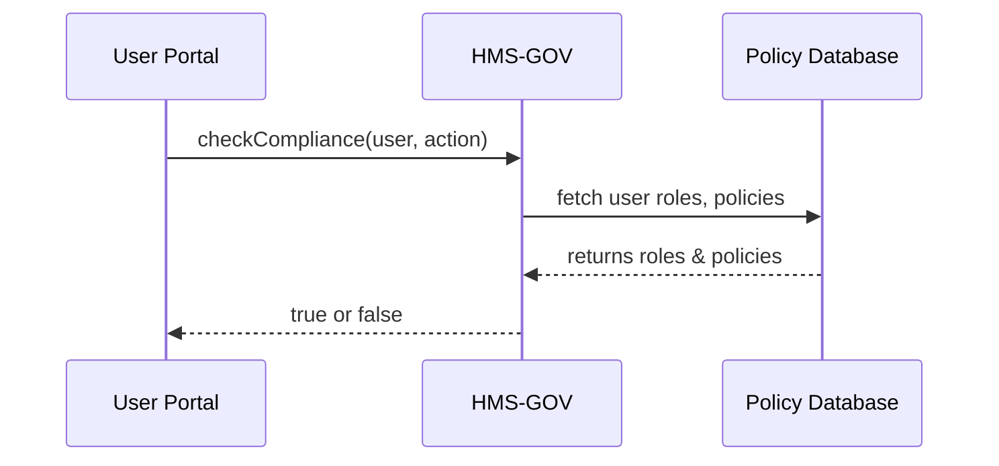

# Chapter 1: Core System Platform (HMS-GOV)

Welcome! In this chapter, we introduce the **Core System Platform (HMS-GOV)**—the central “headquarters” of our system. HMS-GOV sets policies, assigns roles, and enforces high-level controls across all modules, much like a federal agency office issuing directives to its branches.

---

## 1.1 Why We Need HMS-GOV

Imagine a citizen submits an online form to apply for a government permit. We need rules like:
- Who can review the application?
- Which data fields are mandatory?
- When is an application considered complete?

HMS-GOV is where these rules (“policies”) live. It ensures every module—frontend, backend, AI agents—follows the same directives and audit trails.

**Core Use Case**  
A citizen applies for a business license. HMS-GOV will:
1. Define a “Reviewer” role.
2. Define a policy “Only Reviewers can change application status.”
3. Check any status change request against that policy.

---

## 1.2 Key Concepts

1. **Policy**  
   A rule like “Only Managers can approve.”  
2. **Role**  
   A label assigned to a user (e.g., Applicant, Reviewer, Approver).  
3. **Compliance Check**  
   A routine that verifies if an action is allowed by existing policies.

> Analogy: Think of HMS-GOV as the Capitol building. Policies are laws, roles are elected offices, and compliance checks are the police enforcing the laws.

---

## 1.3 How to Use HMS-GOV

Below is a minimal example showing how an application module interacts with HMS-GOV.

```javascript
// app.js
import hmsGov from 'hms-gov-sdk';

// 1. Define a policy
hmsGov.createPolicy('approve:application', {
  description: 'Only Approvers can approve apps'
});

// 2. Assign roles to users
hmsGov.assignRole('alice@example.com', 'Approver');

// 3. Check compliance before changing status
async function approveApp(userId, appId) {
  const canApprove = await hmsGov.checkCompliance(
    userId, 'approve:application'
  );
  if (!canApprove) {
    throw new Error('Access denied');
  }
  // proceed to approve in database...
}
```
*What happens:*  
1. We register a policy in HMS-GOV.  
2. We give Alice the “Approver” role.  
3. Before approving, we ask HMS-GOV, “Can Alice do this?”  

---

## 1.4 Under the Hood: Step-by-Step Walkthrough

Here’s a simple sequence diagram showing what happens when our application calls `checkCompliance`:



1. **User Portal** calls HMS-GOV with a user and desired action.  
2. **HMS-GOV** looks up roles and policies in its database.  
3. **DB** returns roles and policies.  
4. **HMS-GOV** evaluates and returns allow/deny.

---

## 1.5 Internal Implementation

Let’s peek at a simplified version of the core code in `src/hms-gov/core.js`.

### 1.5.1 Policy Registry

```javascript
// src/hms-gov/policyRegistry.js
const policies = {};

export function createPolicy(action, config) {
  policies[action] = config;
}
```
> Stores policies in an in-memory object (in real life, this goes to a database).

### 1.5.2 Role Assignment

```javascript
// src/hms-gov/roleRegistry.js
const userRoles = {};

export function assignRole(user, role) {
  userRoles[user] = userRoles[user] || [];
  userRoles[user].push(role);
}
```

### 1.5.3 Compliance Check

```javascript
// src/hms-gov/compliance.js
import { policies } from './policyRegistry';
import { userRoles } from './roleRegistry';

export async function checkCompliance(user, action) {
  const roles = userRoles[user] || [];
  const policy = policies[action];
  // Very simple: user must have a role matching policy name
  return roles.includes(policy.requiredRole);
}
```

> This minimal example shows how HMS-GOV wires policies and roles together to return a yes/no answer.

---

## 1.6 Summary

In this chapter, you learned to:
- Define **policies** (our “laws”).
- Assign **roles** (our “positions”).
- Run a **compliance check** before critical actions.

With HMS-GOV in place, every part of the system honors the same set of rules, ensuring consistency and auditability.

Up next, we’ll build on this foundation and start actually crafting protocols in the **[Protocol Builder](02_protocol_builder_.md)**!

---

Generated by [AI Codebase Knowledge Builder](https://github.com/The-Pocket/Tutorial-Codebase-Knowledge)