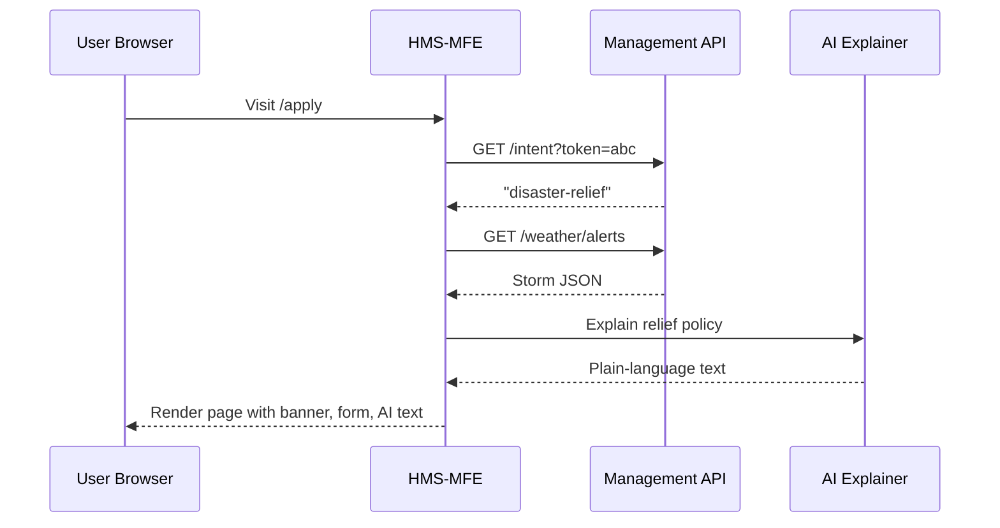

# Chapter 1: Interface Layer (HMS-MFE)

Welcome! In this first chapter we meet the **public-facing window** of the HMS-MKT project—the Interface Layer, also called **HMS-MFE** (Micro-Front-Ends). Think of it as the digital counter at a federal building: citizens “walk up,” tell the clerk what they need, and get routed to the right desk.  
Here the clerk is code, and the desks are little, specialized web widgets.

---

## 1. Why do we need HMS-MFE?

Imagine a citizen in Florida during hurricane season. She visits `my-gov-services.gov`, selecting:

> “I need Disaster Relief Assistance.”

Simultaneously, an engineer from the **National Indian Gaming Commission** logs in to renew a gaming license. Both users hit the **same URL**—yet each sees a tailored dashboard:

• The citizen sees storm warnings, a relief grant form, and a chatbot that explains eligibility rules in plain English.  
• The engineer sees a license-renewal form, current compliance metrics, and AI explanations of pending policy changes.

Delivering these drastically different experiences **without** separate websites is the problem HMS-MFE solves.

---

## 2. Big Ideas (Keep it Friendly)

| Concept | One-Sentence Beginner Explanation |
|---------|------------------------------------|
| Micro-Front-End (MFE) | Tiny, self-contained web apps that plug together like LEGO®. |
| Widget | A single visual chunk (form, chart, chatbot). |
| Intent-Driven Routing | The system listens to what the user wants (“intent”) and shows only relevant widgets. |
| Design System | A shared style guide so every widget looks identical and passes Section 508 accessibility tests. |
| Management APIs | Back-end endpoints HMS-MFE calls to fetch data (covered in [Management / Service Layer](04_management___service_layer__hms_api__hms_svc__.md)). |
| AI Explanation | A helper that converts dense regulation text into plain language. |

---

## 3. A 10-Minute Hello World

Below is a micro-frontend that greets disaster-relief users with a storm warning banner.

```vue
<!-- File: widgets/StormWarning.vue -->
<template>
  <div v-if="alert" class="alert">
    ⚠️ {{ alert.message }}
  </div>
</template>

<script setup>
import { ref, onMounted } from 'vue'
const alert = ref(null)

onMounted(async () => {
  // Tiny call to Management API
  const res = await fetch('/api/weather/alerts?state=FL')
  alert.value = await res.json()
})
</script>

<style scoped>
.alert { background:#ffdede; padding:8px; }
</style>
```

What happens?

1. When mounted, the component calls the weather endpoint.  
2. If an alert exists, it prints a bright banner.  
3. Styling comes from the shared Design System colors.

---

## 4. Gluing Widgets Together

HMS-MFE hosts many widgets on one page. A stripped-down **layout file** might look like this:

```vue
<!-- File: layouts/Dashboard.vue -->
<template>
  <header><SiteNav /></header>
  <main>
    <StormWarning v-if="intent==='disaster-relief'" />
    <LicenseDashboard v-if="intent==='gaming-license'" />
    <AiExplainer :topic="intent" />
  </main>
</template>

<script setup>
import { computed } from 'vue'
import { useIntent } from '@/composables/intent'  // tiny helper
const intent = computed(() => useIntent())        // 'disaster-relief' or 'gaming-license'
</script>
```

Explanation (plain English):

• `useIntent()` checks the URL, user role, or a wizard step to decide the user’s goal.  
• The component tree **conditionally** renders the proper widgets.  
• No page reloads—everything swaps live.

---

## 5. Under the Hood (Step-By-Step)

Below is a minimal, non-code tour of what happens when our Florida citizen lands on `/apply`:



---

## 6. A Peek at Routing Code

Routing is declared in a single, tiny config:

```js
// File: router/routes.js
export default [
  { path: '/apply',   component: () => import('layouts/Dashboard.vue') },
  { path: '/license', component: () => import('layouts/Dashboard.vue') }
]
```

Notice both paths share the same layout. The **intent** comes from query parameters, user roles, or saved session data—not the route itself.

---

## 7. Accessibility & Design System Basics

Every widget imports colors, spacing, and ARIA helpers:

```css
/* File: design-system/colors.css */
:root {
  --primary:#0B6EF6;  /* WCAG AA compliant */
  --alert:#ffdede;
}
```

Because all widgets share this file, Section 508 checks only need to be done **once**.

---

## 8. Where Do Micro-Front-Ends Live?

Folders are split like this (simplified):

```
/widgets
    StormWarning.vue
    LicenseDashboard.vue
/layouts
    Dashboard.vue
/pages
    protocol-builder/index.vue   ← from provided code
```

`Protocol Builder` (already in the repo) is simply another page served by HMS-MFE.

---

## 9. Common Questions

Q: “Do I have to write Vue?”  
A: No. Because we ship MFEs via web-components, a React or Svelte widget can happily live next to Vue ones.

Q: “How big can each widget get?”  
A: Keep it tiny—preferably a single responsibility (form, table, chatbot).

Q: “What about security?”  
A: Authentication happens upstream, then HMS-MFE consults the [Authorization & Role-Based Access Control (RBAC)](05_authorization___role_based_access_control__rbac__.md) service before displaying restricted widgets.

---

## 10. Recap

You now know:

• HMS-MFE acts as the single digital counter for any citizen or agency user.  
• Micro-front-ends = LEGO® pieces you snap in based on user intent.  
• Everything follows one design system, fully accessible.  
• Behind the scenes, widgets call the Management APIs and AI helpers to translate bureaucracy into friendly UI.

Ready to dive deeper into **how intents are detected** and **journeys are guided**?  
Continue to [Intent-Driven Navigation & Guided Journeys](02_intent_driven_navigation___guided_journeys_.md).

---

Generated by [AI Codebase Knowledge Builder](https://github.com/The-Pocket/Tutorial-Codebase-Knowledge)