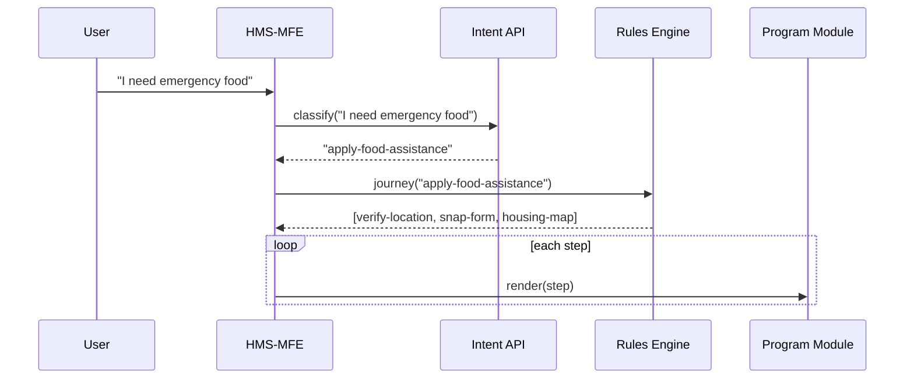

# Chapter 2: Intent-Driven Navigation & Guided Journeys
*(Filename: 02_intent_driven_navigation___guided_journeys_.md)*

[← Back to Chapter 1: Interface Layer (HMS-MFE)](01_interface_layer__hms_mfe__.md)

---

## 1. Why Do We Need “Intent-Driven” Anything?

Picture Maria, a 67-year-old retiree in New Mexico who just lost power after a wildfire.  
She opens `help.gov` and is immediately asked:

> “Hi Maria 👋  
> What would you like to do today?”

She types **“I need emergency food and maybe housing.”**

Instead of forcing her to know terms like “FNS Form 202” or “FEMA IA-2 Worksheet,” HMS-MKT:

1. Detects her *intent* (“emergency food + temporary shelter”).  
2. Stitches together a **Guided Journey**:  
   • Step 1: Verify disaster location (FEMA)  
   • Step 2: Pre-fill SNAP Disaster Relief form (FNS)  
   • Step 3: Offer housing locator map  
3. Shows tooltips, plain-English answers, and a “save & finish later” button.

Maria never sees jargon—just a friendly path to her outcome.

---

## 2. Key Ideas in Plain English

| Term                     | Beginner-Friendly Meaning                                                  |
|--------------------------|-----------------------------------------------------------------------------|
| Intent                   | The *goal* the user states (“renew my passport”).                           |
| Guided Journey           | A bite-sized, step-by-step wizard that reaches that goal.                   |
| Rules Engine             | Simple “if-this-then-that” logic that maps intents to journeys.            |
| AI Intent Classifier     | A small language model that guesses intents from free text.                 |
| Contextual Help          | In-place hints (“What counts as income?”) pulled from policy docs.          |

> Analogy: A 311 phone operator asks *“How can I help?”* and then routes you to trash pickup or pothole repair.  
> HMS-MKT is the same—just digital.

---

## 3. At a Glance: How the Pieces Fit



Keep the names in mind—we’ll see most of them in code soon.

---

## 4. Minimum Code to Try It Out

Let’s build the tiniest **Intent Router** so you can kick the tires locally.

### 4.1 Intent Rules (YAML)

```yaml
# File: rules/intents.yml
apply-food-assistance:
  steps:
    - verify-disaster-location
    - prefillsnap-form
    - offer-housing-map
renew-gaming-license:
  steps:
    - verify-tribal-authorization
    - upload-audit-docs
    - pay-renewal-fee
```

Explanation  
• Keys (`apply-food-assistance`) are *intent IDs.*  
• Each `steps` list becomes a Guided Journey.

### 4.2 Minimal Intent Service

```js
// File: services/intentService.js
import rules from '../rules/intents.yml'

export function getJourney(intentId) {
  return rules[intentId]?.steps ?? []
}
```

Explanation  
• Reads YAML at startup (bundlers like Vite can import it).  
• Returns an array such as `['verify-disaster-location', ...]`.

### 4.3 GuidedJourney Component (Vue 3)

```vue
<!-- File: widgets/GuidedJourney.vue -->
<template>
  <Step v-for="s in steps" :key="s" :name="s" @complete="next()" />
</template>

<script setup>
import { ref } from 'vue'
import { getJourney } from '@/services/intentService'

const props = defineProps({ intentId: String })
const steps = ref(getJourney(props.intentId))
function next() { steps.value.shift() }    // remove finished step
</script>
```

What happens?  
1. Receives an `intentId` like `apply-food-assistance`.  
2. Pulls the step list from the service.  
3. Renders one step at a time and removes each on completion.

> ⚠️ *Real code handles errors, saves progress, etc. We’re staying under 20 lines for learning ease.*

---

## 5. From User Text → Intent ID

A full model is overkill for a demo. Here’s a **3-rule classifier** using keywords.

```js
// File: services/intentClassifier.js
export function classify(text) {
  const t = text.toLowerCase()
  if (t.includes('food')) return 'apply-food-assistance'
  if (t.includes('gaming')) return 'renew-gaming-license'
  return 'general-inquiry'
}
```

You can swap this out later with an Azure / AWS Comprehend endpoint or HMS-A2A’s model (see [AI Representative Agent (HMS-A2A)](08_ai_representative_agent__hms_a2a__.md)).

---

## 6. Wire It Up in the Interface Layer

Inside the same layout we met in Chapter 1:

```vue
<!-- File: layouts/Dashboard.vue (snippet) -->
<template>
  <GuidedJourney v-if="intentId" :intentId="intentId" />
</template>

<script setup>
import { classify } from '@/services/intentClassifier'
import { ref } from 'vue'

const intentId = ref(null)
// Imagine this comes from a free-text box
function onUserSubmit(text) {
  intentId.value = classify(text)  // e.g. "apply-food-assistance"
}
</script>
```

Now typing *“I lost power and need food”* will load the correct journey.

---

## 7. Under the Hood (Deeper Dive)

1. **Intent API**  
   A lightweight endpoint that wraps `classify()`.  
   ```txt
   POST /api/intent
   { text:"I need emergency food" } → { intentId:"apply-food-assistance" }
   ```

2. **Rules Engine**  
   Could be as simple as loading `intents.yml` or as fancy as Drools / Camunda.  
   The only requirement: given an `intentId`, return an ordered list of steps.

3. **Program Modules**  
   Each `step` slug (e.g., `prefillsnap-form`) maps to a self-contained widget called a **Program Module**—the focus of [Chapter 3](03_program_module_.md).

---

## 8. Adding Contextual Help (Bonus)

Sprinkle “What’s this?” links right in a form.

```vue
<!-- File: widgets/HelpTip.vue -->
<template>
  <span class="tip" @click="open">{{ label }}</span>
</template>

<script setup>
import { askAI } from '@/services/helpService'   // wraps HMS-A2A
const props = defineProps({ label:String, topic:String })
function open() {
  askAI(props.topic).then(ans => alert(ans))
}
</script>
```

Behind `askAI` is the same language model used in other chapters—one call, endless plain-language answers.

---

## 9. Frequently Asked Questions

**Q: Can users skip steps?**  
A: Each step emits `complete` only when validation passes, but journeys can branch via the Rules Engine (“if household size > 5, insert extra form”).

**Q: How big can the YAML get?**  
A: Thousands of intents are fine; the file can be split per agency and merged at build time.

**Q: Where does accessibility fit?**  
A: Widgets rendered in Guided Journeys must follow the design system we met in [Chapter 1](01_interface_layer__hms_mfe__.md) so screen readers announce step numbers and progress.

---

## 10. Recap & What’s Next

You learned how HMS-MKT:

• Listens for a plain-language *intent* rather than a technical form name.  
• Uses a rules file (or AI) to translate that intent into a **Guided Journey**.  
• Renders each step through small, reusable **Program Modules**.  

Ready to build those Program Modules themselves? Jump to  
[Chapter 3: Program Module](03_program_module_.md) →

---

Generated by [AI Codebase Knowledge Builder](https://github.com/The-Pocket/Tutorial-Codebase-Knowledge)