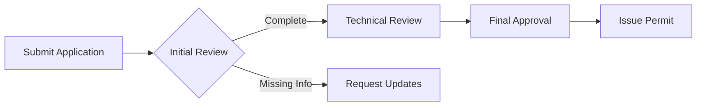
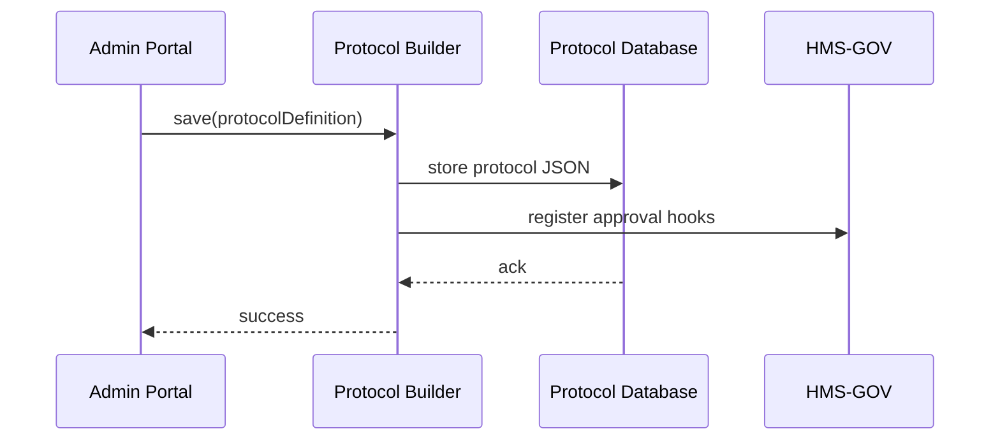

# Chapter 2: Protocol Builder

Welcome back! In [Chapter 1: Core System Platform (HMS-GOV)](01_core_system_platform__hms_gov__.md) we learned how to define policies and roles. Now we’ll step into the **Protocol Builder**—our “policy drafting table” where administrators lay out each action, review checkpoint, and approval stage before a rule goes live.

---

## 2.1 Why a Protocol Builder?

Imagine the **City Planning Department** needs to model its permit‐issuance flow:
1. A citizen **submits** a building permit application.  
2. A **reviewer** does an initial check.  
3. A **technical expert** verifies structural plans.  
4. The **public** can comment.  
5. A **final approver** signs off and issues the permit.

Without a visual workspace, it’s hard to keep track of all steps, roles, and conditional paths. The Protocol Builder gives you a drag-and-drop canvas to:

- Define **steps** (actions like “Submit Form”).  
- Insert **checkpoints** (e.g., “Reviewer OK?”).  
- Assign **approval stages** (roles, due dates).  
- Preview **transitions** (what happens on pass/fail).

> Analogy: Think of a legislative committee drafting a new law. They pin each article on a board, discuss sequentially, and vote at checkpoints. Protocol Builder is that board—digital and interactive.

---

## 2.2 Key Concepts

1. **Canvas**  
   A visual area where you place steps, checkpoints, and approvals in sequence.

2. **Step**  
   An atomic action (e.g., “Receive Application”).  

3. **Checkpoint**  
   A decision node that routes the flow based on criteria (e.g., “If docs complete, go next; else request update”).  

4. **Approval Stage**  
   A special checkpoint requiring a role’s sign‐off (e.g., “City Planner Approval”).  

5. **Transition**  
   The arrows that connect steps and checkpoints, defining the path.

---

## 2.3 Modeling a Simple Permit Flow

Here’s a miniature flowchart of our permit process:



This visual helps stakeholders see the entire journey. Now, let’s build it.

---

## 2.4 Using the Protocol Builder API

Under the hood, the UI relies on a small SDK to create and edit protocols. Let’s see how it works in code.

### 2.4.1 Create a New Protocol

```javascript
import { ProtocolBuilder } from 'hms-mkt';

// Start a new protocol named “City Permit Flow”
const builder = new ProtocolBuilder('City Permit Flow');
```
*What this does:*  
Initializes a fresh protocol definition in memory.

### 2.4.2 Add Steps and Checkpoints

```javascript
builder
  .addStep('Submit Application')
  .addCheckpoint('Initial Review', { role: 'Reviewer' })
  .addStep('Technical Review')
  .addApprovalStage('Final Approval', { role: 'Approver' });
```
*What this does:*  
- `addStep`: simple action.  
- `addCheckpoint`: decision point requiring a Reviewer.  
- `addApprovalStage`: special checkpoint for Approver role.

### 2.4.3 Finalize and Save

```javascript
builder.save().then(proto => {
  console.log('Protocol saved with ID:', proto.id);
});
```
*What this does:*  
Persists your protocol to the backend and returns its database ID.

---

## 2.5 Under the Hood: What Happens When You Save

### 2.5.1 Step-by-Step Sequence



1. **UI** calls `save()`.  
2. **Protocol Builder** stores the flow in the database.  
3. It tells **HMS-GOV** about any approval checkpoints (so compliance checks can run later).  
4. Database acknowledges.  
5. UI shows success.

### 2.5.2 Core Code Snippets

```javascript
// src/hms-mkt/protocol-builder/core.js
const store = []; // in-memory for demo

export class ProtocolBuilder {
  constructor(name) {
    this.proto = { id: Date.now(), name, steps: [] };
  }
  addStep(name) {
    this.proto.steps.push({ type: 'step', name });
    return this;
  }
  addCheckpoint(label, cfg) {
    this.proto.steps.push({ type: 'checkpoint', label, cfg });
    return this;
  }
  addApprovalStage(label, cfg) {
    this.proto.steps.push({ type: 'approval', label, cfg });
    return this;
  }
  save() {
    store.push(this.proto);
    // Imagine a real DB call here
    return Promise.resolve(this.proto);
  }
}
```
*Explanation:*  
- We keep a simple array `store`—in real life this talks to a database.  
- Each `add*` method appends a config object to `steps`.  
- `save()` persists and returns the full protocol.

---

## 2.6 Summary

In this chapter you:

- Learned why a visual **Protocol Builder** solves complex, multi-step flows.  
- Explored the main concepts: **Canvas**, **Step**, **Checkpoint**, **Approval Stage**, **Transition**.  
- Saw a mini flowchart for a city permit process.  
- Used a minimal SDK to create, edit, and save a protocol.  
- Peered under the hood with a sequence diagram and core code.

Next up: plugging these protocols into actual programs in the **[Program Module](03_program_module_.md)**.

---

Generated by [AI Codebase Knowledge Builder](https://github.com/The-Pocket/Tutorial-Codebase-Knowledge)