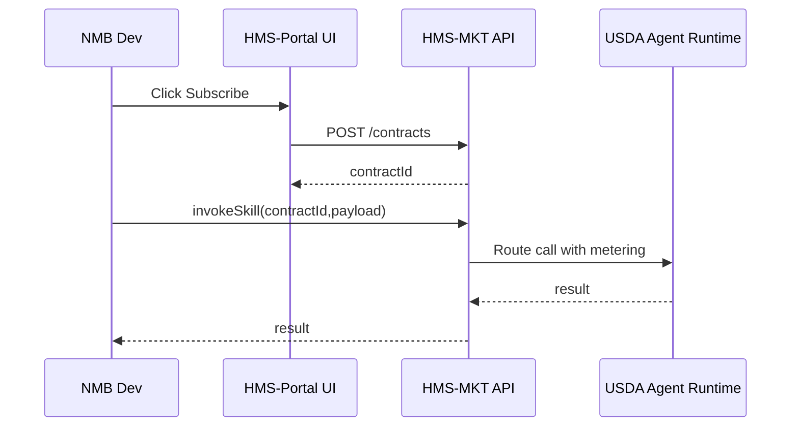

# Chapter 3: HMS-MKT Agent & Data Marketplace


[← Back to Chapter&nbsp;2: Intent-Driven Navigation & Guided Journeys](02_intent_driven_navigation___guided_journeys_.md)

---

## 1. Why Do We Need a Marketplace?

Imagine the small **National Mediation Board (NMB)**.  
They need an AI **fraud-detection** skill to flag bogus travel-expense forms—but they:

* Don’t have a data-science team.  
* Can’t wait 18 months for a new contract.  
* Must show every dollar to their budget officer.

Meanwhile the **Department of Agriculture (USDA)** already built and vetted that exact model.

The **HMS-MKT Marketplace** is our “government app store” that lets:

1. USDA **publish** the skill with price, policy tags, and sample accuracy.  
2. NMB **subscribe** with one click; their developers get a plug-and-play API.  
3. Budget officers see the cost in real-time and approve it up-front.

No reinventing the wheel, no secret side agreements, no hidden invoices.

---

## 2. Big Picture in One Sentence

HMS-MKT is a searchable shelf of pre-vetted **AI skills** and **datasets** that any agency can rent like LEGO bricks—while finance, security, and policy teams watch every transaction.

---

## 3. Key Concepts (Plain English)

| Term            | What It Really Means                                                     |
|-----------------|--------------------------------------------------------------------------|
| Listing         | A public card in the marketplace (e.g., “🐮 USDA Fraud Detector v2”).    |
| Provider        | Agency that publishes the listing.                                       |
| Subscriber      | Agency that purchases / activates the listing.                           |
| Skill Agent     | A containerized micro-service that performs a task (translate, detect).  |
| Data Product    | A static or streaming dataset (crop yields, postal zip shapes).          |
| Contract Token  | A digitally-signed document describing price & usage caps.               |
| Sandbox Call    | Free, low-volume endpoint for developers to test before paying.          |

Keep these seven words in mind and you can already use 80 % of the marketplace.

---

## 4. Guided Walk-Through: NMB Buys “Fraud-Detector-USDA”

We will:

1. Search the marketplace.  
2. Review pricing and policy tags.  
3. Subscribe and call the skill from code.

### 4.1 Search

Open the HMS portal and type:

```
fraud detection expense form
```

You’ll see a card like:

```
🐮 Fraud-Detector-USDA
Price: $0.02 / call     Accuracy: 96 %
Tags: PII-Safe, FedRAMP-High
```

Click **“Details”** to view the contract token and sample API call.

### 4.2 Subscribe (UI)

```
[Subscribe]  Qty cap: 10 000 calls/month
 Cost:       $200
 Budget Code: 2024-NMB-Ops
 [Request Approval]
```

Your budget officer receives a notification.  
Once approved, HMS-MKT automatically issues `contractId = "ct_abc123"` and adds the skill to NMB’s **Active Assets** list.

### 4.3 Call the Skill (Code ‑ 11 lines)

```js
import { invokeSkill } from 'hms-svc-client'   // see Chapter 7

const contractId = 'ct_abc123'                 // issued in 4.2
const payload = { formPdfUrl: 'https://.../1234.pdf' }

invokeSkill('usda/fraud-detector', contractId, payload)
  .then(res => console.log('Verdict:', res.result))
  .catch(err => console.error(err))
```

Explanation  
1. One helper `invokeSkill` hides auth headers and rate limits.  
2. If the monthly cap is reached, HMS-MKT returns `HTTP 402 Payment Required`, preventing surprise bills.

---

## 5. How to Publish Your Own Listing

Let’s act as **USDA** creating a *translation* skill.

### 5.1 Fill the Listing YAML (8 lines)

```yaml
# listings/translation-usda.yaml
name: translation-usda
type: skill
pricePerCallUSD: 0.005
sandboxLimitPerDay: 100
dataSensitivity: CUI
maintainer: ai-team@usda.gov
dockerImage: ghcr.io/usda/translate:3.1.0
```

### 5.2 Push & Register (Shell Command)

```bash
hms publish listings/translation-usda.yaml
```

What happens?  
• HMS-MKT validates security scans.  
• Legal team auto-attaches standard inter-agency contract text.  
• Listing appears within 60 seconds in the marketplace search.

---

## 6. Under the Hood (No Heavy Code)



Key points:  
• **MK** (Marketplace) meters every call.  
• **AGR** (Agent Runtime) is still owned and hosted by USDA.  
• Billing happens monthly via the contract token.

---

## 7. Peek Inside: Minimal Server Code

File: `hms-mkt/src/routes/skillInvoke.ts` (16 lines)

```ts
router.post('/invoke/:provider/:skill', async (req, res) => {
  const { contractId } = req.headers
  const contract = await db.getContract(contractId)

  if (!contract || contract.callsUsed >= contract.callCap)
    return res.status(402).send('Cap reached')

  const endpoint = registry.endpoint(req.params.provider, req.params.skill)
  const result = await fetch(endpoint, { method:'POST', body: req.body }).then(r=>r.json())

  await db.incUsage(contractId)
  res.json(result)
})
```

Explanation line-by-line:  
1-3. Verify the **contract token** exists.  
4-5. Stop if the quota is exhausted.  
6-7. Look up the provider’s micro-service URL.  
8-10. Proxy the request, increment the meter, return the answer.

---

## 8. Where Does the Money Flow?

* The **Budget Code** entered on subscribe creates an *obligation* in the financial system (future integration in [Backend Service & Public API](07_backend_service___public_api__hms_svc___hms_mkt__.md)).  
* Monthly, HMS-MKT bundles usage logs and sends them to [HMS-GOV Admin / Policy-Maker Portal](05_hms_gov_admin___policy_maker_portal_.md) for review.  
* Payment is settled via intra-governmental payment file (IPAC).

---

## 9. Connecting to Other HMS Pieces

Need the skill inside a citizen journey? Just call it from a widget living in the [HMS-MFE Micro-Frontend Shell](01_hms_mfe_micro_frontend_shell_.md).  
Need a long-running process? Chain the skill in [HMS-ACT Orchestration & Workflow Engine](08_hms_act_orchestration___workflow_engine_.md).

---

## 10. Try It Yourself (30-Second Lab)

1. Run the demo marketplace:

   ```bash
   npm run dev --workspace=hms-mkt
   ```

2. In the browser console, paste:

   ```js
   HMS.MKT.subscribe('translation-usda')
   ```

3. Call the sandbox endpoint and check the JSON response.

---

## 11. Recap

You can now:

• Search, subscribe, and invoke ready-made AI skills.  
• Publish your own listings with one YAML file.  
• Understand the contract-meter-bill flow inside HMS-MKT.

By reusing each other’s work, agencies focus on missions instead of rebuilding tools.

[Next Chapter: AI Representative Agent (HMS-AGT + AGX)](04_ai_representative_agent__hms_agt___agx__.md)

---

Generated by [AI Codebase Knowledge Builder](https://github.com/The-Pocket/Tutorial-Codebase-Knowledge)