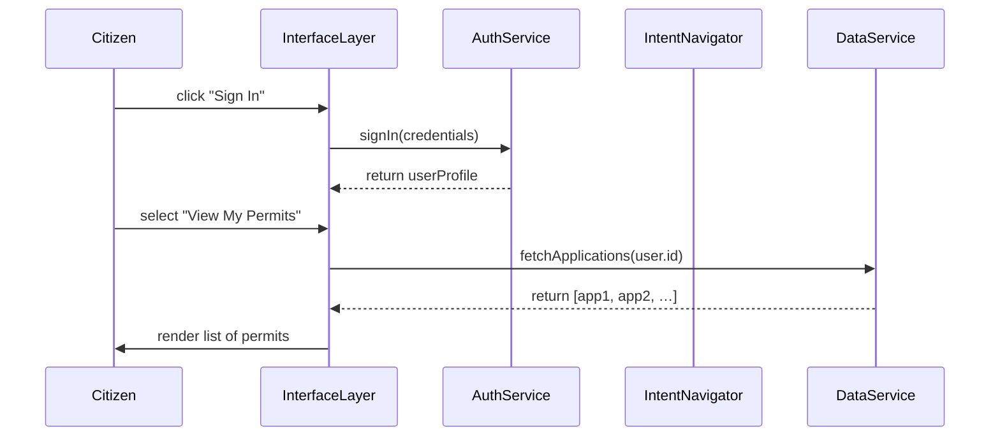

# Chapter 3: Interface Layer

Welcome back! In [Chapter 2: Frontend Interface Library](02_frontend_interface_library_.md), we built reusable UI components like `<Button>` and `<Input>`. Now we’ll see how those pieces fit together in the **Interface Layer**—the client-facing tier of HMS-MKT that acts like the front desk of a government office.

---

## 1. Why an Interface Layer?

Imagine you’re a citizen and you visit a government portal to check the status of a permit application. You need to:

1. Sign in.  
2. Pick “View Permit Status.”  
3. See a list of your past submissions.  

The **Interface Layer** is responsible for all of that: user sign-in, navigation menus, and showing data fetched from backend services. It lives in our web/mobile apps—HMS-MFE for the public, HMS-GOV for internal staff—and makes sure users can seamlessly interact with government systems.

---

## 2. Key Concepts

1. **Entry Point**  
   The main component (e.g., `App.jsx`) that boots up the portal.

2. **Authentication**  
   Handling user sign-in/out via an `AuthService`.

3. **Navigation**  
   Tying into our Intent-Driven flows ([Chapter 1](01_intent_driven_navigation_.md)) and rendering the right screens.

4. **Data Presentation**  
   Calling backend APIs to load data and rendering lists, forms, and details.

---

## 3. Using the Interface Layer

Let’s build a minimal HMS-MFE app that:

1. Shows a sign-in form.  
2. After sign-in, displays a menu of actions.  
3. Lets users fetch and view a list of their permit requests.

### 3.1 Setup the App Entry Point

```js
// src/interface/App.jsx
import React from 'react'
import { ThemeProvider } from '@hms-mkt/ui-lib'
import InterfaceLayer from './InterfaceLayer'

export default function App() {
  return (
    <ThemeProvider>
      <InterfaceLayer />
    </ThemeProvider>
  )
}
```
Here we wrap our interface in the shared theme so all UI components look consistent.

### 3.2 Sign-In and Menu

```js
// src/interface/InterfaceLayer.jsx
import React, { useState } from 'react'
import { Input, Button, Menu, DataList } from '@hms-mkt/ui-lib'
import AuthService from '../services/AuthService'
import DataService from '../services/DataService'

export default function InterfaceLayer() {
  const [user, setUser] = useState(null)
  const [applications, setApplications] = useState([])

  async function handleSignIn(creds) {
    const profile = await AuthService.signIn(creds)
    setUser(profile)
  }

  async function loadApplications() {
    const apps = await DataService.fetchApplications(user.id)
    setApplications(apps)
  }

  if (!user) {
    return (
      <div>
        <Input id="email" label="Email" />
        <Input id="password" label="Password" type="password" />
        <Button onClick={() => handleSignIn({ /* read fields */ })}>
          Sign In
        </Button>
      </div>
    )
  }

  return (
    <div>
      <Menu items={['View My Permits']} onSelect={loadApplications} />
      <DataList data={applications} />
    </div>
  )
}
```

Explanation:

- Before sign-in, we render two `<Input>` fields and a `<Button>`.  
- On success, we switch to a menu with “View My Permits.”  
- Clicking that calls `loadApplications`, fetches data, and shows it via `<DataList>`.

---

## 4. Under the Hood: What Happens Step-by-Step

Below is a simple sequence diagram showing a citizen viewing their permit list:



---

## 5. A Peek at Internal Code

### 5.1 AuthService (src/services/AuthService.js)

```js
// Simulated auth calls
export default {
  async signIn({ email, password }) {
    // In real life: call `/api/auth/login`
    return { id: 'user-123', name: 'Jane Doe', email }
  }
}
```

This service would normally call a backend endpoint and store a token.

### 5.2 DataService (src/services/DataService.js)

```js
export default {
  async fetchApplications(userId) {
    // In real life: fetch(`/api/users/${userId}/applications`)
    return [
      { id: 'app-1', type: 'Building Permit', status: 'Approved' },
      { id: 'app-2', type: 'Event Permit', status: 'Pending' }
    ]
  }
}
```

It simulates returning an array of permit records.

---

## 6. Analogy: Front Desk of a Government Office

Think of the **Interface Layer** as the front desk agent:

- **Greets** you and checks your ID (Authentication).  
- **Shows** you a directory of services (Navigation).  
- **Fetches** your files and hands them to you (Data Presentation).

Everything feels smooth—no confusing links, no raw JSON data, just clear steps.

---

## 7. Summary & Next Steps

You’ve learned how the **Interface Layer**:

- Boots up under a `ThemeProvider`.  
- Manages sign-in via an `AuthService`.  
- Hooks into menus and intent flows.  
- Fetches and displays data using our UI library.

Next, we’ll connect these UI screens with structured messages and data models in [Chapter 4: Protocol Builder](04_protocol_builder_.md).

---

Generated by [AI Codebase Knowledge Builder](https://github.com/The-Pocket/Tutorial-Codebase-Knowledge)