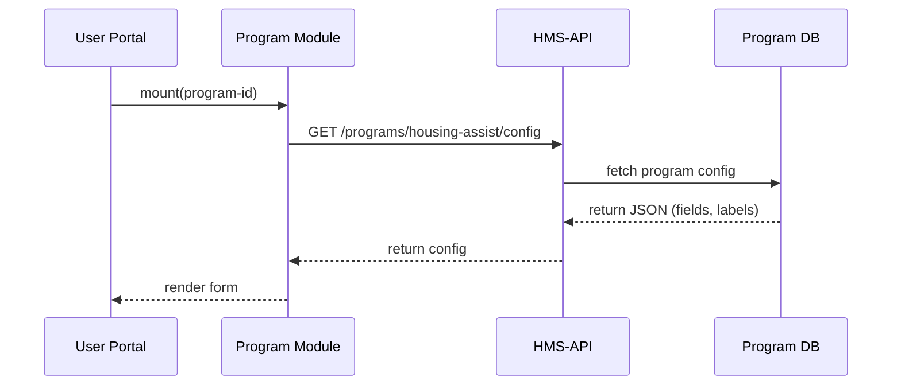

# Chapter 3: Program Module

Welcome back! In [Chapter 2: Protocol Builder](02_protocol_builder_.md) we designed the workflows and approval steps. Now we’ll package those protocols (and UI) into a **Program Module**—a self-contained “plug-and-play” box that portals can drop in to expose any service or benefit.

---

## 3.1 Why a Program Module?

Imagine the U.S. Interagency Council on Homelessness wants to embed a **Housing Assistance** tool on multiple state portals. Instead of re-building that form and logic each time, you pack everything—UI, data fetch, policy checks—into a single module. Any portal can import it, point to the right program ID, and you’re live.

Analogy: Think of a Program Module as a power outlet extension. You design it once, then plug it into any wall (portal) and it just works—no rewiring needed.

**Central Use Case**  
Expose a “Housing Assistance” program on both a state portal and a nonprofit website with zero duplicated code.

---

## 3.2 Key Concepts

1. **Container Component**  
   The front-end wrapper (e.g., `ProgramModule.vue`) that renders title, form, results.

2. **Program Configuration**  
   Metadata fetched from the backend: fields, labels, API routes.

3. **Service Logic**  
   Encapsulated functions to load data, submit forms, and handle errors.

4. **Policy Hook-ups**  
   Integrations with [HMS-GOV](01_core_system_platform__hms_gov__.md) to enforce roles or approvals before actions.

---

## 3.3 Using a Program Module

Let’s embed the “Housing Assistance” module in your portal.

### 3.3.1 Install or Import

```javascript
// main.js
import Vue from 'vue'
import ProgramModule from './components/Modules/ProgramModule.vue'

Vue.component('ProgramModule', ProgramModule)
```

_Explanation: We register the module globally so any page can use it._

### 3.3.2 Render with Program ID

```html
<!-- housing.html -->
<template>
  <div>
    <h1>Apply for Housing Assistance</h1>
    <ProgramModule
      program-id="housing-assist"
      title="Housing Assistance"
    />
  </div>
</template>
```

_Explanation: The `program-id` tells the module which configuration to fetch from the backend._

### What Happens

1. The module reads `program-id="housing-assist"`.  
2. It calls its internal service to fetch fields and validation rules.  
3. It renders the form and “Submit” button.  
4. On submit, it checks policies with [HMS-GOV](01_core_system_platform__hms_gov__.md) before sending data to the API.

---

## 3.4 Under the Hood: Sequence Walkthrough

Here’s a minimal sequence when the module loads:



1. **Portal** mounts `<ProgramModule>`.  
2. **Module** requests its configuration from **HMS-API**.  
3. **HMS-API** looks up the program in the database.  
4. The config arrives and the form renders automatically.

---

## 3.5 Internal Implementation

Let’s peek at two core files that power our module.

### 3.5.1 components/Modules/ProgramModule.vue

```html
<template>
  <div class="program-module">
    <h2>{{ title }}</h2>
    <form @submit.prevent="submit">
      <div v-for="f in config.fields" :key="f.name">
        <label :for="f.name">{{ f.label }}</label>
        <input :id="f.name" v-model="form[f.name]" />
      </div>
      <button>Submit</button>
    </form>
  </div>
</template>

<script>
import { fetchProgramConfig, submitProgramData } from '../../services/programService'

export default {
  props: ['programId','title'],
  data() {
    return { config: { fields: [] }, form: {} }
  },
  async created() {
    this.config = await fetchProgramConfig(this.programId)
    // initialize form keys
    this.config.fields.forEach(f => (this.form[f.name] = ''))
  },
  methods: {
    async submit() {
      // policy check with HMS-GOV could go here
      await submitProgramData(this.programId, this.form)
      alert('Application sent!')
    }
  }
}
</script>
```

_Explanation:  
- On creation, we call `fetchProgramConfig` to get field definitions.  
- We render inputs dynamically.  
- On submit, we post the data._

### 3.5.2 services/programService.js

```javascript
// Minimal service functions
export async function fetchProgramConfig(id) {
  const resp = await fetch(`/api/programs/${id}/config`)
  return resp.json()
}

export async function submitProgramData(id, data) {
  const resp = await fetch(`/api/programs/${id}/apply`, {
    method: 'POST',
    headers: { 'Content-Type': 'application/json' },
    body: JSON.stringify(data)
  })
  return resp.json()
}
```

_Explanation:  
- `fetchProgramConfig` and `submitProgramData` wrap simple HTTP calls.  
- Portals don’t need to know any details beyond program ID._

---

## 3.6 Summary

In this chapter you:

- Saw why a **Program Module** is your reusable “plug-and-play” box for services.  
- Learned the main pieces: **container**, **config**, **service logic**, **policy hooks**.  
- Embedded a “Housing Assistance” module with just a few lines of code.  
- Peeked under the hood with a sequence diagram and core Vue + JS service files.

Up next, we’ll explore how the backend API supports these modules in [Chapter 4: Backend API (HMS-API/HMS-MKT)](04_backend_api__hms_api_hms_mkt__.md).

---

Generated by [AI Codebase Knowledge Builder](https://github.com/The-Pocket/Tutorial-Codebase-Knowledge)