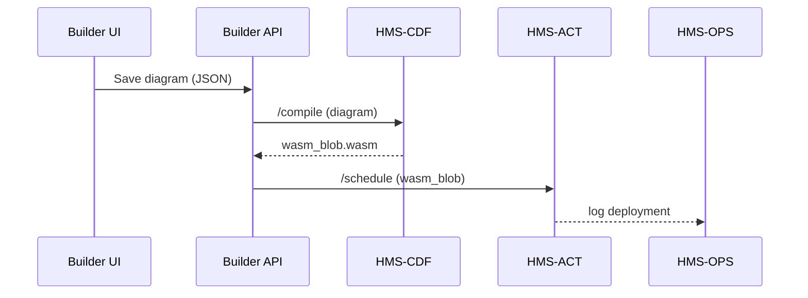

# Chapter 3: Protocol Builder Page

*(A friendly sequel to [Policy & Legislative Engine (HMS-CDF)](02_policy___legislative_engine__hms_cdf__.md))*  

---

## 1. Why Do We Need a “Protocol Builder”?

Picture the Federal Railroad Administration (FRA).  
They want a **“Quick Track-Safety Audit”** that field inspectors can run from a tablet.  
The audit must:

1. Check rail temperature  
2. If too hot, trigger a slow-order notice  
3. Log the result in the national rail database  
4. Email a summary to headquarters

Today that logic would bounce between Excel macros, SharePoint forms, and three different IT teams. **Yikes!**

The **Protocol Builder Page** lets a non-developer drag blocks on a canvas—**click-save—and HMS does the rest**.  
Behind the scenes:

* HMS-CDF (Chapter 2) turns the diagram into executable policy code  
* HMS-ACT (Chapter 5) schedules each step in live workflows  

Result: a “flowchart” becomes real software **without writing a single `if` statement**.

---

## 2. Key Ideas in Plain English

| Builder Term | Friendly Analogy | 🏛️ Gov Example |
|--------------|-----------------|---------------|
| Component Palette | A box of LEGO bricks | “Email Notice”, “Temperature Sensor”, “Database Write” |
| Canvas | The table where you snap bricks together | Your audit workflow |
| Step Block | One LEGO brick | “Measure rail temp” |
| Branch / Condition | A fork in a hiking trail | If temp > 140 °F → send slow-order |
| Run Preview | A dress rehearsal | Simulate an inspector’s day |
| Save & Publish | Printing the final instruction manual | HMS-CDF compiles it, HMS-ACT rolls it out |

---

## 3. A 3-Minute Guided Tour

We will build the **Quick Track-Safety Audit** in four baby steps.

### 3.1 Open the Builder

1. Sign in as `fra_admin`  
2. Navigate to **Protocols → New**

> You see an empty grid and a palette on the left.

### 3.2 Drag Blocks

| Action | What to Drag |
|--------|--------------|
| Start point | 🟢 “Begin Audit” |
| Measure | 📏 “Read Temperature” |
| Decision | 🔀 “If > 140°F?” |
| Notification | ✉️ “Email HQ” |
| Log | 🗄️ “Write to RailDB” |
| End | 🔴 “Finish” |

Snap them so they flow top-to-bottom.

### 3.3 Configure a Block (1 click!)

Select “Read Temperature” → set **SensorID** to `TRACK_TEMP_01`.  
No code—just a dropdown.

### 3.4 Preview & Publish

Click “Preview”.  
You’ll see:

```
(1) Begin Audit
(2) Read Temperature = 147°F
(3) Condition TRUE
(4) Email HQ ➜ Sent
(5) Write to RailDB ➜ OK
(6) Finish
```

Looks good! Hit **Save & Publish**.  
Done—inspectors will see it in their mobile app tomorrow morning.

---

## 4. Under the Hood (What Really Happens?)



1. The UI sends a **tiny JSON** describing the blocks and connections.  
2. HMS-CDF turns it into a secure WebAssembly file (`wasm_blob`).  
3. HMS-ACT schedules that blob across worker nodes.  
4. HMS-OPS (Chapter 17) records metrics and logs.

---

## 5. Peeking at the Code (20-line promise!)

### 5.1 Frontend – minimal Vue component

```vue
<!-- pages/protocol-builder/index.vue -->
<script setup>
import { ref } from 'vue'
const diagram = ref('{}')        // JSON string
async function save() {
  await fetch('/api/builder', {
    method: 'POST',
    body: diagram.value
  })
}
</script>

<template>
  <div>
    <ProtocolCanvas v-model="diagram" />
    <button @click="save">Save & Publish</button>
  </div>
</template>
```

Explanation:  
`<ProtocolCanvas>` is a custom widget that edits a JSON diagram.  
Pressing **Save** POSTs it to the backend—*that’s all!*.

### 5.2 Backend – Express-style route

```js
// routes/builder.js
router.post('/', async (req, res) => {
  const json = req.body            // diagram
  const wasm = await cdf.compile(json) // call HMS-CDF SDK
  await act.deploy(wasm)              // notify HMS-ACT
  res.sendStatus(204)
})
```

Explanation:  
1. Receive diagram JSON  
2. Ask HMS-CDF to compile  
3. Send compiled blob to HMS-ACT  
4. Return `204 No Content`

### 5.3 How does `cdf.compile` look?

```js
// services/cdf.js
export async function compile(diagramJson){
  const res = await fetch('http://cdf/compile', {
    method:'POST', body: diagramJson
  })
  return await res.arrayBuffer()    // wasm bytes
}
```

Simple REST call—language-agnostic.

---

## 6. File Format Cheat-Sheet

A saved protocol is just JSON:

```json
{
  "name": "Quick Track-Safety Audit",
  "version": 1,
  "steps": [
    { "id": "start", "type": "begin" },
    { "id": "t1",    "type": "sensor.read", "props": { "sensorId": "TRACK_TEMP_01" } },
    { "id": "c1",    "type": "condition", "expr": "t1.value > 140" },
    { "id": "e1",    "type": "email", "to": "hq@fra.gov" },
    { "id": "db1",   "type": "db.write", "table": "rail_audits" },
    { "id": "end",   "type": "finish" }
  ],
  "links": [
    ["start","t1"], ["t1","c1"], ["c1","e1","true"],
    ["c1","db1"], ["db1","end"]
  ]
}
```

You could author it by hand, but the drag-and-drop canvas does it for you.

---

## 7. Frequently Asked Questions

**Q: Do I need to know JavaScript or Rust?**  
No. The whole point is *visual authoring*. Code only appears if you want to extend custom blocks.

**Q: Can I reuse a published protocol for a different agency like the Defense Health Agency (DHA)?**  
Yes—clone it, change block properties (e.g., email to `dha@health.mil`), and publish version 2.

**Q: How are legal checks enforced?**  
When you press **Save**, HMS-CDF passes the diagram through its conflict & compliance engine (see [Policy & Legislative Engine](02_policy___legislative_engine__hms_cdf__.md)). If a step violates a statute, you’ll get a red error banner.

**Q: What if I need human sign-off?**  
Route the draft to [Governance Interface Layer](01_governance_interface_layer__hms_gov__.md) before auto-publishing.

---

## 8. What You Learned

• The **Protocol Builder Page** turns drag-and-drop diagrams into real, executable workflows—no coding required.  
• A protocol consists of blocks (steps) and links (flow).  
• Saving sends JSON to HMS-CDF → compiled to WASM → deployed by HMS-ACT.  
• Minimal code (under 20 lines per piece) wires the UI to the backend.  

Ready to see how lawyers and compliance officers double-check those automated steps? Jump to [Compliance & Legal Reasoning (HMS-ESQ)](04_compliance___legal_reasoning__hms_esq__.md).

---

Generated by [AI Codebase Knowledge Builder](https://github.com/The-Pocket/Tutorial-Codebase-Knowledge)