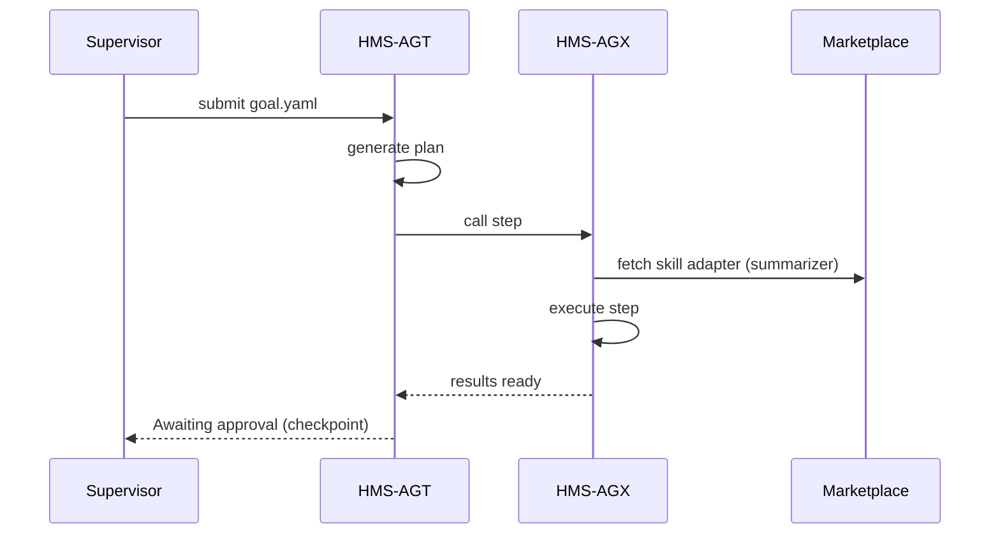

# Chapter 4: AI Representative Agent (HMS-AGT + AGX)

[← Back to Chapter 3: HMS-MKT Agent & Data Marketplace](03_hms_mkt_agent___data_marketplace_.md)

---

## 1. Why Do We Need an “AI Representative”?

Picture the **Census Bureau** drowning in 4 000 citizen e-mails a day:

* “Where is my survey form?”  
* “How do I correct my household size?”  

A human aide could:

1. Read each message  
2. Look up policy in the giant Census manual  
3. Draft a polite reply or route the ticket  
4. Hand the response to a supervisor for final sign-off  

…but that aide would eventually sleep.  
**HMS-AGT + AGX** is the never-sleeping, rule-reading aide.

You give it a goal:

```
"Respond to backlog of census email inquiries."
```

It then:

1. Studies the e-mail corpus  
2. Designs a response plan  
3. Executes low-risk steps itself  
4. Flags anything sensitive for a human supervisor  

All without writing custom Python every week.

---

## 2. Key Ideas in Plain English

| Term | What It Really Means |
|------|----------------------|
| HMS-AGT | The “brain.” Generates plans from goals. |
| HMS-AGX | The “hands.” Executes those plans: calls APIs, files forms. |
| Skill Adapter | A small wrapper that lets AGX call a marketplace skill or an external API. |
| Human Checkpoint | A rule that pauses execution until a human clicks ✔ or ✖. |
| Goal Ticket | JSON record that tracks goal → plan → actions → results. |

Remember these five words; they unlock 80 % of the agent.

---

## 3. Quick Start: Clear the Census Inbox in Three Commands

We will spin up an agent, point it at the inbox, and watch it propose a plan.

> Prerequisites  
> • Chapter 3 marketplace running (`npm run dev --workspace=hms-mkt`)  
> • Node 18+

### 3.1 Install the CLI

```bash
npm install -g @hms/agt-cli
```

### 3.2 Describe the Goal (goal.yaml – 10 lines)

```yaml
id: census-backlog-001
goal: "Respond to unread census inquiry e-mails"
constraints:
  - "No PII is sent to third-party services"
  - "Human approval required before sending replies"
dataSources:
  - type: imap
    url: imaps://mail.census.gov/inbox
```

### 3.3 Launch

```bash
hms-agt run goal.yaml
```

Console output (trimmed):

```
➡️  Reading 2374 unread messages
🤔  Drafting plan...
1. Group emails into 5 common categories ✅
2. Use 'text-summarizer-gsa' skill to create template replies ✅
3. Pause for human approval ⏸
```

The agent now waits at **Step 3** until a supervisor reviews the drafts inside the web UI (we will meet that UI in the next chapter).

---

## 4. What Just Happened? (Non-Code Walk-Through)



Only five actors—easy to keep in your head.

---

## 5. Under the Hood (Tiny Code Peek)

Folder layout:

```
hms-agt/
 ├─ src/
 │   ├─ planner.ts
 │   └─ registry.ts
hms-agx/
 ├─ src/
 │   └─ executor.ts
```

### 5.1 The Planner (planner.ts – 15 lines)

```ts
// Step 1: turn goal into steps
export async function plan(goal) {
  const tasks = []
  if (goal.goal.includes('email')) {
    tasks.push({ id: 'categorize', skill: 'nlp/group' })
    tasks.push({ id: 'draft', skill: 'text-summarizer-gsa' })
    tasks.push({ id: 'checkpoint', type: 'human' })
  }
  return tasks
}
```

Explanation  
• Looks naïve, but in reality uses a language-model prompt.  
• Always adds a `checkpoint` if the goal touches citizens directly.

### 5.2 The Executor (executor.ts – 18 lines)

```ts
export async function execute(tasks, context) {
  for (const t of tasks) {
    if (t.type === 'human') return 'WAITING_HUMAN'
    const adapter = await loadAdapter(t.skill)   // pulls from marketplace
    const output  = await adapter.run(context)
    context = { ...context, [t.id]: output }     // accumulate results
  }
  return 'DONE'
}
```

Explanation  
1. Stops at the first `human` step.  
2. `loadAdapter` re-uses contracts from [HMS-MKT Agent & Data Marketplace](03_hms_mkt_agent___data_marketplace_.md).  
3. Passes growing `context` between steps.

---

## 6. Adding Your Own Skill Adapter (4 Minutes)

Need the agent to create PDFs? Wrap the Treasury PDF service.

```js
// adapters/pdf-create.js
export async function run({ draft }) {
  const res = await fetch('https://pdf.treasury.gov/api', {
    method: 'POST',
    body: JSON.stringify({ html: draft }),
    headers: { 'Authorization': process.env.PDF_KEY }
  })
  return await res.text()  // returns pdfUrl
}
```

Register it:

```bash
hms-agt adapter add pdf-maker-treasury ./adapters/pdf-create.js
```

Now `pdf-maker-treasury` can be referenced in any future plan.

---

## 7. Where Are Decisions Logged?

Every action is written to the **Goal Ticket** inside the unified **HMS-DTA** data lake (see [HMS-DTA Unified Data Lake & Catalog](11_hms_dta_unified_data_lake___catalog_.md)).  
The **Human-in-the-Loop Framework** (Chapter 14) reads these tickets to show “who approved what.”

---

## 8. Try-It-Yourself Lab (5 Minutes)

1. Spin up demo inbox:

   ```bash
   npm run dev --workspace=inbox-mock
   ```

2. Start agent with sample goal:

   ```bash
   hms-agt run examples/sample-goal.yaml
   ```

3. In another terminal, approve drafts:

   ```bash
   hms-agt approve census-backlog-001
   ```

4. Verify replies sent (`inbox-mock/outbox` folder). 🎉

---

## 9. Recap & What’s Next

You just:

• Met the **AI Representative Agent**—the civil-service aide who never sleeps.  
• Turned a plain-English *goal* into a *plan* and watched it execute.  
• Learned how checkpoints keep humans in control.  
• Added your own skill adapter in a few lines.

In the next chapter we’ll see how supervisors and policy makers monitor these agents, tweak rules, and sign approvals from a friendly web console.

[Next Chapter: HMS-GOV Admin / Policy-Maker Portal](05_hms_gov_admin___policy_maker_portal_.md)

---

Generated by [AI Codebase Knowledge Builder](https://github.com/The-Pocket/Tutorial-Codebase-Knowledge)