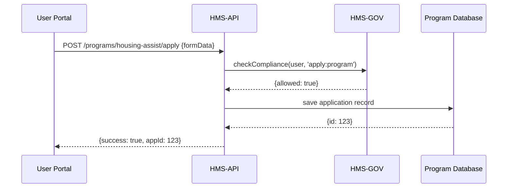

# Chapter 4: Backend API (HMS-API/HMS-MKT)

In [Chapter 3: Program Module](03_program_module_.md) we learned how to embed reusable program modules on portals. To power those modules—and any AI agents or external system integrations—we need a **Backend API**: our secure courier network for data and commands.

---

## 4.1 Why We Need a Backend API

Imagine a state portal’s “Housing Assistance” form. When a citizen clicks **Submit**, the portal needs to:
1. Check policy with HMS-GOV.
2. Store form data.
3. Trigger notifications or AI reviews.
4. Return a success or error response.

The **Backend API** (HMS-API/HMS-MKT) is the central dispatcher that handles these steps. It exposes HTTP endpoints, validates requests, enforces security, and talks to databases, other services, and HMS-GOV.

**Central Use Case**  
A citizen applies for benefits. The portal calls:
- `GET /api/programs/{id}/config` to build the form.
- `POST /api/programs/{id}/apply` to submit data.
- The API checks roles with HMS-GOV and saves to the database.

---

## 4.2 Key Concepts

1. **Endpoint**  
   A URL path (e.g. `/api/programs/:id/apply`) that clients call.

2. **Request & Response**  
   JSON payload sent by client; JSON returned by API.

3. **Authentication & Authorization**  
   Verifying identity (e.g. JWT token) and making sure the caller has the right role via [HMS-GOV](01_core_system_platform__hms_gov__.md).

4. **Controller**  
   The “front desk” function that maps an endpoint to business logic.

5. **Service Layer**  
   Encapsulates core logic: fetch config, enforce policies, save data.

6. **Data Model**  
   Database schemas or ORM models defining how data is stored.

---

## 4.3 Using the Backend API

Let’s see how a portal or AI agent interacts with HMS-API.

### 4.3.1 Fetch Program Configuration

Client code:

```javascript
// In your portal or script
async function loadConfig(programId) {
  const res = await fetch(`/api/programs/${programId}/config`, {
    headers: { Authorization: 'Bearer <token>' }
  });
  return await res.json();
}

// Example call
loadConfig('housing-assist').then(cfg => {
  console.log('Fields:', cfg.fields);
});
```

Explanation:  
- We send a GET request with a bearer token.  
- API returns JSON with field definitions, labels, validation rules.

### 4.3.2 Submit Application Data

Client code:

```javascript
async function apply(programId, formData) {
  const res = await fetch(`/api/programs/${programId}/apply`, {
    method: 'POST',
    headers: {
      'Content-Type': 'application/json',
      Authorization: 'Bearer <token>'
    },
    body: JSON.stringify(formData)
  });
  return await res.json();
}

// Using the function
apply('housing-assist', { name: 'Alice', income: 35000 })
  .then(resp => console.log(resp.message));
```

Explanation:  
- POSTs the user’s form.  
- Backend enforces policy checks via HMS-GOV, saves data, and returns a status message.

---

## 4.4 Under the Hood: Sequence Diagram

Here’s what happens when the portal calls **apply**:



1. **Portal** posts data with user token.  
2. **API** asks HMS-GOV if the user can apply.  
3. **HMS-GOV** returns allow/deny.  
4. If allowed, **API** saves to **Program DB**.  
5. **API** returns success with application ID.

---

## 4.5 Internal Implementation

Below is a minimal Express.js example showing how endpoints, controllers, and services connect.

### 4.5.1 Defining Routes (`routes/programs.js`)

```javascript
const express = require('express');
const { getConfig, applyToProgram } = require('../controllers/programController');
const router = express.Router();

router.get('/:id/config', getConfig);
router.post('/:id/apply', applyToProgram);

module.exports = router;
```

_Explanation:_  
- We map `GET /:id/config` to `getConfig`.  
- We map `POST /:id/apply` to `applyToProgram`.

### 4.5.2 Controller Functions (`controllers/programController.js`)

```javascript
const service = require('../services/programService');

exports.getConfig = async (req, res) => {
  const cfg = await service.fetchConfig(req.params.id);
  res.json(cfg);
};

exports.applyToProgram = async (req, res) => {
  const result = await service.submitApplication(
    req.user, req.params.id, req.body
  );
  res.json(result);
};
```

_Explanation:_  
- Controllers parse `req`, call service, then send JSON.

### 4.5.3 Service Layer (`services/programService.js`)

```javascript
const hmsGov = require('hms-gov-sdk');
const ProgramModel = require('../models/Program');
const AppModel = require('../models/Application');

exports.fetchConfig = async id => {
  return ProgramModel.findById(id);  // returns { fields: [...] }
};

exports.submitApplication = async (user, programId, data) => {
  const ok = await hmsGov.checkCompliance(user.id, 'apply:program');
  if (!ok) throw new Error('Access denied');
  const app = await AppModel.create({ programId, userId: user.id, data });
  return { success: true, appId: app.id };
};
```

_Explanation:_  
- We fetch program config from the database.  
- On submit, we call HMS-GOV for policy, then save application.

---

## 4.6 Summary

In this chapter you learned:
- Why we need a **Backend API** to power portals, AI agents, and external sync.  
- Core concepts: **Endpoints**, **Controllers**, **Services**, **Data Models**, **AuthZ**.  
- How to call the API from a client.  
- Under-the-hood flow with a **sequence diagram**.  
- Minimal Express.js code showing routes → controllers → services.

Up next, we’ll build the user’s view of these APIs in the **[Frontend Interface (HMS-MFE)](05_frontend_interface__hms_mfe__.md)**.

---

Generated by [AI Codebase Knowledge Builder](https://github.com/The-Pocket/Tutorial-Codebase-Knowledge)