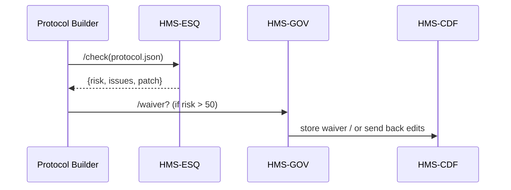

# Chapter 4: Compliance & Legal Reasoning (HMS-ESQ)

*(A friendly sequel to [Protocol Builder Page](03_protocol_builder_page_.md))*  

---

## 1. Why Do We Need HMS-ESQ?

Imagine you work at the **U.S. Department of Health & Human Services (HHS)**.  
Yesterday an engineer dragged a few blocks in the **Protocol Builder** and published an automated **“Drug-Trial Enrollment Bot.”**  

Great, except:

1. The bot collects **patient age**—but HIPAA forbids storing it in plain text.  
2. It sends email reminders, yet the **CAN-SPAM Act** demands an unsubscribe link.  
3. A 2019 court ruling restricts incentives for trial participation.

Miss any of those and HHS could face lawsuits, fines, or even Congressional hearings.  
**HMS-ESQ is the in-house lawyer that never sleeps.**  
Every time a policy, protocol, or AI action is about to go live, HMS-ESQ speed-reads:

* U.S. Code & CFR  
* Case law databases  
* Agency-specific rulebooks  
* Prior versions of your own policies  

…and raises a hand if something clashes.

---

## 2. Key Ideas in Plain English

| Term | Friendly Analogy | Quick Example |
|------|------------------|---------------|
| Statute Matcher | A search dog sniffing for keywords | Finds “age” + “health info” → HIPAA |
| Precedent Checker | A paralegal pulling past cases | Flags 2019 *Doe v. HHS* ruling |
| Risk Score | A weather forecast: sunny → stormy | 0 = Safe, 100 = Certain lawsuit |
| Red-Line Patch | Track-changes in MS Word | Shows exactly what to edit |
| Waiver Route | “Ask my manager” button | Kicks to [HITL Control](08_human_in_the_loop__hitl__control_.md) |

---

## 3. A 3-Step Walk-Through (HHS Drug-Trial Bot)

### 3.1 Draft Protocol Exists

From Chapter 3 we have `drug_trial_enrollment.json`.

### 3.2 Call HMS-ESQ for Review

```js
// esq.client.js  (≤ 15 lines)
export async function legalCheck(protocolJson){
  const res = await fetch('/api/hms-esq/check', {
    method: 'POST',
    body: protocolJson
  })
  return await res.json()     // { risk: 67, issues: […], patch: {...} }
}
```

Explanation:  
We POST raw JSON; ESQ returns a **risk score**, a list of **issues**, and a suggested **patch**.

### 3.3 What Comes Back

```json
{
  "risk": 67,
  "issues": [
    "HIPAA §164.312(a): PHI must be encrypted at rest.",
    "CAN-SPAM §5: No unsubscribe link in email template.",
    "Doe v. HHS (D.D.C. 2019): Incentive cap exceeded."
  ],
  "patch": {
    "encryptFields": ["patient_age"],
    "email.addUnsubscribe": true,
    "incentive.max": 75
  }
}
```

*Risk ≥ 50* means **auto-block** until fixed or waived by a human reviewer in [HMS-GOV](01_governance_interface_layer__hms_gov__.md).

---

## 4. Fix or Waive? Two Happy Paths

1. **Auto-Fix** – Protocol Builder applies `patch` and re-submits.  
2. **Request Waiver** – Routes to Human-in-the-Loop (HITL). A compliance officer may override with a signed memo.

---

## 5. Under the Hood — A Peek Inside HMS-ESQ



1. **PB** asks **ESQ** to review.  
2. **ESQ** returns risk data in milliseconds.  
3. If risky, **PB** sends it to **GOV** for human decision.  
4. Approved text finally flows to **CDF** for compilation.

---

## 6. How Does ESQ Find Conflicts So Fast?

### 6.1 Super-Slim Pseudocode (≤ 20 lines)

```python
# hms_esq/engine.py
def check(protocol):
    text = json.dumps(protocol)
    statutes = search_us_code(text)
    cases    = search_case_law(text)
    rules    = search_agency_rules(text)
    issues   = statutes + cases + rules
    risk     = min(100, len(issues)*20)
    patch    = suggest_patch(issues, protocol)
    return {"risk": risk, "issues": issues, "patch": patch}
```

Explanation:

* `search_*` functions look up keywords, dates, and numeric limits.  
* Each hit adds ~20 points to the **risk**.  
* `suggest_patch` tries templated fixes (e.g., `encryptFields`).

### 6.2 Data Sources (Schema-Lite)

```yaml
# data/statutes.yml
- id: HIPAA_164.312a
  keywords: ["health", "age", "encrypt"]
  fix: "encryptFields"
```

Every record holds:

* `keywords` to trigger the rule  
* a one-line `fix` hint used by `suggest_patch()`

---

## 7. Plugging ESQ into Your App (Full Flow)

```js
// publishProtocol.js
import { legalCheck } from './esq.client.js'
import { saveProtocol } from './builder.client.js'

export async function publish(protocol){
  const report = await legalCheck(JSON.stringify(protocol))
  if (report.risk === 0){
     return await saveProtocol(protocol)   // straight to CDF
  }
  if (report.risk <= 30){
     const patched = applyPatch(protocol, report.patch)
     return await saveProtocol(patched)
  }
  // risk > 30 → need human eyes
  notifyReviewer(report)
}
```

Explanation:

1. Run legal check.  
2. **Risk 0** → ship it.  
3. **Risk 1-30** → auto-patch and ship.  
4. **Risk > 30** → alert reviewer.

All under **20 lines**—beginners welcome!

---

## 8. Frequently Asked Questions

**Q: Does ESQ replace real lawyers?**  
No. It handles *routine* cross-checks. Anything novel or high-risk is escalated to humans via [HITL Control](08_human_in_the_loop__hitl__control_.md).

**Q: How often are statutes updated?**  
Nightly. ESQ’s crawler pulls from GovInfo and the Federal Register.

**Q: Can I add state or municipal laws?**  
Yes—drop YAML files in `data/statutes/` and they’re indexed on the next run.

**Q: What about international regulations like GDPR?**  
Same pattern: add sources, map keywords, set risk multipliers.

---

## 9. What You Learned

• **HMS-ESQ** is the automated legal sentry for every policy, workflow, or AI action.  
• It returns a **risk score**, issue list, and optional patch—within milliseconds.  
• Anything risky flows to [Governance Interface Layer](01_governance_interface_layer__hms_gov__.md) and [Human-in-the-Loop Control](08_human_in_the_loop__hitl__control_.md).  
• Integrating ESQ takes < 20 lines of code.  

Ready to see how approved policies leap into real-world execution?  
Jump to [Workflow Orchestrator (HMS-ACT)](05_workflow_orchestrator__hms_act__.md).

---

---

Generated by [AI Codebase Knowledge Builder](https://github.com/The-Pocket/Tutorial-Codebase-Knowledge)