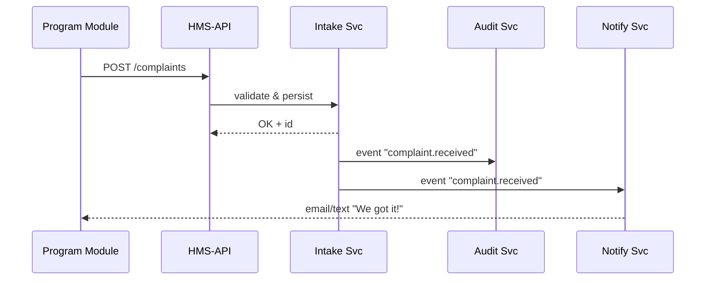

# Chapter 4: Management / Service Layer (HMS-API, HMS-SVC)
*(Filename: 04_management___service_layer__hms_api__hms_svc__.md)*  

[← Back to Chapter 3: Program Module](03_program_module_.md)

---

## 1. Why Do We Need a “Management Layer”?

Picture the real U.S. **Hour & Wage Division**.  
Citizens file wage-theft complaints, employers submit payroll data, and auditors verify compliance—*all at once*.  
Behind the office windows a back-room team:

1. Checks everyone’s ID cards (authentication).  
2. Throttles the queue so no one system crashes (rate-limiting).  
3. Routes each case file to the correct specialists (orchestration).  
4. Logs everything for Congress’ annual oversight (metrics & audits).

In HMS-MKT that back-room is the **Management / Service Layer**.  
It exposes:

• **HMS-API** – friendly REST endpoints (“/complaints”, “/payroll”)  
• **HMS-SVC** – internal micro-services & real-time events

Without it, our shiny micro-front-ends and Program Modules would scream *“404 – form not found.”*

---

## 2. Big Ideas in Plain English

| Term                        | Beginner Meaning (Government Analogy)                    |
|-----------------------------|----------------------------------------------------------|
| HMS-API                     | Public “counter” where outside apps hand in forms.       |
| HMS-SVC                     | Internal clerks that carry folders between departments.  |
| Authentication              | Checking an ID badge at the door.                        |
| Rate-Limiting               | Only letting 100 people per hour into the office.        |
| Versioned Workflow          | Keeping old & new form editions side by side.            |
| Orchestration               | “Take file A to Finance, then Health, then Archive.”     |
| Event Bus                   | The office PA system: “Form 123 is approved!”            |

---

## 3. One Use-Case We’ll Solve—“Submit a Wage-Theft Complaint”

Goal: a citizen posts a complaint → data is validated → three services (Intake, Audit, Notifications) react instantly.

---

## 4. What Does Calling the Management Layer Look Like?

### 4.1 Minimal REST Call (Client Side)

```js
// File: services/complaintClient.js
export async function submitComplaint(data) {
  const res = await fetch('/api/v1/complaints', {
    method:'POST',
    headers:{ 'Content-Type':'application/json' },
    body: JSON.stringify(data)
  })
  return res.json()    // { id: "CMP-2024-001", status:"RECEIVED" }
}
```

Explanation  
1. `POST /complaints` is our **HMS-API** endpoint.  
2. Returns a tracking ID so the citizen can check status later.

### 4.2 Triggering Down-Stream Services (Server Side)

```js
// File: svc/intakeService.js
import bus from './eventBus.js'
export async function handleNewComplaint(rec) {
  // 1. Save to DB (skipped)
  bus.emit('complaint.received', rec)   // 🔔 broadcast
}
```

Explanation  
• `bus.emit` is the **PA system**. Other services will subscribe.

---

## 5. Step-By-Step Walkthrough (No Code)



Plain English Notes  
1. UI only knows `/complaints`.  
2. The Management Layer fans the request to whoever cares—*no extra work for the UI team.*

---

## 6. Internal Building Blocks

### 6.1 API Gateway (Tiny Express Stub)

```js
// File: api/index.js
import express from 'express'
import { intakeGuard } from './middleware/auth.js'
import { handleNewComplaint } from '../svc/intakeService.js'

const app = express()
app.use(express.json())

app.post('/api/v1/complaints', intakeGuard, async (req, res) => {
  const rec = await handleNewComplaint(req.body)
  res.status(201).json(rec)          // { id:"CMP-..." }
})

app.listen(8080)
```

What’s happening?  
• `intakeGuard` checks the user’s JWT token (we meet tokens in [Authorization & Role-Based Access Control (RBAC)](05_authorization___role_based_access_control__rbac__.md)).  
• All business logic lives in **services**, *not* the route handler.

### 6.2 Rate-Limiter (5 Lines)

```js
// File: api/middleware/rate.js
import RateLimiter from 'express-rate-limit'
export const limiter = RateLimiter({ windowMs:60000, max:30 }) // 30 req/min
```

Attach with `app.use(limiter)`—now abusive bots are politely slowed.

### 6.3 Event Bus (In-Memory for Demo)

```js
// File: svc/eventBus.js
import { EventEmitter } from 'events'
export default new EventEmitter()
```

Each service does `bus.on('complaint.received', handler)`.

---

## 7. Versioned Workflows—Side-by-Side Forms

```js
// File: svc/intakeService.js (extra)
const WORKFLOWS = {
  'v1': ['audit', 'notify'],
  'v2': ['fraudCheck', 'audit', 'notify']
}

export function pickWorkflow(req) {
  return WORKFLOWS[req.headers['x-complaint-version'] || 'v1']
}
```

Why? A new regulation in 2025 might require `fraudCheck`.  
Old mobile apps still send `v1`, new apps send `v2`. Both work!

---

## 8. Putting It All Together in a Program Module

Inside our Wage Division Module (from Chapter 3):

```js
// File: modules/wage/module.js (snippet)
import { submitComplaint } from '@/services/complaintClient'
export default {
  id:'wage',
  actions:{
    fileComplaint: submitComplaint
  }
}
```

A single import lets front-end code stay blissfully ignorant of authentication, throttling, or multi-service orchestration.

---

## 9. Frequently Asked Questions

**Q: Do I need Kubernetes or fancy meshes?**  
A: For a local demo, Express + Node’s `EventEmitter` is plenty. Chapter 12 (**Microservice Mesh & Scalability Backbone**) covers production-grade routing, retries, and TLS.

**Q: How does RBAC fit in?**  
A: Every route attaches a guard middleware that checks scopes issued by the RBAC service. Details next chapter → [Authorization & Role-Based Access Control (RBAC)](05_authorization___role_based_access_control__rbac__.md).

**Q: Can external agencies subscribe to events?**  
A: Yes. Add a tiny adapter that publishes selected events to an **External System Sync Adapter** (`/06_external_system_sync_adapter_.md`) via webhook or message queue.

---

## 10. Recap & Next Steps

You learned:

• HMS-API = public facade; HMS-SVC = behind-the-desk staff.  
• Common chores (auth, throttling, versioning, orchestration) live here—so UI teams don’t reinvent wheels.  
• A REST call plus an internal event can activate multiple micro-services instantly.

Ready to dive into *how* we authenticate callers and grant the right scopes?  
Continue to [Chapter 5: Authorization & Role-Based Access Control (RBAC)](05_authorization___role_based_access_control__rbac__.md) →

---

---

Generated by [AI Codebase Knowledge Builder](https://github.com/The-Pocket/Tutorial-Codebase-Knowledge)