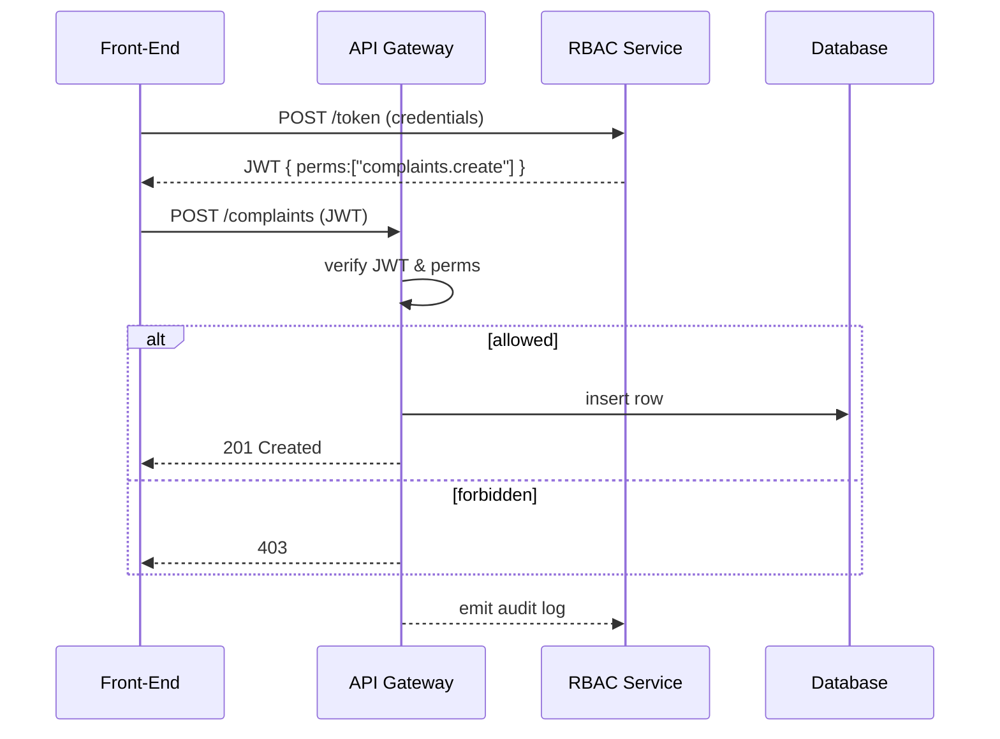

# Chapter 5: Authorization & Role-Based Access Control (RBAC)
*(Filename: 05_authorization___role_based_access_control__rbac__.md)*  

[← Back to Chapter 4: Management / Service Layer (HMS-API, HMS-SVC)](04_management___service_layer__hms_api__hms_svc__.md)

---

## 1. Why Do We Need RBAC?

Imagine a bustling **Department of Labor** office:

* **Olivia** (a citizen) files a wage-theft complaint.  
* **Clerk Chen** reviews the complaint but **must never** see Olivia’s SSN.  
* **Director Adams** can re-assign the case, download audit spreadsheets, and read **everything**.  
* An **AI service account** only needs read-only access to complaint summaries for analytics.

Without strict rules, a typo could let the AI overwrite data or let Chen peek at SSNs—violating **FISMA/GDPR** and risking real harm to citizens.

**Authorization & Role-Based Access Control (RBAC)** is our digital doorman:

1. Checks the visitor’s badge (identity).  
2. Hands out a **room-specific key** (token with scopes).  
3. Writes every door-opening in a log (audit trail).

One size never fits all, and RBAC guarantees each participant gets **just enough** access—no more, no less.

---

## 2. Key Ideas in Plain English

| Concept        | Beginner-Friendly Meaning (Building Analogy)                |
|---------------|--------------------------------------------------------------|
| Identity       | The visitor—citizen, clerk, AI bot (their photo ID).        |
| Role           | Job title—“Citizen”, “Clerk”, “Director”, “AI-Reader”.      |
| Permission     | A single door or action—“edit field X”, “download file”.    |
| Scope Token    | A badge listing every door you may open.                    |
| Policy         | The written rulebook mapping roles → permissions.           |
| Audit Log      | The guard’s notebook: *who* opened *which* door *when*.     |

> Analogy:  A federal building might let a janitor into every hallway **after hours** but never into the HR filing cabinet. RBAC encodes that exact logic in software.

---

## 3. The 5-Minute Wage-Theft Example

Goal:  
1. Olivia submits `POST /complaints`.  
2. Clerk Chen sees the record **minus** the `ssn` field.  
3. Director Adams sees everything.

### 3.1 Defining Roles & Permissions (YAML ≤ 15 lines)

```yaml
# File: rbac/roles.yml
Citizen:
  - complaints.create
Clerk:
  - complaints.read.redacted   # hides PII fields
Director:
  - complaints.read.full
  - complaints.reassign
```

Explanation  
• Each bullet is a **permission string**.  
• “redacted” vs “full” controls field-level visibility.

### 3.2 Issuing a Scope Token (Stub ≤ 20 lines)

```js
// File: rbac/tokenService.js
import jwt from 'jsonwebtoken'
import roles from './roles.yml'

export function issueToken(identity) {
  const perms = roles[identity.role] || []
  return jwt.sign(
    { sub: identity.id, perms },      // payload
    process.env.JWT_SECRET,
    { expiresIn:'2h' }
  )
}
```

What happens?  
1. Look up the visitor’s role (e.g., “Clerk”).  
2. Embed the resulting permission list (`perms`) inside a **JWT**.  
3. Caller now holds a signed “badge.”

### 3.3 Guarding a Route in HMS-API (≤ 15 lines)

```js
// File: api/middleware/rbacGuard.js
import jwt from 'jsonwebtoken'
export function need(perm) {
  return (req, res, next) => {
    const tok = req.headers.authorization?.split(' ')[1] || ''
    const { perms } = jwt.verify(tok, process.env.JWT_SECRET)
    if (!perms.includes(perm)) return res.sendStatus(403)
    next()
  }
}
```

Usage in the complaint route:

```js
app.get('/api/v1/complaints/:id/redacted',
        need('complaints.read.redacted'),
        ctrl.getRedacted)
```

**Result**  
• Clerk ✅, Director ✅, Citizen ❌—all enforced in one line.

---

## 4. What Happens Under the Hood?



Key Points  
1. **Only** the gateway touches secrets; front-end never sees role logic.  
2. Every permit check emits an `audit log` event for later review.

---

## 5. Implementing the RBAC Micro-Service (Tiny Demo)

Folder outline

```
/rbac
   tokenService.js
   auditService.js
   routes.js
```

### 5.1 Minimal Audit Logger (≤ 15 lines)

```js
// File: rbac/auditService.js
import fs from 'fs'
export function log(event) {
  const line = JSON.stringify({ ...event, ts:Date.now() }) + '\n'
  fs.appendFile('audit.log', line, ()=>{})
}
```

Called from our `rbacGuard`:

```js
import { log } from '../rbac/auditService.js'
...
if (!perms.includes(perm)) {
  log({ user:req.user, perm, action:'DENY' })
  return res.sendStatus(403)
}
log({ user:req.user, perm, action:'ALLOW' })
```

When Director Adams downloads data, a line like this is written:

```text
{"user":"adams@dol.gov","perm":"complaints.read.full","action":"ALLOW","ts":1710000000000}
```

Now auditors (or [Human-in-the-Loop Oversight](09_human_in_the_loop__hitl__oversight_.md)) can trace every sensitive access.

---

## 6. Field-Level Redaction—One-Liner Transformation

```js
// File: api/controllers/complaints.js
export function getRedacted(req, res) {
  const rec = db.find(req.params.id)
  delete rec.ssn           // remove PII
  res.json(rec)
}
```

Because route `complaints.read.redacted` only points here, clerks *cannot* hit the “full” endpoint.

> In production we’d use JSON-Mask or Row-Level Security in SQL, but this 3-line demo keeps the idea clear.

---

## 7. Tying Back to Other Layers

• The **Interface Layer** ([Chapter 1](01_interface_layer__hms_mfe__.md)) checks the user’s role to hide or show buttons—*but never trusts the UI*, the real enforcement is server-side.

• The **Management Layer** ([Chapter 4](04_management___service_layer__hms_api__hms_svc__.md)) attaches `need('…')` guards to every route.

• **Program Modules** ([Chapter 3](03_program_module_.md)) declare required permissions in their `module.js`:

```js
export default {
  id:'wage',
  requires:['complaints.create', 'complaints.read.redacted']
}
```

During module registration the framework warns if the RBAC service lacks those scopes—no surprises at runtime.

---

## 8. Frequently Asked Questions

**Q: What if one person needs two roles?**  
A: The token can embed multiple roles or the union of their permissions—whichever is simpler for your policy team.

**Q: Does RBAC slow requests?**  
A: A JWT check is just a signature verification—micro-seconds. Heavy querying is avoided by baking scopes **inside** the token.

**Q: Who updates `roles.yml`?**  
A: Changes come through the [Process & Policy Builder](07_process___policy_builder_.md) and require sign-off logged in the **Governance Layer** (next chapter).

---

## 9. Recap & What’s Next

You now know how RBAC:

1. Maps identities → roles → permissions → scope tokens.  
2. Guards every action with one reusable middleware.  
3. Keeps regulators happy through immutable audit logs.  

Ready to see **who** approves new roles, **how** policies are versioned, and **where** audits are reviewed? Continue to  
[Chapter 6: Governance Layer (HMS-GOV)](06_governance_layer__hms_gov__.md) →

---

---

Generated by [AI Codebase Knowledge Builder](https://github.com/The-Pocket/Tutorial-Codebase-Knowledge)