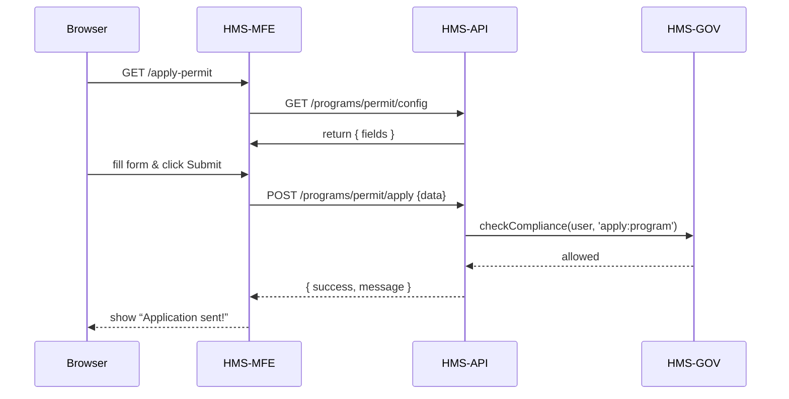

# Chapter 5: Frontend Interface (HMS-MFE)

In [Chapter 4: Backend API (HMS-API/HMS-MKT)](04_backend_api__hms_api_hms_mkt__.md) we built the HTTP endpoints that store and protect data. Now it’s time to give citizens and staff a friendly **user interface**—a web app they can click, fill out, and explore. This is our **Frontend Interface (HMS-MFE)**.

---

## 5.1 Why We Need HMS-MFE

Imagine Alice goes online to apply for a building permit. She shouldn’t have to stare at raw JSON or pasted SQL queries. Instead, HMS-MFE turns our APIs into pages, forms, tables, and buttons:

- A **home page** listing available services (permits, licenses, feedback).  
- A **permit page** that fetches form fields from the backend.  
- A **submission flow** that shows success messages or errors.  

Think of HMS-MFE as the “public counter” at City Hall—but in your browser.

**Central Use Case**  
A citizen visits `/apply‐permit`. The page loads form fields via the Backend API, renders inputs, and when she clicks Submit, HMS-MFE sends her data back. All without a page reload.

---

## 5.2 Key Concepts

1. **App Shell**  
   The global layout (header, nav, footer) that wraps every page.

2. **Pages & Routes**  
   URL‐driven screens (e.g. `/`, `/apply-permit`, `/status`) handled by a router.

3. **Components**  
   Reusable bits like `<FormField>`, `<Button>`, `<DataTable>`.

4. **State Management**  
   A simple store (or Vue’s reactivity) to hold user info and API responses.

5. **API Services**  
   Thin wrappers around `fetch()` to call HMS-API endpoints.

---

## 5.3 Building a Minimal HMS-MFE App

We’ll use Vue 3 and Vue Router. All code blocks stay under 20 lines.

### 5.3.1 index.html

```html
<!DOCTYPE html>
<html>
  <head>
    <script src="https://unpkg.com/vue@3"></script>
    <script src="https://unpkg.com/vue-router@4"></script>
  </head>
  <body>
    <div id="app"></div>
    <script src="main.js"></script>
  </body>
</html>
```

Explanation:  
We include Vue and the router via CDN and mount our app in `<div id="app">`.

### 5.3.2 main.js

```javascript
import { createApp } from 'vue'
import App from './App.vue'
import router from './router.js'

createApp(App)
  .use(router)
  .mount('#app')
```

Explanation:  
We bootstrap Vue, register routes, and attach to `#app`.

### 5.3.3 router.js

```javascript
import { createRouter, createWebHistory } from 'vue-router'
import HomePage from './pages/HomePage.vue'
import PermitPage from './pages/PermitPage.vue'

const routes = [
  { path: '/', component: HomePage },
  { path: '/apply-permit', component: PermitPage }
]

export default createRouter({
  history: createWebHistory(),
  routes
})
```

Explanation:  
Two routes: a home screen and our “Apply Permit” page.

### 5.3.4 pages/PermitPage.vue

```html
<template>
  <div>
    <h2>Building Permit Application</h2>
    <form @submit.prevent="submit">
      <div v-for="f in fields" :key="f.name">
        <label>{{ f.label }}</label>
        <input v-model="form[f.name]" />
      </div>
      <button>Submit</button>
    </form>
  </div>
</template>

<script>
import { fetchConfig, submitForm } from '../services/api.js'
export default {
  data() { return { fields: [], form: {} } },
  async created() {
    this.fields = (await fetchConfig('permit')).fields
    this.fields.forEach(f => this.$set(this.form, f.name, ''))
  },
  methods: {
    async submit() {
      const resp = await submitForm('permit', this.form)
      alert(resp.message)
    }
  }
}
</script>
```

Explanation:  
1. On creation we fetch field definitions (`name`, `label`).  
2. Render inputs dynamically.  
3. On submit we post data and show a confirmation.

---

## 5.4 Under the Hood: What Happens at Runtime

Here’s a simplified flow when a user opens `/apply-permit` and submits:



---

## 5.5 Internal Implementation Details

### services/api.js

```javascript
export async function fetchConfig(id) {
  const res = await fetch(`/api/programs/${id}/config`)
  return res.json()
}

export async function submitForm(id, data) {
  const res = await fetch(`/api/programs/${id}/apply`, {
    method: 'POST',
    headers: { 'Content-Type': 'application/json' },
    body: JSON.stringify(data)
  })
  return res.json()
}
```

Explanation:  
These helpers wrap the HTTP calls so components stay clean.

### App.vue (App Shell)

```html
<template>
  <header><h1>My Citizenship Portal</h1></header>
  <router-view/>
  <footer>© 2024 City Services</footer>
</template>
```

Explanation:  
`<router-view/>` renders whichever page matches the URL.

---

## 5.6 Summary

In this chapter you learned how to:

- Set up a minimal Frontend Interface using Vue 3 and Vue Router.  
- Organize **App Shell**, **Pages**, **Components**, and **API services**.  
- Fetch form definitions from [HMS-API](04_backend_api__hms_api_hms_mkt__.md) and render dynamic forms.  
- Handle user input, submit data, and show feedback.

Up next, we’ll build a full-featured **[User Portal](06_user_portal_.md)** with login, dashboards, and profile management!

---

Generated by [AI Codebase Knowledge Builder](https://github.com/The-Pocket/Tutorial-Codebase-Knowledge)