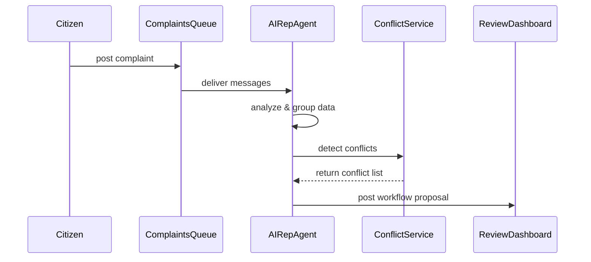

# Chapter 6: AI Representative Agent

Welcome back! In [Chapter 5: Program Module](05_program_module_.md), we learned how to embed self-contained UI widgets for displaying program timelines and steps. Now, let’s add intelligence to our portal with an **AI Representative Agent**—an automated “policy advisor” that listens to citizen complaints, detects conflicts, and drafts streamlined workflows for human review or automated rollout.

---

## 1. Motivation: Why an AI Representative Agent?

Imagine the Office of Community Planning and Development (CPD) receives hundreds of housing‐permit complaints each week:

- Citizens report delays in permit approvals.  
- Staff sort, tag, and escalate issues manually.  
- Bottlenecks get buried in spreadsheets.

What if an automated helper could:

1. **Ingest** all incoming complaints.  
2. **Analyze** patterns (e.g., 70% of delays happen at zoning approval).  
3. **Detect** conflicting rules or policy overlaps.  
4. **Propose** a revised “fast‐track” workflow.  

This **AI Representative Agent** acts like an automated policy advisor at the Department of Justice—only here it optimizes citizen service processes in real time.

---

## 2. Key Concepts

1. **Complaint Listener**  
   A webhook or message queue consumer that receives user feedback (complaints, bug reports, suggestions).

2. **Data Analyzer**  
   A module that aggregates and categorizes complaints (text analysis, grouping by type).

3. **Conflict Detector**  
   Checks new proposals against existing rules or workflows to find contradictions.

4. **Workflow Proposer**  
   Generates draft process updates or new decision trees, based on analysis results.

5. **Draft Generator**  
   Outputs a JSON representation of the optimized steps for human review or automated rollout.

---

## 3. Using the AI Representative Agent

Let’s walk through a minimal example: ingesting a batch of complaints and requesting a proposed workflow.

### 3.1 Configure & Start the Agent

```js
// src/agent/config.js
export const agentConfig = {
  source: 'complaints-queue',          // message queue topic
  conflictServiceUrl: '/api/conflicts',
  reviewWebhook: '/api/hitl/review'    // for [HITL control]
};
```

Explanation: We tell the agent where to listen and how to call conflict detection or human review endpoints.

### 3.2 Ingest Complaints & Generate Proposal

```js
// src/agent/index.js
import { AIRepresentativeAgent } from './AIRepresentativeAgent'
import { agentConfig } from './config'

const agent = new AIRepresentativeAgent(agentConfig)

agent.on('ready', () => agent.runBatch())
```

Explanation:  
1. We create an instance with our config.  
2. On startup, we call `runBatch()` to process all queued complaints.

### 3.3 What You’ll See

```json
{
  "proposalId": "prop-456",
  "optimizedWorkflow": [
    { "step": "verify-zoning", "role": "ZoningOfficer" },
    { "step": "auto-validate-docs", "role": "System" },
    { "step": "final-approval", "role": "Supervisor" }
  ],
  "conflicts": [
    { "ruleId": "rule-32", "issue": "overlap with noise-permit" }
  ]
}
```

The agent returns a draft workflow plus any conflict notes for staff review.

---

## 4. Under the Hood: Step-by-Step

Here’s a high-level sequence when the agent processes complaints:



1. **Queue delivers** incoming complaints to the agent.  
2. The agent **analyzes** text and categorizes issues.  
3. It calls the **ConflictService** to find rule clashes.  
4. Finally, it pushes a **workflow proposal** to a review dashboard or triggers an automated rollout.

---

## 5. Internal Implementation

### 5.1 Core Service (src/agent/AIRepresentativeAgent.js)

```js
export class AIRepresentativeAgent {
  constructor(config) {
    this.config = config
  }

  async runBatch() {
    const complaints = await this.fetchComplaints()
    const analysis = this.analyzeData(complaints)
    const conflicts = await this.detectConflicts(analysis)
    const proposal = this.proposeWorkflow(analysis, conflicts)
    await this.publishProposal(proposal)
  }
}
```

Explanation:  
- `fetchComplaints()` reads from the queue.  
- `analyzeData()` groups and summarizes issues.  
- `detectConflicts()` calls the conflict service.  
- `proposeWorkflow()` builds a draft process.  
- `publishProposal()` sends it on for review.

### 5.2 Conflict Detection (src/agent/ConflictDetector.js)

```js
export async function detectConflicts(analysis) {
  const resp = await fetch(
    `${agentConfig.conflictServiceUrl}`, {
      method: 'POST',
      body: JSON.stringify({ issues: analysis.issues })
    })
  return resp.json()  // e.g., [{ ruleId, issue }, …]
}
```

Explanation: We POST identified issues and receive any rule overlaps or policy clashes.

---

## 6. Analogy: Automated Policy Advisor

Think of the **AI Representative Agent** like a digital counsel in the Department of Justice:

- It **listens** to all briefs (complaints).  
- It **researches** past decisions (conflict detection).  
- It **drafts** new policy language or process updates.  
- Human experts then **review** before publication.

This speeds up policy iteration and surfaces hidden bottlenecks in service delivery.

---

## 7. Summary & Next Steps

You’ve learned how to configure and run the **AI Representative Agent**:

- Ingest complaints via a queue.  
- Analyze data and detect policy conflicts.  
- Generate and publish draft workflows.  

Next, we’ll explore how to incorporate **Human-in-the-Loop (HITL) Control** for manual review and final approval of these proposals in [Chapter 7: Human-in-the-Loop (HITL) Control](07_human_in_the_loop__hitl__control_.md).

---

Generated by [AI Codebase Knowledge Builder](https://github.com/The-Pocket/Tutorial-Codebase-Knowledge)