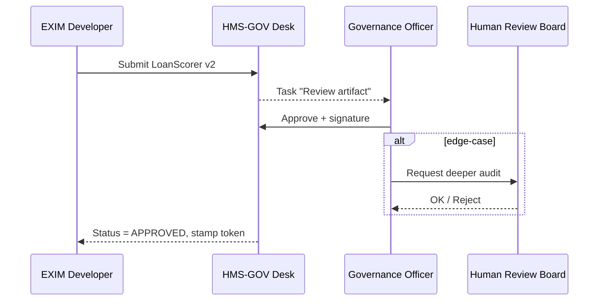

# Chapter 6: Governance Layer (HMS-GOV)
*(Filename: 06_governance_layer__hms_gov__.md)*  

[← Back to Chapter 5: Authorization & Role-Based Access Control (RBAC)](05_authorization___role_based_access_control__rbac__.md)

---

## 1. Why Do We Need a “Cabinet Office” for Software?

Picture the **Export-Import Bank** rolling out a brand-new AI widget that pre-approves small-business loans.  
Without guardrails, the widget could:

* Ignore privacy rules and expose applicant SSNs  
* Use a biased model that rejects minority-owned firms  
* Push un-vetted UI changes straight to production

The **Governance Layer (HMS-GOV)** acts like the *Cabinet Office* that signs every executive order:

1. Stores the official rulebook (policies, ethics guidelines, retention rules).  
2. Forces every micro-service to *prove* compliance before it goes live.  
3. Lets human policy-makers review AI decisions and, if needed, **pull the emergency brake**.

The result: developers keep shipping fast, but nothing reaches citizens unless it passes the same standards Congress demands of real-world agencies.

---

## 2. Key Ideas in Plain English

| Term                     | Beginner-Friendly Analogy                                         |
|--------------------------|-------------------------------------------------------------------|
| Policy Registry          | A locked filing cabinet of up-to-date regulations.                |
| Digital Policy Desk      | A dashboard where administrators publish or retire rules.         |
| Policy Enforcement Point | The security guard at every hallway door (“Show me your permit!”) |
| Signed Artifact          | A stamp saying “This widget obeys Policy 123 & Privacy A-1”.      |
| Human-in-the-Loop (HITL) | A real clerk who can override an AI decision. See [Chapter 9](09_human_in_the_loop__hitl__oversight_.md). |
| Audit Ledger             | An un-changeable log of “who approved what, and when.”            |

> Short version: HMS-GOV is the **constitution**; everything else is just a federal agency following it.

---

## 3. A Concrete Use-Case — “New AI Loan Scoring Widget”

Step-by-step goal:

1. The EXIM engineering team submits **LoanScorer v2** for approval.  
2. Governance officers review the model card, privacy impact, and fairness report.  
3. They sign the widget with a **Policy Stamp** valid for 90 days.  
4. At runtime, every request hitting *LoanScorer v2* must present that stamp, or it is blocked.

Let’s walk through it.

---

## 4. Declaring a Policy (≤ 15 Lines)

```yaml
# File: policies/fair_lending.yml
id: FAIR-LENDING-001
title: "Fair Lending – No Discrimination"
requires:
  - model_bias_report
  - training_data_audit
expires: "2025-12-31"
```

Explanation  
• A simple YAML file lives in **HMS-GOV**’s Policy Registry.  
• `requires` lists evidence the dev team must attach.

---

## 5. Submitting an Artifact for Sign-off (≤ 20 Lines)

```js
// File: scripts/submitArtifact.js
import fetch from 'node-fetch'

const artifact = {
  name: 'LoanScorer v2',
  sha256: '4f2d...',             // build checksum
  evidenceLinks: [
    's3://exim/reports/bias.pdf',
    's3://exim/reports/data_audit.pdf'
  ],
  policies: ['FAIR-LENDING-001']
}

await fetch('https://gov-desk/api/artifacts', {
  method: 'POST',
  headers: { 'Authorization':'Bearer DEV-TOKEN',
             'Content-Type':'application/json' },
  body: JSON.stringify(artifact)
})
```

What happens?  
1. The dev script sends metadata and links to required evidence.  
2. HMS-GOV stores the entry with status **`PENDING_REVIEW`**.

---

## 6. Review & Sign-off Flow (No Code View)



Plain English  
• At least one human must click “Approve.”  
• Optional **HITL escalation** for sensitive cases.

---

## 7. Using the Policy Stamp in a Live Service (≤ 20 Lines)

```js
// File: svc/loanScorer/api.js
import { verifyStamp } from '@/middleware/govGuard.js'

app.post('/score',
         verifyStamp('LoanScorer v2'),      // 👈 Governance check!
         (req,res) => {
            /* ...run model... */
         })
```

`verifyStamp()` does three tiny things:

1. Looks for `x-policy-stamp` header.  
2. Confirms the stamp’s JWT signature & expiry.  
3. Ensures it covers *this* component (`LoanScorer v2`).

No valid stamp → **HTTP 451 Unavailable For Legal Reasons**.

---

## 8. Under the Hood – Minimal Implementation

### 8.1 Stamp Issuer (≤ 20 Lines)

```js
// File: gov/stampService.js
import jwt from 'jsonwebtoken'

export function issueStamp(artifact, officerId) {
  return jwt.sign(
    { art:artifact.sha256,
      pol:artifact.policies,
      by: officerId },
    process.env.GOV_SECRET,
    { expiresIn:'90d' }
  )
}
```

A stamp is just a JWT; simple but tamper-proof.

### 8.2 Policy Enforcement Middleware (≤ 20 Lines)

```js
// File: middleware/govGuard.js
import jwt from 'jsonwebtoken'
export function verifyStamp(component) {
  return (req,res,next) => {
    const raw = req.headers['x-policy-stamp'] || ''
    try {
      const data = jwt.verify(raw, process.env.GOV_SECRET)
      if (data.art !== component) throw 'wrong component'
      next()
    } catch {
      return res.status(451).send('Policy stamp missing/invalid')
    }
  }
}
```

Explanation  
• One middleware line protects every endpoint—no service forgets the rule.

---

## 9. How Other Layers Interact

* **RBAC** ([Chapter 5](05_authorization___role_based_access_control__rbac__.md)) decides *who* may approve policies (`role = GovernanceOfficer`).  
* **Management / Service Layer** ([Chapter 4](04_management___service_layer__hms_api__hms_svc__.md)) mounts the `govGuard` middleware on every micro-service route.  
* **Human-in-the-Loop Oversight** ([Chapter 9](09_human_in_the_loop__hitl__oversight_.md)) is automatically triggered by HMS-GOV when a policy demands manual review.  

Together they form an iron triangle of **auth → policy → human oversight**.

---

## 10. Frequently Asked Questions

**Q: Does every request need to attach the stamp header?**  
A: Only calls that pass data through a *governed component*. Static assets or public info pages may be whitelisted.

**Q: What if a policy changes tomorrow?**  
A: HMS-GOV can “revoke” any stamp. The next request fails verification, forcing the service back to the staging environment.

**Q: Can I see who approved my widget?**  
A: Yes—the **Audit Ledger** stores officer ID, timestamp, SHA256 of the artifact, and decision. A CSV export is one click away in the Digital Policy Desk.

---

## 11. Tiny “Hello World” You Can Run Locally

1. `npm run gov` – starts a bare-bones HMS-GOV server with one policy.  
2. `node scripts/submitArtifact.js` – registers *LoanScorer v2*.  
3. Open `http://localhost:9000/policy-desk` – click **Approve**.  
4. Start the scoring service with `STAMP=<token> npm run scorer`.  
5. Try hitting `/score` *without* the header ➜ 451 error.  
6. Add `x-policy-stamp: <token>` ➜ works! 🎉

---

## 12. Recap

You learned that HMS-GOV:

• Stores and versions every rule your agency cares about.  
• Forces services to attach a cryptographic **policy stamp**.  
• Provides dashboards for humans to approve, revoke, or override AI behavior.  
• Emits immutable audit logs that satisfy FOIA, FISMA, and curious journalists alike.

Ready to learn how *policies themselves* are drafted, edited, and version-controlled by non-developers? Head over to  
[Chapter 7: Process & Policy Builder](07_process___policy_builder_.md) →

---

Generated by [AI Codebase Knowledge Builder](https://github.com/The-Pocket/Tutorial-Codebase-Knowledge)