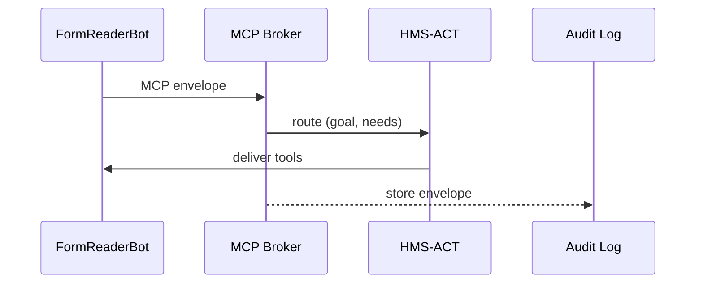

# Chapter 6: Model Context Protocol (HMS-MCP)

*(A friendly sequel to [Workflow Orchestrator (HMS-ACT)](05_workflow_orchestrator__hms_act__.md))*  

---

## 1. Why Do We Need “Yet Another Protocol”?

Imagine the **Small Business Administration (SBA)** is helping a bakery apply for a disaster loan:

1. **FormReaderBot** extracts data from a PDF.
2. **CreditScoreBot** asks Treasury for the owner’s credit score.
3. **RiskOfficer** (a human) must see every request and response in plain English.

If each actor spoke a different dialect (PDF tags, SQL, random JSON), the conversation would be chaos.  
**HMS-MCP is the shared diplomatic language**—a tiny, predictable JSON envelope that *every* message must wear.  
Think of it as:

* A **cover sheet** that states “Who am I, what do I want, what tools do I need?”  
* A **running diary** that records every step for auditors.

Result: bots, humans, and micro-services swap places freely, and SBA can replay the whole story during an Inspector General audit.

---

## 2. Key Ideas in Plain English

| MCP Term | Friendly Analogy | SBA Example |
|----------|-----------------|-------------|
| `speaker` | The name badge at a conference | `"FormReaderBot"` |
| `goal` | Elevator pitch | `"Extract applicant income"` |
| `needs` | Shopping list | `["pdf_page_3"]` |
| `actions` | Meeting minutes | `[{ tool:"ocr", output:"$income=72K" }]` |
| `state` | Current notebook page | Free-form notes the next actor can read |

An MCP message is always: **Envelope → Diary → Payload**.  
If you can read JSON, you can read MCP.

---

## 3. A 2-Minute Look at a Real Message

```json
{
  "speaker": "CreditScoreBot",
  "goal": "Fetch Experian score for EIN 12-3456789",
  "needs": ["experian_api"],
  "state": {
    "ein": "12-3456789",
    "prev_score": null
  },
  "actions": [
    { "tool": "experian_api", "input": "EIN 12-3456789" },
    { "tool": "normalize",   "input": "raw=680" }
  ],
  "result": { "credit_score": 680 },
  "timestamp": "2024-04-12T15:03:11Z"
}
```

*Even a non-coder can see who spoke, what was done, and the numeric result.*

---

## 4. Building Blocks of MCP (One-by-One)

### 4.1 Envelope

```json
{ "speaker": "RiskOfficer", "goal": "Approve or deny loan" }
```
• *Who* is talking and *why*.

### 4.2 Needs List

```json
"needs": ["loan_model_v2", "previous_scores"]
```
• What external resources the actor will ask the system to provide.

### 4.3 State Object

```json
"state": { "loan_amount": 150000, "applicant_tier": "B" }
```
• Public scratch-pad any later actor can update.

### 4.4 Actions Log

```json
"actions": [
  { "tool": "underwrite", "input": "$tier=B", "output": "risk=medium" }
]
```
• Verb-object lines—auditors love these.

### 4.5 Result

```json
"result": { "decision": "conditionally approved" }
```
• Final output of this turn.

Each field is OPTIONAL except `speaker`—keeping MCP light-weight.

---

## 5. Using MCP in Your Code (≤ 20 Lines!)

```js
// mcp.send.js
export async function sendMCP(msg){
  await fetch('/api/broker', {
    method: 'POST',
    headers: { 'Content-Type': 'application/mcp+json' },
    body: JSON.stringify(msg)
  })
}
```

Explanation  
1. Wrap your usual payload in an MCP envelope.  
2. POST it—HMS components guarantee routing & logging.

---

### 5.1 Minimal Example: FormReaderBot’s First Turn

```js
import { sendMCP } from './mcp.send.js'

const msg = {
  speaker: "FormReaderBot",
  goal:    "Extract applicant income",
  needs:   ["ocr"],
  state:   { pdf_id: "loan_app_842.pdf" }
}

await sendMCP(msg)
```

Less than 15 lines and **zero** special libraries.

---

## 6. What Happens Under the Hood?



1. **Broker** checks the MCP schema—rejects malformed JSON.  
2. **HMS-ACT** inspects `goal` & `needs` to assign the right service queue.  
3. **Audit Log** stores the exact envelope for later replay.

---

## 7. Peeking at the Broker (Server Side)

`/services/broker.js` (11 lines)

```js
export async function handle(req, res){
  const mcp = req.body              // raw JSON
  if (!mcp.speaker) return res.status(400).send("speaker required")
  await log.save(mcp)               // durable store
  await act.enqueue(mcp)            // hand to HMS-ACT
  res.sendStatus(202)               // Accepted
}
```

Beginner-friendly highlights:

* **Schema check**: one line.  
* **Logging**: one line.  
* **Routing**: one line.  

---

## 8. Validating Messages (Client Side Bonus)

```js
// mcp.schema.js (tiny)
export const REQ = ["speaker"]
export function isMCP(obj){
  return REQ.every(k => k in obj)
}
```

Call `isMCP(msg)` before you send—prevents easy mistakes.

---

## 9. Frequently Asked Questions

**Q: Is MCP only for AI agents?**  
No. A plain REST micro-service can wrap its normal response in MCP for full traceability.

**Q: Does MCP slow things down?**  
Each envelope adds ~200 bytes—smaller than most HTTP headers.

**Q: Where is the schema defined?**  
`/schemas/mcp.v1.json` in the repo—just open it in any text editor.

**Q: Can I add custom fields?**  
Yes, but prefix them (e.g., `"x-sba-priority": "high"`) so future versions remain compatible.

---

## 10. What You Learned

• **HMS-MCP** is the universal JSON envelope that keeps multi-agent conversations **auditable** and **interoperable**.  
• Five fields (`speaker`, `goal`, `needs`, `state`, `actions`) cover 95 % of use-cases.  
• Sending an MCP message takes < 20 lines of code.  
• Brokers validate, log, and route envelopes automatically.  

Ready to build agents that speak MCP fluently?  
Jump to [Agent Framework (HMS-AGT / HMS-AGX)](07_agent_framework__hms_agt___hms_agx__.md).

---

Generated by [AI Codebase Knowledge Builder](https://github.com/The-Pocket/Tutorial-Codebase-Knowledge)