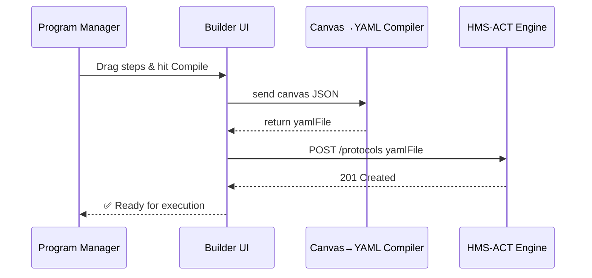

# Chapter 6: Protocol Builder UI  

[← Back to Chapter 5: HMS-GOV Admin / Policy-Maker Portal](05_hms_gov_admin___policy_maker_portal_.md)

---

## 1. Why Do We Need a Drag-and-Drop “Process LEGO® Set”?

Picture the Department of Energy (DOE) launching a **Renewable-Energy Grant**:

1. Researchers apply online.  
2. Review board scores the proposal.  
3. DOE issues the award.

Congress now mandates a **30-day public-comment period** between steps 2 and 3.  
Without a builder tool, DOE developers must:

* Read the 200-page HMS-ACT API.  
* Hard-code a new workflow by hand.  
* Redeploy, hope nothing breaks.

The **Protocol Builder UI** lets a non-technical program manager open a canvas, **drag “Public Comment” between “Review” and “Issue Award,” click “Compile,” and go home before lunch.**  
HMS-ACT (our workflow engine) automatically executes the new flow.

---

## 2. Meet the Building Blocks

Term | Plain-English Meaning
---- | ---------------------
Canvas | Whiteboard where you arrange steps.
Step | One colored card (e.g., “Collect Application,” “Public Comment”).
Connector | Arrow that shows order: Step A ➜ Step B.
Trigger | Event that starts the protocol (e.g., “Form Submitted”).
Condition | Yes/No rule that decides which branch to follow.
Parameter Panel | Right-hand form to tweak a step (deadlines, assignee, etc.).
Compile Button | Converts the picture into machine-readable YAML for HMS-ACT.

Keep these seven words in mind—you already speak 80 % of the Builder’s language.

---

## 3. Hands-On: Insert a Public-Comment Step (5 Minutes)

We’ll modify the **Renewable-Energy Grant** process.

### 3.1 Open the Template

1. In the HMS portal choose  
   `Builder → Templates → Renewable-Energy Grant`.
2. The canvas shows three cards:

```
[Collect Application] → [Board Review] → [Issue Award]
```

### 3.2 Drag & Drop

1. From the **Step Library** grab **“Public Comment”**.  
2. Drop it between **Board Review** and **Issue Award**.  
3. An arrow auto-snaps:

```
[Board Review] → [Public Comment] → [Issue Award]
```

### 3.3 Configure the Step (Parameter Panel)

Field | Value
----- | -----
Comment Window | 30 days
Notification Email | public-notice@energy.gov
Visibility | Public

Click **Save**.

### 3.4 Compile & Publish

Press the big blue **Compile** button.  
Toast message:  
`✅ Protocol compiled to DOE-grant-v3.yaml (version 3)`

You can now send it straight to HMS-ACT or store it for later review inside [HMS-GOV Admin / Policy-Maker Portal](05_hms_gov_admin___policy_maker_portal_.md).

---

## 4. What Does “Compile” Actually Produce?

```yaml
# doe-grant-v3.yaml  (auto-generated)
id: doe-grant
version: 3
trigger:
  type: form.submitted
  formId: DOE-GRANT-01
steps:
  - id: collect
    type: form.collect
  - id: review
    type: board.score
    assigneeRole: "DOE-Reviewer"
  - id: comment
    type: public.comment
    windowDays: 30
    notify: public-notice@energy.gov
  - id: award
    type: finance.issue
    account: DOE-GRANT-FUND
```

Explanation:

1. **ID & version** let HMS-ACT keep history.  
2. Each **step** is a tiny JSON/YAML block; no code needed.  
3. Parameters you set in the panel (e.g., `windowDays`) appear verbatim.

---

## 5. Under the Hood—Low-Code Magic Unveiled



Four actors—easy to remember.

---

## 6. Tiny Peek at the Compiler Code (Simplified)

_File: `builder/src/compile.ts`_

```ts
export function compile(canvasJson) {
  const yaml = { id: canvasJson.id, version: canvasJson.version++ }
  yaml.trigger = canvasJson.trigger
  yaml.steps = canvasJson.nodes.map(mapNode)  // translate each card
  return YAML.stringify(yaml)                 // returns a string
}

function mapNode(n) {
  return {
    id: n.id,
    type: n.type,
    ...n.params           // duration, email, etc.
  }
}
```

What’s happening?

1. **Gather metadata.**  
2. **Translate** every visual card via `mapNode`.  
3. Use a YAML helper to spit out text—done in <20 lines!

---

## 7. Editing Rules Without Breaking History

The Builder stores **every version**.  
Need to audit who removed a security check? Open **Version History**, compare v2 vs v3, and roll back with one click—records flow into [Activity Logging & Auditing](15_activity_logging___auditing__within_hms_act___ops__.md).

---

## 8. Power Tips

Tip | Why It Rocks
----|--------------
Use **Conditions** to create “fast lanes.” | Example: skip Board Review if grant < $10 000.
Save to **Template Library**. | Reuse the same pattern for 50 state field offices.
Drag **External Skill** steps. | Call a marketplace fraud detector (see [HMS-MKT Agent & Data Marketplace](03_hms_mkt_agent___data_marketplace_.md)) directly inside the process.

---

## 9. 60-Second Playground

```bash
# 1. Start dev server
npm run dev --workspace=protocol-builder

# 2. Auto-open sample canvas
open http://localhost:5173?template=sample-grant

# 3. Drag a "Notify Governor" step, compile, and watch YAML update live
```

No backend? Compilation still works offline—great for airplane prototyping.

---

## 10. Recap & What’s Next

You have now:

• Discovered the **Protocol Builder UI**—the Build-a-Bear workshop for government workflows.  
• Added a new compliance step **without** writing code.  
• Learned how the picture turns into YAML consumed by HMS-ACT.  
• Peeked at the tiny compiler function under the hood.

Next we’ll tour the pipes that store, version, and expose these protocols to every other team in the stack: [Backend Service & Public API (HMS-SVC / HMS-MKT)](07_backend_service___public_api__hms_svc___hms_mkt__.md) →

---

Generated by [AI Codebase Knowledge Builder](https://github.com/The-Pocket/Tutorial-Codebase-Knowledge)