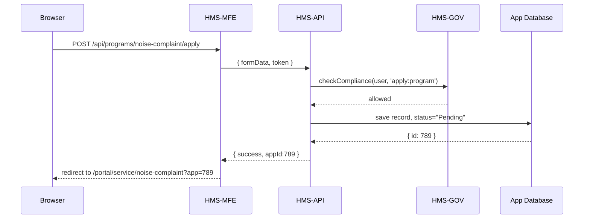

# Chapter 6: User Portal

Welcome back! In [Chapter 5: Frontend Interface (HMS-MFE)](05_frontend_interface__hms_mfe__.md) we built the basic pages, routing, and form rendering. Now we’ll create a **User Portal**—the public‐side “lobby” where citizens can sign in, submit service requests (forms), and track their progress.

---

## 6.1 Why We Need a User Portal

Imagine Jane wants to file a noise complaint with her city. She needs to:

1. Sign in to the portal.  
2. See the list of services (e.g. “Noise Complaint”, “Tree Removal Permit”).  
3. Pick “Noise Complaint” and fill out the form.  
4. Submit and get a ticket number.  
5. Check back later to see the status (e.g. “Under Review”, “Resolved”).

The **User Portal** bundles login, a service catalog, the request‐submission flow (using our [Program Module](03_program_module_.md)), and a dashboard to track requests—just like a physical service desk lobby.

---

## 6.2 Key Concepts

1. **Authentication**  
   Users register or log in to get a JWT token.  

2. **Service Catalog**  
   A menu or grid listing available programs (each a `program-id`).  

3. **Submission Flow**  
   A route that mounts `<ProgramModule>` to let users fill forms.  

4. **Dashboard**  
   A page showing all requests the user has filed, with current status.  

5. **Status Detail**  
   Drill‐down view for one request’s timeline and updates.

---

## 6.3 Building the User Portal

We’ll extend our Vue Router and add pages under `/portal`. All code blocks stay under 20 lines.

### 6.3.1 Extend Routes (`router.js`)

```javascript
import LoginPage from './pages/LoginPage.vue'
import PortalHome from './pages/PortalHome.vue'
import ServicePage from './pages/ServicePage.vue'
import DashboardPage from './pages/DashboardPage.vue'

const routes = [
  // public
  { path: '/login', component: LoginPage },
  // user portal
  {
    path: '/portal',
    component: PortalHome,
    children: [
      { path: 'dashboard', component: DashboardPage },
      { path: 'service/:id', component: ServicePage }
    ]
  }
]
export default createRouter({ history: createWebHistory(), routes })
```

Explanation:  
- `/login` is public.  
- `/portal` is protected; its children are the Dashboard and individual Service pages.

### 6.3.2 Login Page (`pages/LoginPage.vue`)

```html
<template>
  <h2>Sign In</h2>
  <form @submit.prevent="login">
    <input v-model="email" placeholder="Email" />
    <input v-model="pass" type="password" placeholder="Password" />
    <button>Login</button>
  </form>
</template>
<script>
import { authService } from '../services/authService.js'
export default {
  data: () => ({ email: '', pass: '' }),
  methods: {
    async login() {
      await authService.login(this.email, this.pass)
      this.$router.push('/portal/dashboard')
    }
  }
}
</script>
```

Explanation:  
- User submits email/password.  
- We call `authService.login`, store the JWT, then redirect to the dashboard.

### 6.3.3 Dashboard Page (`pages/DashboardPage.vue`)

```html
<template>
  <h2>Your Requests</h2>
  <ul>
    <li v-for="r in requests" :key="r.id">
      <router-link :to="`/portal/service/${r.programId}?app=${r.id}`">
        {{ r.title }} — {{ r.status }}
      </router-link>
    </li>
  </ul>
</template>
<script>
import { userService } from '../services/userService.js'
export default {
  data: () => ({ requests: [] }),
  async created() {
    this.requests = await userService.fetchRequests()
  }
}
</script>
```

Explanation:  
- On load, fetch all applications for the signed-in user.  
- Show title and status; each links to a detailed view.

### 6.3.4 Service Page (`pages/ServicePage.vue`)

```html
<template>
  <div v-if="appId">
    <!-- Status Detail -->
    <StatusDetail :id="appId" />
  </div>
  <div v-else>
    <!-- New Submission -->
    <ProgramModule :program-id="serviceId" title="Apply" />
  </div>
</template>
<script>
import ProgramModule from '../components/Modules/ProgramModule.vue'
import StatusDetail from '../components/StatusDetail.vue'
export default {
  components: { ProgramModule, StatusDetail },
  computed: {
    serviceId() { return this.$route.params.id },
    appId() { return this.$route.query.app }
  }
}
</script>
```

Explanation:  
- If `?app=123` is in URL, we show `<StatusDetail>` for that application.  
- Otherwise we mount `<ProgramModule>` for a new request.

---

## 6.4 Under the Hood: Sequence Flow

Here’s what happens when Jane submits a new noise‐complaint request:



1. `<ProgramModule>` posts to `/apply`.  
2. API enforces policy via HMS-GOV.  
3. Saved in the database.  
4. Returns `appId`.  
5. Portal navigates to status view.

---

## 6.5 Internal Implementation Details

### `services/authService.js`

```javascript
export const authService = {
  async login(email, pass) {
    const res = await fetch('/api/auth/login', {
      method:'POST', headers:{'Content-Type':'application/json'},
      body: JSON.stringify({ email, pass })
    })
    const { token } = await res.json()
    localStorage.setItem('jwt', token)
  },
  getToken() { return localStorage.getItem('jwt') }
}
```

Explanation:  
- `login` saves the JWT.  
- Other services read it for the `Authorization` header.

### `services/userService.js`

```javascript
import { authService } from './authService.js'
export const userService = {
  async fetchRequests() {
    const res = await fetch('/api/user/requests', {
      headers: { Authorization: 'Bearer '+authService.getToken() }
    })
    return res.json()  // returns [ {id, programId, title, status}, … ]
  }
}
```

Explanation:  
- Wraps the API call that returns the user’s requests.

### `components/StatusDetail.vue`

```html
<template>
  <div>
    <h3>Request #{{ id }} Status</h3>
    <ul>
      <li v-for="e in events" :key="e.time">
        {{ e.time }} — {{ e.note }}
      </li>
    </ul>
  </div>
</template>
<script>
export default {
  props:['id'],
  data:() => ({ events:[] }),
  async created() {
    const res = await fetch(`/api/applications/${this.id}/events`, {
      headers:{ Authorization:'Bearer '+localStorage.jwt }
    })
    this.events = await res.json()
  }
}
</script>
```

Explanation:  
- Fetches a timeline of status events for a single application.

---

## 6.6 Summary

In this chapter we built the **User Portal** where citizens can:

- Sign in and register.  
- Browse a catalog of services.  
- Submit new requests via `<ProgramModule>`.  
- Track existing requests in a dashboard.  
- View detailed status timelines.

Next up: the back-office side in the **[Admin/Gov Portal](07_admin_gov_portal_.md)**, where staff review and process these requests.

---

Generated by [AI Codebase Knowledge Builder](https://github.com/The-Pocket/Tutorial-Codebase-Knowledge)