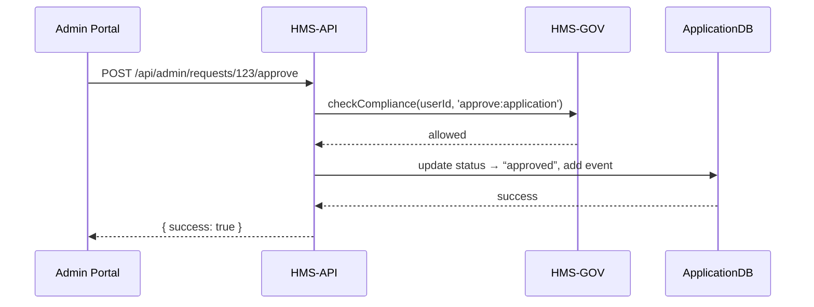

# Chapter 7: Admin/Gov Portal

Welcome back! In [Chapter 6: User Portal](06_user_portal_.md) we built the citizen‐facing side: sign-in, submit requests, track status. Now it’s time for the other half of the service workflow—the **Admin/Gov Portal**—where managers, officials, and policy-makers review, adjust, and approve AI-generated proposals or citizen inputs, much like a council chamber where decisions are debated and ratified.

---

## 7.1 Why We Need an Admin/Gov Portal

Imagine the City Zoning Board has received 50 building-permit applications. An AI agent has pre-screened them and flagged 10 for missing data. City planners need a secure dashboard to:
1. See all pending and flagged applications.
2. Open each application, review AI notes or citizen comments.
3. Edit fields (e.g. correct an address).
4. Approve, reject, or request more information.
5. Record the decision in an audit log.

Without a dedicated portal, officials would juggle spreadsheets, emails, and paper files. The Admin/Gov Portal centralizes everything—roles, data, comments, and approvals—in one secure place.

**Central Use Case**  
A planner logs in, filters “Pending” applications, clicks into #123, reads AI-generated summary (“Site plan missing north elevation”), corrects the elevation field, then clicks **Approve**. The system records the decision, notifies the applicant, and moves the record to “In Construction.”

---

## 7.2 Key Concepts

1. **Dashboard**  
   A landing page showing quick stats (counts) and a table of requests, filterable by status or program.

2. **Detail View**  
   A form-style page showing all data for one application, AI suggestions, and an audit timeline.

3. **Actions**  
   Buttons or dropdowns—**Approve**, **Reject**, **Request Changes**—each triggering policy checks and state transitions.

4. **Audit Log**  
   A chronological list of events (submission, review, approval) that anyone can inspect for transparency.

5. **Role Enforcement**  
   Only users with the “Reviewer” or “Approver” role (defined in [Core System Platform](01_core_system_platform__hms_gov__.md)) see certain buttons or data fields.

---

## 7.3 Using the Admin/Gov Portal

Let’s walk through adding the Admin Portal routes and components in Vue.

### 7.3.1 Add Admin Routes (`router.js`)

```javascript
import AdminHome from './pages/AdminHome.vue'
import AdminRequests from './pages/AdminRequests.vue'
import AdminReview from './pages/AdminReview.vue'

const routes = [
  // ... existing routes
  {
    path: '/admin',
    component: AdminHome,
    children: [
      { path: 'requests', component: AdminRequests },
      { path: 'review/:id', component: AdminReview }
    ]
  }
]
export default createRouter({ history: createWebHistory(), routes })
```
Explanation:  
We mount `/admin/requests` for listing and `/admin/review/123` for a detail page.

### 7.3.2 Dashboard List (`pages/AdminRequests.vue`)

```html
<template>
  <h2>Pending Applications</h2>
  <table>
    <tr><th>ID</th><th>Program</th><th>Applicant</th><th></th></tr>
    <tr v-for="r in list" :key="r.id">
      <td>{{ r.id }}</td>
      <td>{{ r.programId }}</td>
      <td>{{ r.userName }}</td>
      <td>
        <router-link :to="`/admin/review/${r.id}`">Review</router-link>
      </td>
    </tr>
  </table>
</template>
<script>
import { adminService } from '../services/adminService.js'
export default {
  data: () => ({ list: [] }),
  async created() {
    this.list = await adminService.fetchPending()
  }
}
</script>
```
Explanation:  
On load, we call `fetchPending()` to get all “pending” requests, then render a table with a **Review** link for each.

### 7.3.3 Detail & Actions (`pages/AdminReview.vue`)

```html
<template>
  <div v-if="app">
    <h2>Review #{{ app.id }}</h2>
    <div><strong>Data:</strong> {{ app.data }}</div>
    <div><strong>AI Notes:</strong> {{ app.aiNotes }}</div>
    <button @click="approve()">Approve</button>
    <button @click="reject()">Reject</button>
  </div>
</template>
<script>
import { adminService } from '../services/adminService.js'
export default {
  data: () => ({ app: null }),
  async created() {
    const id = this.$route.params.id
    this.app = await adminService.fetchApplication(id)
  },
  methods: {
    async approve() {
      await adminService.approve(this.app.id)
      alert('Approved!')
      this.$router.push('/admin/requests')
    },
    async reject() {
      await adminService.reject(this.app.id)
      alert('Rejected!')
      this.$router.push('/admin/requests')
    }
  }
}
</script>
```
Explanation:  
- We fetch the full application record on creation.  
- Two buttons trigger **approve** or **reject**, call the service, show feedback, and return to the list.

---

## 7.4 Under the Hood: Sequence Diagram

Here’s what happens when an official clicks **Approve**:



1. The portal calls the **approve** endpoint with the request ID.  
2. The API asks HMS-GOV if the user has the right role.  
3. If allowed, the API updates the database and logs an audit event.  
4. The portal receives success and updates the UI.

---

## 7.5 Internal Implementation

Let’s peek at the Express routes, controller, and service.

### 7.5.1 Admin Routes (`routes/admin.js`)

```javascript
const express = require('express')
const { getPending, getOne, doApprove, doReject } = require('../controllers/adminController')
const router = express.Router()

router.get('/requests', getPending)
router.get('/requests/:id', getOne)
router.post('/requests/:id/approve', doApprove)
router.post('/requests/:id/reject', doReject)

module.exports = router
```
Explanation:  
Defines four endpoints for listing, fetching, approving, and rejecting.

### 7.5.2 Controller (`controllers/adminController.js`)

```javascript
const svc = require('../services/adminService')

exports.getPending = async (req, res) => {
  const list = await svc.fetchPending(req.user)
  res.json(list)
}

exports.doApprove = async (req, res) => {
  await svc.approve(req.user, req.params.id)
  res.json({ success: true })
}

// getOne and doReject are similar...
```
Explanation:  
Controllers parse `req.user` and `req.params`, then delegate to the service.

### 7.5.3 Service (`services/adminService.js`)

```javascript
const hmsGov = require('hms-gov-sdk')
const AppModel = require('../models/Application')

exports.fetchPending = user =>
  AppModel.find({ status: 'pending' }).lean()

exports.approve = async (user, id) => {
  const ok = await hmsGov.checkCompliance(user.id, 'approve:application')
  if (!ok) throw new Error('Access denied')
  await AppModel.findByIdAndUpdate(id, {
    status: 'approved',
    $push: { events: { time: Date.now(), note: 'Approved by admin' } }
  })
}
```
Explanation:  
- `fetchPending` returns all pending apps.  
- `approve` first asks HMS-GOV if the user can approve, then updates status and pushes an audit event.

---

## 7.6 Summary

In this chapter you learned how to build the **Admin/Gov Portal**:

- Added protected routes for listing and reviewing requests.  
- Created a dashboard (`AdminRequests.vue`) and a detail page (`AdminReview.vue`).  
- Saw the runtime sequence: portal → HMS-API → HMS-GOV → database.  
- Dug into Express routes, controllers, and services enforcing role-based policy checks.

Next up: giving AI agents the power to represent citizens in the workflow. Check out [Chapter 8: AI Representative Agent](08_ai_representative_agent_.md).

---

Generated by [AI Codebase Knowledge Builder](https://github.com/The-Pocket/Tutorial-Codebase-Knowledge)