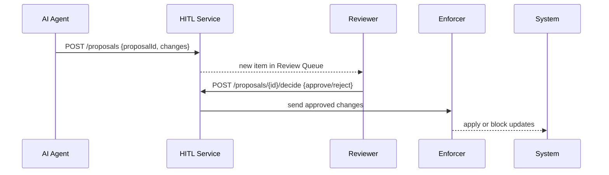

# Chapter 7: Human-in-the-Loop (HITL) Control

Welcome back! In [Chapter 6: AI Representative Agent](06_ai_representative_agent_.md), we saw how our system can ingest citizen complaints, analyze them, and draft workflow proposals automatically. Now, before any AI-generated changes roll out, we need a **Human-in-the-Loop (HITL) Control** step to ensure accountability.  

---

## 1. Why Human-in-the-Loop Control?

Imagine the Department of Transportation’s AI agent proposes to fast-track all bridge-inspection permits by skipping a manual safety check. Sounds efficient—but what if we miss a critical safety rule?  

**HITL Control** acts like a senior manager who must review and co-sign any AI-generated process change before it becomes official policy. This adds a buffer of human judgment, prevents unintended consequences, and keeps an audit trail for compliance.

---

## 2. Key Concepts

1. **Review Queue**  
   A backlog of AI proposals waiting for human approval.

2. **Approval Gate**  
   A check where a designated reviewer (e.g., a supervisor) can **approve** or **reject** each proposal.

3. **Audit Trail**  
   A record of who approved what, when, and any comments—crucial for transparency.

4. **Enforcement Hook**  
   The mechanism that blocks or allows process changes based on the reviewer’s decision.

---

## 3. How to Use HITL Control

Let’s walk through a minimal example where the AI agent sends a workflow proposal to our HITL service, and a human reviewer approves it.

### 3.1 AI Agent Posts a Proposal

```js
// src/agent/index.js
await fetch('/api/hitl/proposals', {
  method: 'POST',
  headers: { 'Content-Type': 'application/json' },
  body: JSON.stringify({
    proposalId: 'prop-789',
    changes: { addStep: 'final-audit' },
    author: 'AI-Agent'
  })
})
// The proposal now sits in the Review Queue.
```
_This sends a JSON payload to the HITL service._

### 3.2 Reviewer Approves or Rejects

```js
// src/hitl/reviewer.js
// Fetch & display pending proposals
const pending = await fetch('/api/hitl/proposals').then(r => r.json())

// Reviewer picks one and decides
await fetch(`/api/hitl/proposals/${pending[0].id}/decide`, {
  method: 'POST',
  body: JSON.stringify({ decision: 'approve', reviewer: 'jane.doe', comment: 'Looks good' })
})
```
_After this call, if approved, the Enforcement Hook applies the change._

---

## 4. Under the Hood: Step-by-Step

Here’s what happens when a proposal flows through HITL Control:



1. **AI Agent** submits a proposal.  
2. **HITL Service** stores it and notifies the **Reviewer**.  
3. Reviewer makes a decision.  
4. **Enforcer** applies or denies the change.

---

## 5. Internal Implementation

### 5.1 HITL Service Routes (src/hitl/routes.js)

```js
// List and create proposals
app.post('/api/hitl/proposals', saveProposal)
app.get ('/api/hitl/proposals', listPending)

// Reviewer decision
app.post('/api/hitl/proposals/:id/decide', async (req, res) => {
  // 1) record decision + audit info
  // 2) if approved, call Enforcement Hook
  res.send({ status: 'recorded' })
})
```
- `saveProposal` saves a pending record.  
- `listPending` returns unreviewed items.  
- `/decide` logs the reviewer’s choice.

### 5.2 Enforcement Hook (src/hitl/enforcer.js)

```js
export async function applyDecision(proposal) {
  if (proposal.decision === 'approve') {
    // call the downstream API to apply changes
    await fetch('/api/workflows/apply', {
      method: 'POST', body: JSON.stringify(proposal.changes)
    })
  } else {
    console.log(`Proposal ${proposal.id} was rejected.`)
  }
}
```
_This function is invoked once the HITL service records an approval._

---

## 6. Analogy: Manager Co-Signing a Memo

Think of any office memo that needs a director’s signature before becoming policy. The director reviews, signs off, or sends it back for edits. **HITL Control** brings that same step into our AI workflows—ensuring real people stand behind every automated change.

---

## 7. Summary & Next Steps

You’ve learned how **Human-in-the-Loop Control**:

- Queues AI proposals for review.  
- Lets humans approve or reject changes.  
- Keeps an audit trail and enforces decisions.

Up next, we’ll dive deeper into overarching policies and compliance in the [Governance Layer](08_governance_layer_.md).

---

Generated by [AI Codebase Knowledge Builder](https://github.com/The-Pocket/Tutorial-Codebase-Knowledge)