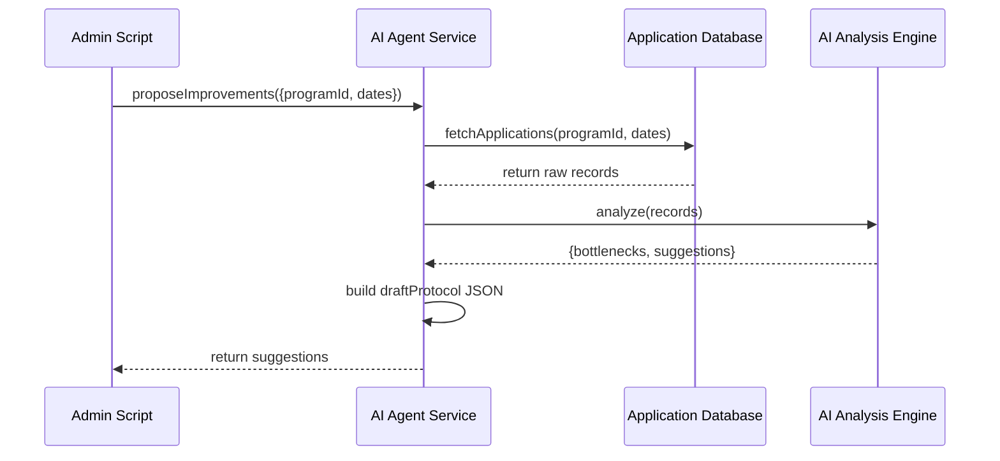

# Chapter 8: AI Representative Agent

In the previous chapter we built the **[Admin/Gov Portal](07_admin_gov_portal_.md)** where staff manually review and approve applications. Now it’s time to introduce the **AI Representative Agent**—a digital policy adviser that automatically analyzes data, spots bottlenecks, and drafts optimized workflows to speed up permit approvals, benefit distributions, or any multi-step process.

---

## 8.1 Why We Need an AI Representative Agent

Imagine the Department of Building Services receives hundreds of permit applications each month. Some applications pile up waiting for technical review, while others wait on missing documents. A human reviewer might not spot the recurring delays fast enough.

The **AI Representative Agent** steps in like a smart consultant:

- It scans recent application records.
- Identifies where queues grow longest.
- Proposes a new step-by-step workflow to clear backlogs.
- Drafts a workflow definition that administrators can review and deploy.

**Central Use Case**  
A city planner runs the agent on last month’s building permits. The agent finds a 48-hour average delay between “Initial Review” and “Technical Review.” It suggests adding an automated document completeness check before routing to a reviewer—and outputs a draft protocol the planner can load into the **[Protocol Builder](02_protocol_builder_.md)**.

---

## 8.2 Key Concepts

1. **Agent Instance**  
   A configured object tied to a specific program or permit flow (e.g., “building-permit”).

2. **Data Analyzer**  
   Module that fetches and aggregates application data (times, statuses, counts).

3. **Bottleneck Detector**  
   Logic that scans aggregated data for slow steps or frequent back-and-forth.

4. **Workflow Proposer**  
   Component that translates detected issues into a drafted protocol (steps, checkpoints).

5. **Review Draft**  
   The generated workflow definition (JSON) that an admin can import into **[Protocol Builder](02_protocol_builder_.md)**.

---

## 8.3 Using the AI Agent

Below is a minimal example showing how an administrator script can invoke the agent.

```javascript
// scripts/runAgent.js
import { AIRepresentativeAgent } from 'hms-mkt';

// 1. Create an agent for the “building-permit” program
const agent = new AIRepresentativeAgent({ programId: 'building-permit' });

// 2. Analyze last 30 days of data and get improvement suggestions
const suggestions = await agent.proposeImprovements({
  fromDate: '2024-05-01',
  toDate:   '2024-05-31'
});

console.log('Bottlenecks found:', suggestions.bottlenecks);
console.log('Draft protocol:', suggestions.draftProtocol);
```

What happens:  
1. We instantiate the agent with a program ID.  
2. We call `proposeImprovements()` with a date range.  
3. The agent returns:
   - `bottlenecks`: an array of step names where delays occur.
   - `draftProtocol`: a JSON object representing an optimized workflow.

A sample output might be:

```json
{
  "bottlenecks": ["Technical Review"],
  "draftProtocol": {
    "name": "Permit Flow Optimized",
    "steps": [
      { "type": "step", "name": "Submit Application" },
      { "type": "checkpoint", "label": "Auto-Checklist", "cfg": { role: "System" } },
      { "type": "step", "name": "Technical Review" },
      { "type": "approval", "label": "Final Approval", "cfg": { role: "Approver" } }
    ]
  }
}
```

---

## 8.4 Under the Hood: Step-by-Step Walkthrough

Here’s a simplified sequence of what happens when you call `proposeImprovements()`:



1. **Admin script** calls the AI agent service.  
2. **Agent** fetches application history from the database.  
3. **Agent** passes records to an AI engine (could be a simple rules engine or ML model).  
4. **AI engine** detects slow steps and suggests improvements.  
5. **Agent** packages results into a `draftProtocol`.  
6. Suggestions return to the caller.

---

## 8.5 Internal Implementation

Let’s peek at a minimal implementation in **src/hms-mkt/aiRepresentativeAgent.js**.

```javascript
// src/hms-mkt/aiRepresentativeAgent.js
import { dataService } from './dataService'
import { aiEngine }    from './aiEngine'

export class AIRepresentativeAgent {
  constructor({ programId }) {
    this.programId = programId
  }

  async proposeImprovements({ fromDate, toDate }) {
    // 1. Fetch raw application data
    const records = await dataService.fetchApplications(
      this.programId, fromDate, toDate
    )

    // 2. Analyze for bottlenecks
    const analysis = await aiEngine.analyze(records)

    // 3. Build a draft protocol
    const draftProtocol = {
      name: `${this.programId}-optimized-flow`,
      steps: analysis.suggestedFlow
    }

    return {
      bottlenecks: analysis.bottlenecks,
      draftProtocol
    }
  }
}
```

Explanation:  
- `dataService.fetchApplications` gets stored application timestamps and statuses.  
- `aiEngine.analyze` runs the core logic (spotting delays, loops).  
- We turn the analysis into a `draftProtocol` object that matches the **Protocol Builder** format.

### Supporting Modules

**dataService.js** might simply query your database:

```javascript
export const dataService = {
  async fetchApplications(programId, from, to) {
    // Imagine this hits your Application DB
    return await fetch(
      `/api/internal/data/${programId}?from=${from}&to=${to}`
    ).then(r => r.json())
  }
}
```

**aiEngine.js** could be rule-based for now:

```javascript
export const aiEngine = {
  analyze(records) {
    // Very simple: find the step with highest avg wait time
    const agg = {/* ...compute stats...*/};
    const bottleneck = /* step name */;
    // Suggest inserting a checklist before the bottleneck
    return {
      bottlenecks: [bottleneck],
      suggestedFlow: [
        { type: 'step', name: 'Submit Application' },
        { type: 'checkpoint', label: 'Auto-Checklist', cfg: { role: 'System' } },
        ...agg.steps
      ]
    }
  }
}
```

---

## 8.6 Summary

In this chapter you learned how to:

- Instantiate the **AI Representative Agent** for a given program.  
- Call `proposeImprovements()` to auto-detect bottlenecks and generate a draft workflow.  
- Understand the sequence—from fetching data to running an AI analysis engine and building a protocol.  
- Peek under the hood at minimal code for `AIRepresentativeAgent`, `dataService`, and `aiEngine`.

With AI helping draft optimized workflows, admins can focus on policy review and deployment. In the next chapter we’ll take these draft protocols and put them into action in the **[Policy Deployment Workflow](09_policy_deployment_workflow_.md)**.

---

Generated by [AI Codebase Knowledge Builder](https://github.com/The-Pocket/Tutorial-Codebase-Knowledge)