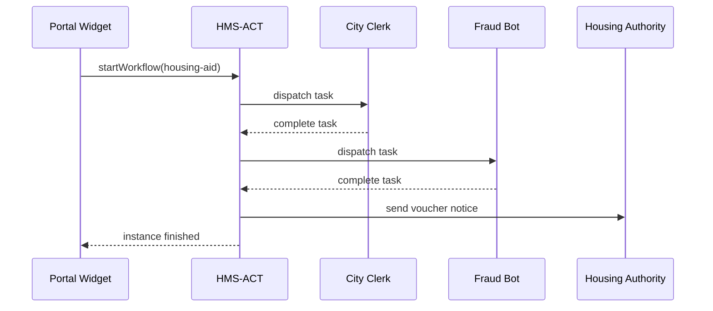

# Chapter 8: HMS-ACT Orchestration & Workflow Engine

[← Back to Chapter 7: Backend Service & Public API](07_backend_service___public_api__hms_svc___hms_mkt__.md)

---

## 1. Why Do We Need a “Dispatch Center”?

Imagine a citizen, **James**, applying for **Emergency Housing Assistance**:

1. He uploads proof-of-income.
2. A city clerk verifies the document.
3. A fraud-detection bot cross-checks the SSN.
4. The Housing Authority issues a voucher.

If any one step stalls, James is left on the street.  
**HMS-ACT** acts like the **USPS package tracker** for government tasks:

* Routes each step to the right human, bot, or partner agency.  
* Monitors progress in real time.  
* Guarantees nothing “falls behind the cabinet.”

By the end of this chapter you’ll launch a mini workflow, watch it run, and peek inside the engine that keeps everything moving.

---

## 2. Key Concepts (Plain-English Cheatsheet)

| Word            | Think of It As…                                         |
|-----------------|---------------------------------------------------------|
| Workflow        | A recipe (ordered steps) produced by the [Protocol Builder UI](06_protocol_builder_ui_.md). |
| Instance        | One live copy of that recipe for a specific request (e.g., James #447). |
| Task            | A single to-do (“Verify income”).                       |
| Assignee        | Who must do the task: a human **clerk**, a **bot**, or an **external agency**. |
| Status          | `queued → in-progress → done → failed`.                 |
| Tracker ID      | The barcode you paste into a dashboard to see progress. |
| SLA Timer       | Countdown clock that raises an alert if a task lingers. |

Keep these seven words handy—you already speak 80 % of HMS-ACT.

---

## 3. Guided Walk-Through: James’ Housing Workflow

### 3.1 The Recipe (YAML)

Generated earlier in Chapter 6:

```yaml
id: housing-aid
version: 1
steps:
  - id: upload-docs     type: form.collect   assignee: citizen
  - id: clerk-review    type: human.review   assignee: city-clerk
  - id: fraud-check     type: bot.invoke     skill: fraud-detector-usda
  - id: issue-voucher   type: agency.notify  target: HousingAuthority
```

### 3.2 Start a New Instance (one POST)

```bash
curl -X POST https://act.hms.gov/workflows/housing-aid/instances \
  -H "Authorization: Bearer jamesToken" \
  -d '{ "citizenId": "c-987" }'
```

Response:

```json
{ "instanceId": "wf_601ab2", "status": "queued" }
```

Explanation  
1. HMS-ACT stores the request.  
2. Returns a **Tracker ID** `wf_601ab2` for follow-ups.

### 3.3 Clerk Completes Her Task

```bash
curl -X POST https://act.hms.gov/tasks/tk_44/complete \
  -H "Authorization: Bearer clerkToken"
```

Engine immediately enqueues the next step (`fraud-check`) for the bot.

### 3.4 Peek at the Gantt-Style Timeline

```bash
curl https://act.hms.gov/instances/wf_601ab2/timeline
```

Sample JSON (trimmed):

```jsonc
[
  { "step":"upload-docs",  "start":"08:00", "end":"08:05" },
  { "step":"clerk-review", "start":"08:05", "end":"08:20" },
  { "step":"fraud-check",  "start":"08:20", "end":"08:21" },
  { "step":"issue-voucher","start":"08:21", "end":"08:22" }
]
```

Your dashboard draws this as a tiny Gantt bar—program managers love it!

---

## 4. What Happens Behind the Curtain?



Only five actors—easy to reason about.

---

## 5. Tiny Peek at Engine Code

_File: `act/src/engine.ts` (18 lines)_

```ts
export async function tick(instance) {
  const step = instance.steps[instance.cursor]

  // 1. If no more steps, mark done
  if (!step) return finish(instance)

  // 2. Dispatch based on type
  if (step.type === 'human.review')
    await sendToInbox(step, step.assignee)
  else if (step.type === 'bot.invoke')
    await invokeSkill(step.skill, instance.data)
  else if (step.type === 'agency.notify')
    await notifyAgency(step.target, instance.data)

  // 3. Advance cursor & recurse
  instance.cursor++
  await save(instance)
  return tick(instance)  // naive, runs next step if instantly done
}
```

Explanation line-by-line  
1-4  • Finishes if all steps are done.  
5-11 • Chooses a **dispatcher** based on `step.type`.  
12-15 • Moves the “bookmark” forward, saves, and loops.

Even a beginner can follow this logic!

---

## 6. Connecting to the Rest of HMS

Component | Interaction with HMS-ACT
----------|--------------------------
[Protocol Builder UI](06_protocol_builder_ui_.md) | Pushes the YAML recipes you just saw.
[Backend Service & Public API](07_backend_service___public_api__hms_svc___hms_mkt__.md) | Exposes `/instances` and `/tasks` routes.
[HMS-MKT Agent & Data Marketplace](03_hms_mkt_agent___data_marketplace_.md) | Provides bot skills (e.g., `fraud-detector-usda`) used inside steps.
[Human-in-the-Loop Framework](14_human_in_the_loop__hitl__oversight_framework_.md) | Inserts mandatory approval tasks before sensitive steps.
[Activity Logging & Auditing](15_activity_logging___auditing__within_hms_act___ops__.md) | Records every state change for inspectors.

---

## 7. 60-Second Local Playground

```bash
# 1. Start dev server
npm run dev --workspace=hms-act

# 2. Seed recipe
curl -X POST localhost:5000/protocols -d @examples/housing-aid.yaml

# 3. Launch an instance
curl -X POST localhost:5000/workflows/housing-aid/instances

# 4. Watch live log
tail -f ./logs/act.log
```

You’ll see lines like:

```
[08:05] task tk_44 assigned to city-clerk
[08:20] task tk_44 completed
[08:21] bot fraud-detector-usda OK
```

---

## 8. Recap & Next Steps

You have:

• Dispatched a real workflow from start to finish.  
• Learned the core vocabulary—workflow, instance, task, tracker.  
• Seen how HMS-ACT guarantees no citizen request vanishes.  
• Peeked at the super-simple engine loop that drives it all.

Next we’ll dive deeper into **how new policies are validated for conflicts and compliance before they even reach HMS-ACT** in [HMS-CDF Policy Governance Engine](09_hms_cdf_policy_governance_engine_.md).

---

Generated by [AI Codebase Knowledge Builder](https://github.com/The-Pocket/Tutorial-Codebase-Knowledge)