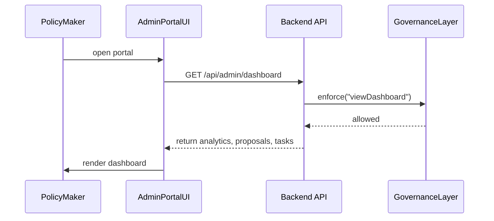

# Chapter 9: Admin/Gov Portal

In [Chapter 8: Governance Layer](08_governance_layer_.md) we built a central policy‐enforcement gate. Now we’ll create the **Admin/Gov Portal**—a secure web dashboard where ministers, policy-makers, and compliance officers review AI proposals, override suggestions, and publish final policies.

---

## 1. Why an Admin/Gov Portal?

Imagine you’re a policy director at the Department of Energy. Your AI agent has drafted an updated regulation for nuclear waste storage:

- It flagged conflicts with existing noise ordinances.
- It proposed a new expedited review step.
- It recommended changes to the “waste-tracking” workflow.

Before any of this goes live, you need one place to:

1. See key analytics (e.g., number of proposals, conflict rates).  
2. Review pending AI-generated policy changes.  
3. Assign tasks to human reviewers.  
4. Edit or override AI suggestions.  
5. Publish the final, approved policy.

That central “ministerial dashboard” is your **Admin/Gov Portal**.

---

## 2. Key Concepts

1. **Dashboard**  
   A landing page showing high-level analytics and recent activity.

2. **Analytics Panel**  
   Charts and counters (e.g., total proposals, conflict percentages).

3. **Pending Changes**  
   A list of AI-drafted policy suggestions awaiting review or override.

4. **Workflow Tasks**  
   Tasks assigned to human reviewers (e.g., “Check conflict #23”).

5. **Policy Editor & Overrides**  
   An inline editor that lets you tweak or reject AI proposals.

6. **Publish Action**  
   A “Publish” button that sends approved changes into production.

---

## 3. Using the Admin/Gov Portal

Below is a minimal React example that mounts the portal and handles overrides.

```js
// src/app/AdminPage.jsx
import React from 'react'
import { AdminPortal } from '@hms-mkt/admin-portal'

export default function AdminPage({ user }) {
  return <AdminPortal user={user} />
}
```
When mounted, `<AdminPortal>` will:
- Fetch analytics, pending proposals, and tasks from `/api/admin/dashboard`.
- Display panels and let you interact.

### 3.1 Overriding a Suggestion

```js
// inside AdminPortal’s child component
function onOverride(suggestionId, newPolicyText) {
  fetch(`/api/admin/override`, {
    method: 'POST',
    headers: {'Content-Type': 'application/json'},
    body: JSON.stringify({ suggestionId, newPolicyText })
  })
}
```
Explanation:  
When you edit and save, the portal calls this endpoint to record your override.

---

## 4. Under the Hood: What Happens When You Load the Portal



1. The UI requests dashboard data.  
2. Governance Layer enforces that the user’s role is allowed.  
3. Data returns and UI renders charts, lists, and task panels.

---

## 5. Internal Implementation

### 5.1 AdminPortal Component

```js
// src/admin-portal/AdminPortal.jsx
import React, { useEffect, useState } from 'react'
import AnalyticsPanel from './AnalyticsPanel'
import PendingList   from './PendingList'
import TaskList      from './TaskList'

export function AdminPortal({ user }) {
  const [data, setData] = useState({ analytics:[], proposals:[], tasks:[] })

  useEffect(() => {
    fetch('/api/admin/dashboard')
      .then(res => res.json())
      .then(setData)
  }, [])

  return (
    <div>
      <h1>Welcome, {user.name}</h1>
      <AnalyticsPanel stats={data.analytics} />
      <PendingList  proposals={data.proposals} />
      <TaskList     tasks={data.tasks} />
    </div>
  )
}
```

### 5.2 AnalyticsPanel

```js
// src/admin-portal/AnalyticsPanel.jsx
import React from 'react'

export default function AnalyticsPanel({ stats }) {
  return (
    <div>
      <h2>Key Metrics</h2>
      {stats.map(item =>
        <p key={item.name}>
          {item.name}: {item.value}
        </p>
      )}
    </div>
  )
}
```

You’d build `PendingList` and `TaskList` similarly—listing items and wiring up buttons to review, override, or mark tasks done.

---

## 6. Analogy: Ministerial Dashboard

Think of the Admin/Gov Portal like a minister’s briefing binder:

- **First pages**: Executive summary (Analytics Panel).  
- **Next section**: Proposed memos and drafts (Pending Changes).  
- **Back**: Action items for assistants (Workflow Tasks).  
- **Cover sheet**: Signature block to finalize (Publish Action).

Everything lives in one place—no hopping between spreadsheets, email threads, or slides.

---

## 7. Summary & Next Steps

You’ve learned how the **Admin/Gov Portal**:

- Provides a unified dashboard for analytics, proposals, and tasks.  
- Lets policy-makers override AI drafts inline.  
- Enforces permissions via the [Governance Layer](08_governance_layer_.md).  

Next up, we’ll see how these approved policies feed into operations in the [Management Layer](10_management_layer_.md).

---

Generated by [AI Codebase Knowledge Builder](https://github.com/The-Pocket/Tutorial-Codebase-Knowledge)